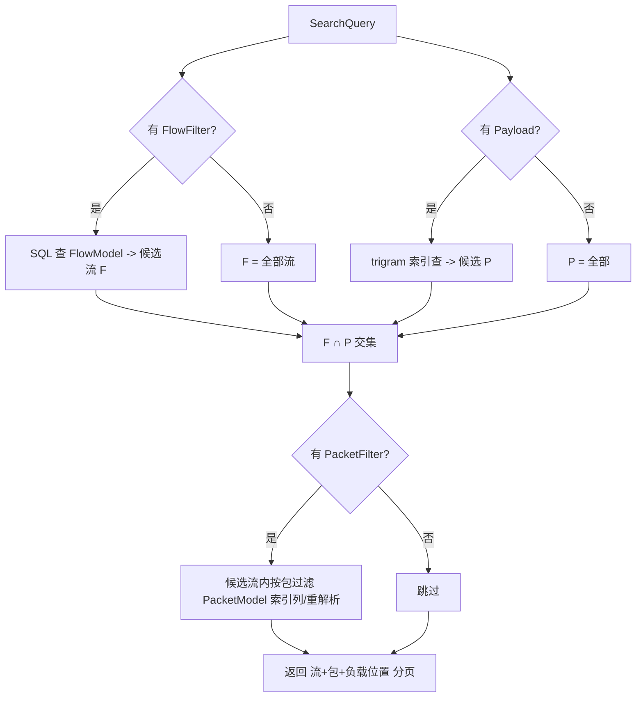

# PCAP 解析引擎设计

> 设计日期：2026-07-12
> 范围：`internal/pcapparser/` 模块的实现设计
> 依据：[`docs/requirements.md` §17](./requirements.md#17-pcap-解析引擎)（需求规格）
> 状态：设计阶段（待评审）

---

## 0. 背景与目标

§17 定义了 PCAP 解析引擎的需求：读 pcap/pcapng，产出全层级结构化描述，供资产查看与回放发包两个消费方共用。本文档定 **HOW**--模块结构、关键算法、数据流、接口。

**设计原则：**

- **流式**：用 gopacket `PacketSource` 逐包迭代，不聚合全量包到内存
- **单遍**：导入一次遍历完成流聚合、TCP 重组、偏移提取、trigram 索引
- **黑盒**：对资产层（§15）只暴露 `Parse()`，内部实现可独立演进
- **真理之源**：pcap 文件是字节真理，DB 存指针 + 聚合，不存可重算派生值
- **可扩展**：协议解析插件化，新协议不动核心
- **封装恒定利用**：字段偏移按流存一份（封装结构流内恒定），不每包存

---

## 1. 模块结构

```
internal/pcapparser/
├── parser.go          # Parse() 入口、PacketSource 迭代、主流程编排
├── flow.go            # 流分组、FlowState、FlowModel 构建
├── reassembly.go      # TCP 重组（gopacket tcpassembly 封装）
├── fragment.go        # IP 分片分组与重组
├── offset.go          # 偏移布局提取（byte-patch 用）
├── payload.go         # .payloads 物化、两级负载地址
├── trigram.go         # trigram 索引构建 + 搜索
├── search.go          # 多条件查询引擎
├── dynamic.go         # 单包动态重解析
├── plugin.go          # ProtocolParser 接口 + Registry
├── reparse.go         # 重解析（parser 升级后重建）
└── l7/                # L7 协议解析器（插件）
    ├── registry.go
    ├── http.go
    ├── dns.go
    ├── tls.go
    └── ...
```

**依赖**：`github.com/google/gopacket`（含 `gopacket/pcap`、`gopacket/tcpassembly`、`gopacket/layers`）。

---

## 2. 对外接口

```go
package pcapparser

// Parse 导入时全量解析。资产层调用，返回分析结果（含 FlowModel/PacketModel 数据，
// 由资产层落库）。opts 控制行为（超时、进度回调、parser 版本等）。
func Parse(path string, opts ...Option) (*PcapAnalysis, error)

// ParsePacket 查询时动态重解析单包（按 RawOffset 读 pcap 文件那段字节，gopacket 解析）。
// 供"查看单包全字段"端点调用。linkType 从 PcapAssetModel.LinkType 传入。
func ParsePacket(pcapPath string, rawOffset int64, length int, linkType layers.LinkType) ([]LayerRecord, error)

// Search 多条件组合查询。idx 为已加载的 trigram 索引，query 为结构化查询条件。
func Search(idx *TrigramIndex, query *SearchQuery) (*SearchResult, error)

// MatchPreview matcher 命中预览：传 FlowMatcher，返回命中的流 ID 列表。
// 供"配置改写规则时验证命中"端点调用，查 FlowModel（资产层传入）。
type Option func(*parseConfig)
```

`PcapAnalysis` 是 `Parse()` 的产出，资产层拿到后落库（FlowModel/PacketModel 表 + 写 .payloads/trigram 文件）。

---

## 3. 数据模型与索引策略

FlowModel / PacketModel 字段定义见 §17.3 / §17.4。本节定 **索引策略**（哪些列建索引，支撑查询）。

### PacketModel 索引

| 列 | 索引 | 查询场景 |
|----|------|---------|
| `PcapAssetID` | index | 按资产查包 |
| `FlowID` | index | 流内包分页 |
| `UserID` | index | 用户隔离 |
| `TimestampUs` | index | 时间排序/区间过滤 |
| `Direction` | index | c2s/s2c 过滤 |
| `L4Protocol` | index | 协议过滤 |
| `PayloadHash` | index | 等值断言/查重 |
| `AnomalyFlag` | index | 异常包过滤 |
| `FragGroupID` | index | 分片组查询 |

复合索引：`(PcapAssetID, FlowID, IndexInFlow)` 支持流内包按序分页。

### FlowModel 索引

| 列 | 索引 | 查询场景 |
|----|------|---------|
| `PcapAssetID` | index | 按资产查流 |
| `FlowKey` | index | 精确定位流 |
| `L4Protocol` | index | 协议过滤 |
| `SrcIP` / `DstIP` | index | IP 过滤 |
| `L7Protocol` | index | L7 类型过滤 |
| `L7Method` / `L7Host` / `L7QueryName` | index | L7 元数据过滤（反范式列） |

### 不建索引

- L2-L7 完整字段值（不存，动态重解析）
- 负载字节（在 pcap 文件 / .payloads，不进 DB）

---

## 4. 导入主流程

```mermaid
flowchart TB
    A[Parse&#40;path&#41;] --> B[pcap.OpenOffline]
    B --> C[NewPacketSource]
    C --> D{遍历包}
    D -->|每包| E[解析 layers]
    E --> F[算 flow key]
    F --> G[累积 FlowState]
    E --> H[建 PacketModel]
    E --> I[喂 tcpassembly]
    E --> J[提取偏移布局]
    E --> K{有 L7 负载?}
    K -->|是| L[喂 trigram 索引]
    D -->|流结束/超时| M[finalize FlowModel]
    M --> N[物化重组流到 .payloads]
    N --> O[流上跑 L7 解析]
    D -->|遍历完| P[flush 所有流]
    P --> Q[写 trigram 索引文件]
    Q --> R[返回 PcapAnalysis]
```



### 单遍解析步骤

```
1. pcap.OpenOffline(path) -> handle；记录 linkType、snaplen
2. gopacket.NewPacketSource(handle, linkType)
3. 初始化：
   - flows map[string]*FlowState  // 活跃流
   - assembler = tcpassembly.NewAssembler(streamPool)
   - trigramIdx = newTrigramIndex()
   - payloadsFile = open("{id}.payloads", write)
4. for packet := range packetSource.Packets():
   a. gopacket 解析（lazy，packet.Layers() 触发）
   b. 算 RawOffset（包数据在文件中的字节偏移，跳过 16B pcap record header）
   c. 算 flow key（§5）
   d. 取/建 FlowState，累积统计（包数/字节/c2s/s2c/时间 + seq 跟踪测重传/乱序）
   e. 建 PacketModel（RawOffset/Length/Timestamp/IndexInFlow/Direction/L4Protocol
      /PayloadHash=sha256(负载)/AnomalyFlag/FragGroupID/FragOffset），追加到批次
   f. 若 TCP：取 tcpLayer + netFlow，assembler.Assemble(netFlow, tcpLayer)（§7）
   g. 提取偏移布局（§9），存入 FlowState（封装恒定，首包定）
   h. 若分片：fragment 处理（§8）
   i. trigram 索引：UDP 每包负载即时进 trigramIdx；TCP 重组流在 finalize 时进（§11）
   j. 流结束信号（TCP FIN/RST）-> finalize 该流
   k. 批次满（如 1000 包）-> 批量写 DB，控制内存
5. 遍历完：flush 所有活跃流（超时未结束的按不完整处理）
6. flush assembler（重组剩余缓冲）
7. 写 trigram 索引文件
8. 关闭 payloadsFile
9. 返回 PcapAnalysis（含所有 FlowModel + PacketModel + 元数据）
```

**关键点**：

- **流式**：`packetSource.Packets()` 返回 channel，逐包处理，不预加载
- **批次写 DB**：PacketModel 攒批写入，避免每包一次 IO
- **活跃流 map 有界**：流结束即 finalize 并从 map 移除（写入 DB）。超长 pcap 中活跃流数 = 当前未完成流数，可控
- **超时 flush**：流长时间无新包（如 30s 无包）按不完整 finalize，防内存涨

---

## 5. 流分组

**双向归一化 5 元组**：

```go
func flowKey(srcIP, dstIP net.IP, srcPort, dstPort uint16, proto uint8) string {
    // 归一化：按 (ip, port) 大小排序，使双向包归到同一 key
    a, b := endpoint{srcIP, srcPort}, endpoint{dstIP, dstPort}
    if compare(a, b) > 0 { a, b = b, a }
    return fmt.Sprintf("%d|%s|%s", proto, a, b)
}
```

- TCP/UDP：5 元组归一化
- ICMP：(srcIP, dstIP, type, id) 归一化
- ARP：(senderIP, targetIP, op)

**方向（c2s/s2c）判定**：流首包 src 视为 client 候选；握手包校准（SYN->client, SYN-ACK->server），校准一次锁定（§16.7 算法）。存入 FlowState，重组分方向用。

**FlowState**（内存中活跃流状态）：

```go
type FlowState struct {
    FlowModel            // 最终落库的字段
    packets      []PacketModel  // 攒批，满即写 DB
    c2sStream    *reassemblyStream  // tcpassembly Stream 实现
    s2cStream    *reassemblyStream
    offsetLayout OffsetLayout       // 首包定，封装恒定
    dirClassified bool
    dirMethod     string
}
```

---

## 6. 协议解析

### gopacket layer walk

```go
for _, layer := range packet.Layers() {
    layerType := layer.LayerType()
    contents := layer.Contents()   // 该层字节
    payload := layer.Payload()     // 上层字节
    // layerStartOffset = 累积 len(contents) 到此层
    // 字段偏移 = layerStart + 协议已知字段偏移
}
```

gopacket 已解析的层（`layers.TCP`、`layers.IPv4`、`layers.HTTP` 等）直接取字段值；未识别的层（`LayerType` 不在已知集合）走 opaque。

### L7 解析（两层）

1. **包级 L7**：UDP 等无重组协议，每包独立 L7 消息，gopacket 直接解析（DNS 每包一条）
2. **流级 L7**：TCP 重组后的字节流上跑 L7 parser（HTTP 跨多包的完整请求/响应），见 §7

### 未知协议

```go
// gopacket 不认识的层，存 opaque
type OpaqueLayer struct {
    LayerType string  // gopacket LayerType.String()，或 "unknown"
    Bytes     []byte  // 该层原始字节
    Range     [2]int  // 帧内偏移
}
```

不阻断解析，标记"未识别"，前端展示为 hex + 范围。

### 加密流量

- TLS：gopacket `layers.TLS` 解 handshake（ClientHello/ServerHello），提取 SNI/版本/密码套件/cert 链长度。record data 标"加密 opaque"，不解密
- SSH：版本交换明文部分解析，后续标加密

### 协议范围

gopacket 内置全开（HTTP/DNS/TLS/DHCP/SNMP/Modbus/ARP/ICMP/IPv4/IPv6/TCP/UDP/SCTP/GRE/VXLAN/MPLS/...）。新协议（QUIC/HTTP2/HTTP3）走插件（§14）。

---

## 7. TCP 重组

用 `gopacket/tcpassembly`。

### Stream 实现

每流每方向一个 `reassemblyStream`，实现 `tcpassembly.Stream` 接口：

```go
type reassemblyStream struct {
    flowID       string
    dir          string  // c2s|s2c
    payloadsFile *os.File
    startOffset  int64   // 流在 .payloads 中的起始偏移
    offset       int64   // 当前写入偏移
    length       int64
    bodyOffset   int64   // L7 body 起始（L7 头之后），ReassemblyComplete 时填
    bodyLength   int64
    gapDetected  bool
}

// Reassembled tcpassembly 回调：重组后的连续字节段（tcpassembly 内部已去重去乱序）。
// 注意：Reassembly 对象在调用后被复用，必须立即拷贝（WriteAt 即拷贝到文件）。
func (s *reassemblyStream) Reassembled(seg []tcpassembly.Reassembly) {
    for _, r := range seg {
        if r.Skip != 0 { s.gapDetected = true }  // r.Skip 非 0 表示 seq 缺口
        n, _ := s.payloadsFile.WriteAt(r.Bytes, s.offset)  // r.Bytes 是重组字节
        s.offset += int64(n)
        s.length += int64(n)
    }
}

// ReassemblyComplete 流结束（FIN/RST/超时）：读完整重组流，跑 L7 解析
func (s *reassemblyStream) ReassemblyComplete() {
    stream := make([]byte, s.length)
    s.payloadsFile.ReadAt(stream, s.startOffset)
    // 调 ProtocolParser.Parse(完整流) 得 L7 元数据 + body 边界（§14）
    // 回填 FlowModel.L7Metadata / 重组引用 / ReassemblyComplete=!gapDetected
}
```

### Assembler 用法

```go
streamPool := tcpassembly.NewStreamPool()
assembler := tcpassembly.NewAssembler(streamPool)
assembler.MaxBufferedPagesPerConnection = 4  // 控制内存

// 每包：取网络层 Flow + TCP 层，喂给 assembler
// Assemble(netFlow gopacket.Flow, t *layers.TCP) -- 用网络层 Flow（非传输层）
netFlow := packet.NetworkLayer().NetworkFlow()
tcpLayer := packet.Layer(layers.LayerTypeTCP).(*layers.TCP)
assembler.Assemble(netFlow, tcpLayer)
```

### 双向

`netFlow` 是方向性的（A->B 与 B->A 是不同 `gopacket.Flow`），c2s 和 s2c 自动分到不同 Stream，无需手动区分方向。

### 重传/乱序/缺口

- **重传/乱序计数**：tcpassembly 内部已去重去乱序，**计数在 FlowState 包级做**（不在 Stream）。FlowState 跟踪每方向已见最大 seq，包 seq 回退/重叠 = 重传（RetransCount++），填补空洞 = 乱序（OutOfOrderCount++）
- **缺口**：`Reassembly.Skip != 0` 标记 seq 缺口（`gapDetected=true`），`ReassemblyComplete=false`，缺口信息存 FlowModel.GapInfo

### TCP 握手与选项提取

FlowModel 的 TCP 专属字段在包级处理时累积，finalize 时回填：

- **HandshakeStatus**：见 SYN+SYN-ACK+ACK 三步 = `complete`，部分 = `partial`，无 = `none`
- **MSS/WindowScale/SACK**：解析 SYN/SYN-ACK 包的 TCP 选项（`tcpLayer.Options`）
- **C2SInitSeq/S2CInitSeq**：SYN 包的 seq
- **SeqRange**：流内 seq 最小/最大值
- **FlagsSummary**：SYN/FIN/RST/ACK/PSH 各标志包数
- **WindowRange**：窗口字段最小/最大值

### L7 解析在重组流上

`ReassemblyComplete` 时读完整重组流（.payloads 的 `startOffset~startOffset+length`），调 `ProtocolParser.Parse(完整流)`（§14）得 L7 元数据 + body 边界（如 HTTP：找到 `\r\n\r\n`，之后是 body）。记录 `bodyOffset`（相对流起始），method/uri/headers 存 FlowModel.L7Metadata。

### 边界与 flush

- **FIN/RST**：`ReassemblyComplete` 回调触发，finalize 流
- **超时**：`assembler.FlushOlderThan(T)`，强制 finalize 长时间无包的流（防内存涨）
- **超长流**：分段 flush（流太大时中途 finalize + 重开 stream，避免单流 .payloads 占满内存）
- **遍历结束**：`flush 所有活跃流` + `assembler.FlushAll()`，重组剩余缓冲

---

## 8. IP 分片处理

```go
// 分片组 key = IPID + srcIP + dstIP + protocol
func fragGroupKey(ipid uint16, src, dst net.IP, proto uint8) string { ... }
```

- 每个分片包：PacketModel 标 `FragGroupID` + `FragOffset`（IP 头 frag 字段，8 字节单位）
- 非分片包：`FragGroupID=""`，`FragOffset=-1`
- **重组顺序**：IP 分片先重组（拼回原 IP 包），再 TCP 重组。分片重组在 tcpassembly 之前
- **非首片**：无 L4 头，byte-patch 只改 L2/L3（L4 跳过）。FlowState 标记该流有分片，偏移布局按分片变体处理

### 截断/超大/超小包

```go
// PacketModel.AnomalyFlag
if caplen < ipTotalLength { flag = "truncated" }   // snaplen 截断
if frameLen > 1518 { flag = "oversize" }           // jumbo
if frameLen < 64 { flag = "undersize" }            // runt
```

截断包：尽力解析已有部分（L2/L3 可能完整，L4 截断则部分），前端醒目标"不完整"。

---

## 9. 偏移布局（byte-patch 支持）

**封装恒定原理**：一个流的所有包 L2/L3/L4 头结构相同（同以太网 + 同 IP 版本 + 同 L4），字段偏移流内恒定。只有 payload 长度变。

```go
type OffsetLayout struct {
    L2Start, L3Start, L4Start int
    SrcMAC, DstMAC     int  // -1 if absent
    VlanTCO             int  // -1 if no VLAN
    SrcIP, DstIP        int
    TTL, DSCPECN        int
    IPFlagsFrag         int
    IPID                int
    SrcPort, DstPort    int
    Seq, Ack            int  // TCP
    Window, TCPFlags    int  // TCP
    L4Protocol          string
    // 封装变体（分片/VLAN 不一致时多份）
    Variants []OffsetVariant
}
```

**提取**（首包定）：

```
offset = 0
for layer in packet.Layers():
    layerStart = offset
    layerLen = len(layer.Contents())
    按 layer 类型填 OffsetLayout 各字段（layerStart + 协议已知偏移）
    offset += layerLen
```

存入 FlowModel.OffsetLayout（JSON）。回放 byte-patch 直接查这布局 + 包原始字节。

**变体**：若流内出现不同封装（如部分包带 VLAN），记多份 layout，PacketModel 标用哪份。

---

## 10. 两级负载地址与 .payloads 物化

### 包级负载地址

`(RawOffset, header_len, payload_len)` 指向 pcap 文件。

- `RawOffset`：PacketModel 存储
- `header_len`：从 FlowModel.OffsetLayout 得（L2+L3+L4 头总长，封装恒定）或动态重解析
- `payload_len = Length - header_len`

读单包负载：`pcapFile[RawOffset+header_len : RawOffset+Length]`

### 流级负载地址（重组 L7 流）

`(.payloads 文件, offset, body_offset, body_length)` 指向物化的重组流。

- `StreamFile`、`C2SOffset`/`C2SLength`、`S2COffset`/`S2CLength`：§7 重组时记录
- `C2SBodyOffset`/`C2SBodyLength`：L7 parser 在重组流上找的 body 边界

存入 FlowModel（§17.3 重组引用字段）。

### .payloads 文件格式

```
data/pcaps/{pcap_id}.payloads
┌─────────────────────────────────┐
│ flow1 c2s 重组流字节             │  offset=0,  length=L1
├─────────────────────────────────┤
│ flow1 s2c 重组流字节             │  offset=L1, length=L2
├─────────────────────────────────┤
│ flow2 c2s 重组流字节             │  offset=L1+L2, ...
├─────────────────────────────────┤
│ ...                              │
└─────────────────────────────────┘
```

所有流的重组流拼接，DB 存每流每方向的 (offset, length)。空流（纯 ACK 无负载）不占空间。删 pcap 时连 `.payloads` 一起删。

**实时查询**：读重组流 = 一次 `ReadAt`（offset+length），微秒/毫秒级。支持 Range 分块。

---

## 11. trigram 索引

### 构建

```go
type TrigramIndex struct {
    Postings map[[3]byte][]Posting  // trigram -> 出现位置列表
}
type Posting struct {
    FlowID string
    Dir    string  // c2s|s2c
    Offset int64   // 在重组流/包负载中的偏移
    Length int     // 该负载段长度
}
```

**索引范围**：
- TCP：重组 L7 流（c2s/s2c），每流每方向一段
- UDP：每包负载（每包独立 L7 消息），Dir = 包方向

构建：遍历每段负载字节，提取所有 trigram（滑动 3 字节窗口），append 到对应 postings。

### 存储格式

`data/pcaps/{pcap_id}.trigram` 文件：

```
[trigram postings 表]
- 排序的 trigram 列表 + 每个的 posting 列表（flow_id, dir, offset, length）
- 压缩存储（postings 列表是递增整数，delta + varint 编码）
```

DB 不存 trigram（太大），存文件路径 `PcapAssetModel.TrigramIndexPath`。

### 搜索

```
搜索模式 P：
1. P 拆成 trigrams：P[0:3], P[1:4], ..., P[len-3:len]
2. 每个 trigram 查 postings -> 取交集（flow_id+dir 相同的）
3. 交集候选 (flow, dir, offset)：在 offset 附近读负载字节验证是否含 P
4. 命中 -> 返回 (flow_id, dir, offset, length)
```

支持任意子串（文本 + 二进制）。正则模式：trigram 缩范围后正则验证。

### 命中映射回包

重组流知道每段来自哪些包（tcpassembly 记录 seq->packet 映射）。流命中可定位到贡献的包。UDP 直接是包。

### 加密负载

TLS payload 加密，trigram 索引仍建（搜密文），但意义有限。handshake 明文部分正常搜。前端标注"加密流，搜索结果为密文"。

---

## 12. 多条件查询引擎

### 查询结构

```go
type SearchQuery struct {
    FlowFilter   *FlowFilter    // 流级
    PacketFilter *PacketFilter  // 包级
    Payload      *PayloadFilter // 负载内容
    Scope        string         // reassembled|packet
    Limit, Offset int
}
type FlowFilter struct {
    Protocol string; SrcIP, DstIP string; SrcPort, DstPort uint16
    L7Type string; L7Method, L7Host, L7QueryName string
}
type PayloadFilter struct {
    Contains []byte; Encoding string; Regex string
}
```

### 执行计划



### 各条件访问路径

| 条件 | 走什么 | 备注 |
|------|--------|------|
| 流头部（协议/IP/端口/方向） | FlowModel SQL | 索引列 |
| 流 L7（method/host/queryname） | FlowModel SQL | 反范式索引列 |
| 包头部（direction/time） | PacketModel SQL | 索引列 |
| 包 flags | 重解析候选包 | PacketModel 未存 flags |
| 负载内容 | trigram 索引 + 验证 | §11 |
| 时间/大小范围 | 索引列范围查询 | |

**组合**：v1 AND only。OR/嵌套留 v2。

---

## 13. 动态重解析

```go
// linkType 从 PcapAssetModel.LinkType 传入（每 pcap 恒定），避免每包重读 pcap 头
func ParsePacket(pcapPath string, rawOffset int64, length int, linkType layers.LinkType) ([]LayerRecord, error) {
    // 1. 打开 pcap 文件（handle 缓存，复用）
    // 2. ReadAt(rawOffset, length) 读包字节（RawOffset 已跳过 record header）
    // 3. gopacket.NewPacket(data, linkType, NoCopyDecode)
    // 4. 遍历 packet.Layers()，建 []LayerRecord（含 Fields + Offsets + Range）
    // 5. 返回
}
```

- 单包微秒级，翻页 50 包亚毫秒
- pcap handle 缓存（避免每包重开文件），或用内存映射
- `NoCopyDecode` 选项避免字节拷贝

**FlowModel.OffsetLayout vs LayerRecord.Offsets**：前者存储（每流，回放用，只含可改字段）；后者动态（每包每层，查看用，含全字段）。两者并存。

---

## 14. 插件接口

```go
// ProtocolParser L7 协议解析器插件接口
type ProtocolParser interface {
    // CanParse 判断是否处理该层
    CanParse(layerType gopacket.LayerType) bool
    // Parse 在重组流字节上解析（流式 Feed），返回 L7 元数据 + body 边界
    Parse(stream []byte) (*L7Result, error)
    // Name 协议名
    Name() string
}

type L7Result struct {
    Protocol    string
    Metadata    map[string]any  // 协议专属字段
    BodyOffset  int
    BodyLength  int
}

// Registry 注册中心
type Registry struct {
    parsers []ProtocolParser
}
func (r *Registry) Register(p ProtocolParser)
func (r *Registry) Find(layerType gopacket.LayerType) ProtocolParser
```

gopacket 内置协议作为内置 parser 注册。新协议（QUIC/HTTP2/HTTP3）实现接口注册，不动核心。未知协议走 opaque（§6）。

---

## 15. 重解析

parser 逻辑升级后，重建已有资产的索引：

```go
func Reparse(pcapPath string, opts ...Option) (*PcapAnalysis, error)  // 同 Parse，重跑
```

**重建范围**：
- FlowModel（重新聚合）
- `.payloads`（重新重组）
- trigram 索引（重建）

**重建**（parser 派生，可能随逻辑变）：
- FlowModel 全部字段
- PacketModel 的 Direction/AnomalyFlag/FragGroupID/FragOffset（分类/检测逻辑可能变）

**保留**（物理事实不变）：
- PacketModel 的 RawOffset/Length/Timestamp/IndexInFlow/L4Protocol/PayloadHash
- 原始 pcap 文件

**流程**：`POST /pcaps/:id/reparse` -> `Status=reindexing` -> 跑 Reparse -> 替换 FlowModel/payloads/trigram -> `Status=ready`。

**版本一致性**：FlowModel.ParserVersion 标注解析时用的版本。查询时若 `ParserVersion != 当前引擎版本`，提示 reparse。

---

## 16. 存储与文件管理

### 文件布局

```
data/pcaps/
├── {pcap_id}.pcap        # 原始 pcap（真理之源）
├── {pcap_id}.payloads    # 物化重组 L7 流
└── {pcap_id}.trigram     # trigram 索引
```

### 生命周期

- 导入：三文件一起创建
- 删除 pcap：三文件 + DB 记录一起删（`DELETE` 处理）
- 取消导入（importing 中 DELETE）：终止解析 + 清理半成品三文件 + 删 DB 记录
- 重解析：替换 .payloads + .trigram，保留 .pcap

### 磁盘空间检查

导入前预估：`needed = 4 × pcapSize`（.payloads ~1× + trigram ~3× + 索引）。检查 `diskAvailable`，不足拒绝 + 报"预计需 X 可用 Y"。中途写入失败回滚清理。

### 存储代价

| 项 | 大小 |
|----|------|
| `{id}.pcap` | 原始大小 |
| FlowModel + PacketModel | 每流 ~2KB × 流数 + 每包 ~120B × 包数 |
| `{id}.payloads` | ≈ 原 pcap 负载量 |
| `{id}.trigram` | ≈ 3 × 负载量 |

总额外约 **4 × 负载量**。不设上限，全量建。

---

## 17. 错误处理与边界

| 场景 | 处理 |
|------|------|
| pcap 文件损坏/不可读 | gopacket 读取报错，`Status=error` + ParseError |
| 非以太网链路层 | 导入校验拒绝（DLT_EN10MB only） |
| 磁盘空间不足 | 导入前拒绝 + 报数值 |
| 解析超时 | opts 设超时，超时 cancel + 清理 |
| 内存压力（大 pcap 多流） | 流式 + 批次写 + 流超时 flush |
| 重组缺口 | `ReassemblyComplete=false` + GapInfo，不阻断 |
| 未知协议 | opaque 标记，不阻断 |
| 截断包 | AnomalyFlag=truncated，尽力解析 |
| 加密 payload | 标 opaque，不解密 |
| pcap 文件被外部删除 | 读取时校验 sha256，不匹配报错 |
| 并发导入同 hash | 只跑一次，其他复用结果 |

---

## 18. 性能考量

| 操作 | 预期 | 说明 |
|------|------|------|
| 导入解析（1M 包） | ~1-2s | gopacket 解析 ~1-5M pps，瓶颈在 DB 写和 .payloads IO |
| 单包动态重解析 | 微秒 | gopacket 单包 |
| 翻页 50 包 | 亚毫秒 | 50 × 单包 |
| trigram 搜索 | 毫秒 | 索引查询 + 少量验证 |
| 读重组流 | 微秒/毫秒 | 一次 ReadAt，按长度 |
| 流级 SQL 查询 | 毫秒 | 索引列 |

**优化点**：
- PacketModel 批次写（攒 1000 包一次）
- pcap handle 缓存（动态重解析复用）
- .payloads 用 `WriteAt` + `ReadAt`（随机 IO，无锁）
- trigram postings delta+varint 压缩
- 流超时 flush 控制活跃流内存

**不做的优化**（v1）：
- 多协程并行解析（gopacket 单遍足够快，并行增加复杂度）
- 内存映射 pcap（handle 缓存已够）

---

## 19. 测试策略

### 单元测试

- **流分组**：双向归一化（正反方向归同 key）、各协议 key 生成
- **偏移布局**：典型封装（Eth+IP+TCP、Eth+VLAN+IP+UDP）偏移正确性
- **TCP 重组**：完整流、中途抓取、重传、乱序、缺口
- **IP 分片**：分片组 key、非首片处理
- **trigram**：构建正确性、搜索命中（文本/二进制/正则）
- **动态重解析**：单包字段完整性
- **插件**：注册 + Find

### 集成测试

- **端到端导入**：小 pcap 导入 -> 查 FlowModel/PacketModel -> 查包字段 -> 查负载
- **重组流查看**：HTTP pcap -> 重组流 -> body 偏移正确
- **多条件搜索**：各条件组合命中正确
- **重解析**：parser 升级后重建一致性
- **取消导入**：importing 中 DELETE -> 半成品清理干净

### 测试数据

- 内置样本 pcap：各协议典型抓包（TCP 完整流、DNS、HTTP、TLS、分片、截断）
- 大 pcap 生成脚本：验证流式 + 内存控制
- 真实抓包（enp135s0f0np0）

### 回归

- `go test ./internal/pcapparser/... -race`
- 解析结果与 Wireshark 对比（字段值、重组流）

---

## 20. 不在范围

- OR / 嵌套查询（v2）
- HTTP/2 多路复用跨流关联（v2）
- 加密 payload 解密（不做）
- 两 pcap 对比（不做，超出生成器定位）
- 跨用户共享（v2，权限模型）
- 非以太网链路层支持（v2）

---

## 21. 改动文件汇总

| 文件 | 说明 |
|------|------|
| `internal/pcapparser/parser.go`（新增） | Parse() 入口、主流程 |
| `internal/pcapparser/flow.go`（新增） | 流分组、FlowState |
| `internal/pcapparser/reassembly.go`（新增） | TCP 重组 |
| `internal/pcapparser/fragment.go`（新增） | IP 分片 |
| `internal/pcapparser/offset.go`（新增） | 偏移布局 |
| `internal/pcapparser/payload.go`（新增） | .payloads 物化 |
| `internal/pcapparser/trigram.go`（新增） | trigram 索引 |
| `internal/pcapparser/search.go`（新增） | 多条件查询 |
| `internal/pcapparser/dynamic.go`（新增） | 动态重解析 |
| `internal/pcapparser/plugin.go`（新增） | 插件接口 + Registry |
| `internal/pcapparser/reparse.go`（新增） | 重解析 |
| `internal/pcapparser/l7/*.go`（新增） | L7 协议解析器 |
| `internal/storage/models.go` | 新增 PcapAssetModel/FlowModel/PacketModel |
| `internal/api/rest/pcap_handler.go`（新增） | PCAP 资产端点 |
| `internal/storage/db.go` | 新增三模型 CRUD + 索引 |

---

## 22. 实施顺序

```
1. 数据模型 + DB schema（PcapAssetModel/FlowModel/PacketModel + 索引）
   ↓
2. parser.go 主流程 + flow.go 流分组（跑通单遍解析，存 FlowModel/PacketModel）
   ↓
3. offset.go 偏移布局 + dynamic.go 动态重解析（查看 + 回放偏移可用）
   ↓
4. reassembly.go TCP 重组 + payload.go .payloads 物化（重组流可查）
   ↓
5. fragment.go IP 分片
   ↓
6. trigram.go 索引 + search.go 查询引擎（搜索可用）
   ↓
7. plugin.go + l7/ L7 解析器
   ↓
8. reparse.go 重解析
   ↓
9. API 端点 + 资产管理 CRUD
   ↓
10. 测试 + 性能调优
```

每步独立可测，前一步是后一步的基础。

---

*文档状态：设计阶段（待评审）。依据 §17 需求规格编写，实现时以本文档设计为准。*
