# PCAP 回放设计

> 设计日期：2026-07-12
> 范围：`internal/replay/` 模块的实现设计
> 依据：[`docs/requirements.md` §16](./requirements.md#16-pcap-回放)（需求规格）、[§17 解析引擎](./requirements.md#17-pcap-解析引擎)、[`docs/pcap-parser-design.md`](./pcap-parser-design.md)
> 状态：设计阶段（待评审）

---

## 0. 背景与目标

§16 定义了 PCAP 回放需求：读 pcap 资产，按需改写 L2/L3/L4，按设定速率从网卡/pcap 回放，支持多流放大与双口分流。本文档定 **HOW**--模块结构、改写引擎、方向分类、多流放大、速率模型、流水线接入。

**设计原则：**

- **byte-patch 保真**：只改显式指定的字段，不重构包，未改字段（含畸形/未知协议/TCP 选项）原样保留
- **默认忠实**：不修正异常包；校验和/MTU/fixlen 等"修复"动作可控
- **复用引擎**：replay 作为 TrafficClass 接入现有流水线（ConfigWorker/PacketWorker/OutputWorker），零侵入
- **偏移预计算**：byte-patch 偏移读 FlowModel.OffsetLayout（解析时算好），回放不重解析
- **保序**：单 PacketWorker 保文件序，不走 resequencer

---

## 1. 模块结构

```
internal/replay/
├── planner.go       # ReplayPlanner.Plan() - 读 pcap 资产，产 PacketConfig 流
├── rewriter.go      # byte-patch 引擎：应用 patch + 重算校验和
├── rule.go          # 规则匹配、并行执行、冲突检测
├── flowscaling.go   # 多流放大：克隆生成、per-flow 替换、seq 偏移、归并
├── pacing.go        # 速率模型：时间戳 pacing（漂移吸收）/ TokenBucket / max
└── checksum.go      # 校验和重算（IP + L4 伪头）
```

**方向分类**：在 `internal/pcapparser/`（导入时 parser 跑，重组需要），replay 读 `FlowModel.Client/Server/DirStatus` 不重算，避免 replay↔pcapparser 循环依赖。

**依赖**：`internal/pcapparser`（读 FlowModel/PacketModel/OffsetLayout）、`internal/core`（PacketConfig/TokenBucket/Writer）、`gopacket`（校验和计算）。

---

## 2. 数据结构

§16.4 定义了 `ReplaySpec`/`RewriteRule`/`FlowMatcher`/`FlowScaling`/`ReplaySpeed`。本节补充实现细节。

### Patch 指令（planner 产出，buildFunc 消费）

```go
// 一条 patch：在某偏移改若干字节
type Patch struct {
    Field  string   // 逻辑字段名（src_ip/dst_ip/seq/...，冲突检测用）
    Offset int      // 帧内字节偏移（来自 OffsetLayout）
    Bytes  []byte   // 新值
    Layer  string   // l2|l3|l4（决定是否触发校验和重算）
}

// PacketConfig.Metadata 携带的回放数据
// "_replay": true              // buildFunc 分流标记
// "_raw":    []byte            // 原始包字节（从 pcap 文件 RawOffset 读）
// "_patches": []Patch          // 本次应用的 patch 列表
// "_checksum_mode": string     // recompute|preserve
```

buildFunc（replay 路径）拿 `_raw` + `_patches` + OffsetLayout，调 rewriter 应用 + 重算校验和，返回最终字节。

---

## 3. 流水线接入

```mermaid
graph LR
    subgraph Asset["pcap 资产（§15）"]
        F[FlowModel<br/>OffsetLayout/Direction]
        P[PacketModel<br/>RawOffset]
        FILE[pcap 文件]
    end
    subgraph Replay["internal/replay"]
        RP[ReplayPlanner<br/>Plan&#40;&#41;]
        RW[rewriter<br/>patch+checksum]
    end
    subgraph Engine["现有引擎（复用）"]
        CW[ConfigWorker<br/>批量分支]
        PW[PacketWorker<br/>Pacer+buildFunc]
        OW[OutputWorker<br/>routing writer]
    end
    F --> RP
    P --> RP
    FILE --> RP
    RP -->|PacketConfig 带 raw+patches| CW
    CW --> PW
    RW -.->|buildFunc 按 _replay 分流| PW
    PW --> OW
    OW -->|Direction 路由| NIC1[网口1]
    OW -->|Direction 路由| NIC2[网口2]
    OW --> PCAP[pcap 单/双文件]
```



### 三处接入点（扩展，不改现有合约）

1. **ConfigWorker 批量分支**（`worker.go`）：`TrafficClass.Type=="replay"` 调 `replayPlanner.Plan(ctx, replaySpec)`，否则调协议 planner
2. **buildFunc 全局单函数**（`engine.go` SetBuildFunc）：检查 `config.Metadata["_replay"]`，true 走 `rewriter.ApplyPatches`，false 走 `builder.BuildFromConfig`
3. **输出层**：新增 `routing.Writer`（双口），按 `config.Direction` 路由

### ReplayPlanner 接口

```go
package replay

// Plan 实现 core.Planner 接口，产 PacketConfig 流
func (p *ReplayPlanner) Plan(ctx context.Context, spec ReplaySpec) (<-chan core.PacketConfig, error)
```

---

## 4. ReplayPlanner.Plan() 主流程

```mermaid
flowchart TB
    A[Plan&#40;spec&#41;] --> B[读 FlowModel + PacketModel]
    B --> C[预处理规则：matcher 匹配原始值，算每流每包的 patch 集]
    C --> D{有 FlowScaling?}
    D -->|否| E[单流：遍历包]
    D -->|是| F[生成 N 份克隆 + per-flow 替换值]
    F --> G[k-way 归并克隆时间线]
    G --> E
    E -->|每包/克隆| H[读原始字节 RawOffset]
    H --> I[组装 PacketConfig: raw+patches+offsets+direction+ts]
    I --> J{速率模式}
    J -->|original/multiplier| K[算计划发送时刻]
    J -->|bps/pps/max| L[ts 忽略，走 TokenBucket]
    K --> M[送 configChan]
    L --> M
    E -->|遍历完| N[关闭 configChan]
```



### 步骤

```
1. 读资产：FlowModel（含 OffsetLayout/Direction/Client/Server）+ PacketModel（RawOffset/Length/...）
2. 预处理规则（§7）：
   - 每条 RewriteRule 的 matcher 匹配原始 pcap 值（FlowModel/PacketModel 字段）
   - 算出每条流命中哪些规则，每规则的 patch 集（偏移+值）
   - 冲突检测：同字段重叠不同值 -> 报错
3. 若 FlowScaling（§9）：
   - 生成 N 份克隆，每份 per-flow 替换值（IP/端口/MAC 来自 StrategyConfig）
   - 每克隆 seq 随机偏移
   - k-way 归并克隆时间线（stack 模式）
4. 遍历包（或克隆包）：
   a. 读原始字节：pcapFile[RawOffset : RawOffset+Length]
   b. 取该流 OffsetLayout（封装恒定）
   c. 组装 patch 集（规则 patch + 克隆替换 patch）
   d. 算 Direction（读 FlowModel，克隆继承原流方向）
   e. 算 Timestamp（§10 速率模型）
   f. 建 PacketConfig：Metadata{_replay:true, _raw, _patches, _checksum_mode}
   g. 送 configChan
5. 遍历完关闭 configChan
```

---

## 5. Rewriter（byte-patch 引擎）

```go
// ApplyPatches 应用 patch 到原始字节，重算校验和，返回最终帧
func ApplyPatches(raw []byte, patches []Patch, layout OffsetLayout, checksumMode string) ([]byte, error) {
    out := make([]byte, len(raw))
    copy(out, raw)

    touchedL3, touchedL4 := false, false
    for _, p := range patches {
        copy(out[p.Offset:p.Offset+len(p.Bytes)], p.Bytes)
        if p.Layer == "l3" { touchedL3 = true }
        if p.Layer == "l4" { touchedL4 = true }
    }

    // 校验和（§11）
    if checksumMode == "recompute" || touchedL3 || touchedL4 {
        recomputeChecksums(out, layout, touchedL3, touchedL4, checksumMode)
    }
    return out, nil
}
```

**关键点**：
- `copy` 到新切片（不改原始字节，多克隆复用原 raw）
- patch 按 layer 标记，决定校验和重算范围
- 偏移来自 OffsetLayout（封装恒定，每流一份）

---

## 6. 三种改写操作

| 操作 | 实现 | patch 来源 |
|------|------|-----------|
| **映射**（ipmap/portmap/macmap） | 遍历包 src/dst 字段，查映射表替换 | OffsetLayout.SrcIP/DstIP/SrcPort/... 偏移 |
| **端点**（client_ip/server_ip） | 按方向分类，改 c2s 的 src + s2c 的 dst（双向一致） | 偏移 + Direction 判断改哪个 |
| **字段**（src_ip/src_port/...） | 直接覆盖该字段 | OffsetLayout 对应偏移 |

### 映射（含 CIDR）

```go
// ipmap：1.0.0.1 -> 11.0.0.1，或 10.0.0.0/8 -> 192.168.0.0/16（网段平移保偏移）
func applyIPMap(ip net.IP, mapping map[string]string) net.IP {
    for k, v := range mapping {
        if _, cidr, _ := net.ParseCIDR(k); cidr != nil {
            if cidr.Contains(ip) { return translateCIDR(ip, cidr, v) }  // 保偏移
        } else if ip.Equal(net.ParseIP(k)) { return net.ParseIP(v) }
    }
    return ip  // 无匹配
}
```

### 端点（双向一致）

```go
// client_ip：改 client 端点 IP
// c2s 包：改 src_ip（client 是 src）
// s2c 包：改 dst_ip（client 是 dst）
func endpointPatch(dir string, target string, newVal net.IP, layout OffsetLayout) Patch {
    if target == "client_ip" {
        if dir == "c2s" { return Patch{Offset: layout.SrcIP, ...} }
        return Patch{Offset: layout.DstIP, ...}
    }
    // server_ip 反之
}
```

### offset 语义（seq/ack/ip_id）

```go
// apply:offset -- new = orig + offset_k（流内 delta 不变）
func offsetPatch(origVal uint32, offset uint32) uint32 { return origVal + offset }
```

---

## 7. 规则执行（并行，不链式）

**并行模型**：所有 matcher 匹配**原始 pcap 值**（FlowModel/PacketModel 存储字段），所有改写独立计算后合并。

```go
// 预处理：每流算命中规则 + 流级 patch 集（映射/字段，方向无关）
func computeFlowPatches(flow FlowModel, rules []RewriteRule) (matchedRules []RewriteRule, patches []Patch, err error) {
    fieldSeen := map[string][]byte{}  // field -> bytes，冲突检测
    for _, rule := range rules {
        if !matchRule(rule.Match, flow) { continue }
        matchedRules = append(matchedRules, rule)
        for _, p := range genFlowPatches(rule, flow) {  // 映射/字段 patch（方向无关）
            if existing, ok := fieldSeen[p.Field]; ok && !bytes.Equal(existing, p.Bytes) {
                return nil, nil, fmt.Errorf("冲突：字段 %s 既变 %x 又变 %x", p.Field, existing, p.Bytes)
            }
            fieldSeen[p.Field] = p.Bytes
            patches = append(patches, p)
        }
    }
    return matchedRules, patches, nil
}
```

**流级 vs 每包 patch**：
- **流级**（`computeFlowPatches`，一次算）：映射（ipmap/portmap/macmap，流 src/dst 值恒定）、字段（src_ip/dst_port 等，固定偏移）--方向无关
- **每包**（planner 遍历包时算）：端点（client_ip/server_ip，c2s 改 src、s2c 改 dst，按 `PacketModel.Direction`）、克隆替换（per-clone IP/端口/MAC/seq）--方向/克隆相关

端点 patch 不能流级预计算（流内双向包方向不同），在 planner 每包用 Direction 生成，叠加到流级 patch 上。

**规则**：
- 不同字段规则：天然叠加
- 同字段重叠 + 不同值：冲突报错
- 同字段重叠 + 相同值：幂等允许
- 单条 map 的 mapping 表内：同时应用（单次扫描，不内部链式）
- 多条规则间：并行，不链式（规则 N 不看规则 N-1 输出）
- 链式（`see:"rewritten"`）：v2，v1 不做

**matcher 匹配原始值**：matcher 永远匹配 FlowModel/PacketModel 存的原始字段，不受其他规则改写结果影响。

---

## 8. 方向分类

**算法**（§16.7，导入时由 pcapparser 运行，重组需要；结果存 FlowModel.Client/Server/DirMethod/DirStatus，回放读存储结果不重算）：

```
每流独立状态机：
1. 首包定初始方向：流首包 src 视为 client 候选
2. 握手校准：
   - 见 SYN（无 ACK）：SYN 的 src=client -> 校准，锁定
   - 见 SYN+ACK：其 src=server -> 校准，锁定（纠首包猜错）
3. 校准一次后该流方向锁定
4. UDP（无握手）：首包初始方向 + 知名端口辅助
   （首包端口对含 53/67/68/123/161 等，该侧判 server，优先于首包）
5. 分类失败（纯 P2P 无握手无端口辅助）：DirStatus=uncertain
```

**回放使用方向**：
- 双口路由（§12）：c2s 走口 1，s2c 走口 2
- 端点改写（§6）：client_ip/server_ip 按 Direction 决定改 src 还是 dst
- MAC 填充（§12）：按方向填 client/server 侧 MAC

**`DirStatus=uncertain`**：回放按猜测方向处理 + 告警"方向不确定"，提供方向统计让用户核对。

---

## 9. 多流放大

### 克隆生成

```go
type Clone struct {
    Index    int
    SrcIP, DstIP, SrcPort, DstPort, SrcMAC, DstMAC string  // per-flow 替换值
    SeqOffset uint32  // per-flow 随机偏移
}
```

- 源 pcap 有 M 条流，`FlowScaling.Count=N` -> 每原流克隆 N 份，总 N×M 条
- 每克隆 k 的替换值来自 StrategyConfig（inc/rand/fixed），per-flow 取一致值（保流完整）
- seq 随机偏移：`SeqOffset = rand(seed, k)`，流内所有包 `seq += SeqOffset`，delta 不变

### per-flow 替换 patch

每克隆的替换转成 patch（IP/端口/MAC 偏移来自 OffsetLayout），叠加到规则 patch 上。

**与规则的关系**（§16.6）：
- 映射（substitution）+ FlowScaling：可共存（映射打底，克隆递增）
- 端点/字段规则（set 语义）+ FlowScaling 动同字段：冲突报错（set vs vary 意图相斥）

### stack 模式归并（1-to-N 展开）

N 克隆共享原始时间线（同 ts，FlowScaling 无 per-clone 时移），归并即 **1-to-N 展开**：遍历原包序，每个原包发 N 个克隆版（同 ts）。无需堆归并，流式（不预聚合）。

```go
// stack 模式：原包序遍历，每包产 N 克隆（同 ts，应用各自替换）
for origPkt := range originalPackets {  // 流式读原包
    for k := 0; k < N; k++ {
        pkt := clonePacket(origPkt, clones[k])  // 同 ts，应用克隆 k 的 IP/端口/MAC/seq 偏移
        out <- pkt
    }
}
```

`serial` 模式：克隆串行（克隆 1 全部包、再克隆 2...），需 N 轮遍历或缓冲。

**何时需 k-way 堆归并**：若未来 FlowScaling 支持 per-clone 时移（克隆 k 起点 `+k×offset`），时间线不同，需堆按 ts 归并。v1 无时移，用简单 1-to-N 展开。

---

## 10. 速率与时间模型

5 模式分两族：

| 族 | 模式 | Pacer | 机制 |
|----|------|-------|------|
| 时间戳 pacing | original、multiplier | TimestampPacer | 按计划发送时刻 sleep |
| 速率 pacing | bps、pps、max | TokenBucketPacer / MaxPacer | 现有 TokenBucket / 不限速 |

### Pacer 接口

```go
type Pacer interface {
    Wait(ctx context.Context, pkt PacketConfig, size int) error  // 阻塞到该发
}
```

PacketWorker（replay 类）按 class 的 speed mode 选 Pacer，buildFunc 后调 `pacer.Wait(size)`（真实字节数，限速精确；TimestampPacer 忽略 size 按计划时刻 sleep）。

### TimestampPacer（漂移吸收）

```go
type TimestampPacer struct {
    multiplier float64
    timeOffset time.Duration  // 漂移累积，初始 0
    loopBase   time.Duration  // 循环偏移
}
func (p *TimestampPacer) Wait(ctx, pkt, size) error {
    scheduled := pkt.Timestamp * p.multiplier + p.loopBase + p.timeOffset
    now := time.Now()
    if scheduled.After(now) {
        select { case <-time.After(scheduled.Sub(now)): case <-ctx.Done(): return ctx.Err() }
    } else {
        // 迟到：漂移吸收，把原点挪到现在，立即发
        p.timeOffset = now - pkt.Timestamp*p.multiplier - p.loopBase
    }
    return nil
}
```

不丢包、不无限突发（只当前包立即发，后续恢复间隔）、保相对时序。

### TokenBucketPacer / MaxPacer

- TokenBucketPacer：复用现有 `TokenBucket.Wait(bytes)`，按 class BPS/PPS
- MaxPacer：`Wait` 直接返回（不限速，极速）

### 循环时间戳偏移

original/multiplier 模式循环时，每轮 `loopBase += pcapDuration`，避免时间倒退；每轮重随机 seq 偏移（每轮像新流量）。

### 速率 < 原始速率（bps 模式）

有界反压：reader 读得快，TokenBucket 慢，包堆 configChan（有界 maxsize），reader 阻塞被反压。内存安全，不丢包。

---

## 11. 校验和重算

```go
func recomputeChecksums(frame []byte, layout OffsetLayout, touchedL3, touchedL4 bool, mode string) {
    if mode == "preserve" && !touchedL3 && !touchedL4 {
        return  // 纯回放 + preserve：保留原校验和（含坏校验和异常）
    }
    // 改写动字段或 mode=recompute：重算
    if touchedL3 || mode == "recompute" {
        // IP 头校验和（layout.L3Start + 10..12）
        setIPChecksum(frame, layout)
    }
    if touchedL3 || touchedL4 || mode == "recompute" {
        // L4 校验和（含伪头：src/dst IP + proto + L4 len）
        setL4Checksum(frame, layout)
    }
}
```

**规则**：
- `checksum_mode=preserve` + 无改写：保留原校验和（坏校验和异常保留）
- `checksum_mode=preserve` + 改写动字段：强制重算（字段与校验和自相矛盾非所要异常）
- `checksum_mode=recompute`（默认）：始终重算（修好 TX-offload 坏校验和，产出合法包）
- 改 L3 字段：重算 IP 头 + L4（伪头含 IP）
- 改 L4 字段：重算 L4
- 改 L2（MAC）：不影响校验和

---

## 12. 双口分流

### OutputWorker 分流（v1）

```go
// internal/output/routing.go: 双口分流辅助（OutputWorker 调用，不改 Writer 接口）
// PacketOutput 通道携带 Direction，OutputWorker 取出按方向分两组写两个标准 Writer
func SplitByDirection(pkts []PacketOutput, c2sW, s2cW output.Writer) error {
    var c2sPkts, s2cPkts [][]byte
    for _, p := range pkts {
        if p.Direction == "c2s" { c2sPkts = append(c2sPkts, p.Bytes) }
        else { s2cPkts = append(s2cPkts, p.Bytes) }
    }
    if len(c2sPkts) > 0 { c2sW.Write(c2sPkts) }
    if len(s2cPkts) > 0 { s2cW.Write(s2cPkts) }
    return nil
}
```

按 `PacketConfig.Direction` 路由。synth planner 已打 up/down，replay 按方向分类，统一路由。单口模式用一个 writer（不分流）。v1 不引入 RoutingWriter 类（避免改 `Writer.Write([][]byte)` 接口），由 OutputWorker 调 `SplitByDirection` 分流到两个标准 Writer。

### MAC 填充（双口）

- c2s 包：src=client MAC，dst=server MAC，出口 1
- s2c 包：src=server MAC，dst=client MAC，出口 2
- MAC 值来自 FlowScaling/改写规则，出口来自方向，两者正交

### Task 模型

`Task.Interface`（主口/client 侧）+ `Task.Interface2`（server 侧，双口才填，单口留空向后兼容）。

### pcap 输出

- 单文件：包内带 Direction tag，一个 pcap 文件
- 双文件：c2s 写一个，s2c 写一个（一口一个）
- 输出 pcap 时间戳：用计划发送时刻

---

## 13. 回放保真与异常处理

**保真原则（硬保证）**：

1. 默认忠实，不动未显式指定的内容
2. replay 路径**不走 resequencer**，保留 pcap 全局文件序（单 PacketWorker 天然保序）
3. **不去重**，重复/重传原样保留
4. byte-patch 只改显式字段，**不重构包结构**
5. 校验和可配（recompute 默认 / preserve），改写动字段时强制重算
6. fixlen / MTU 截断 / 任何"修复"动作 opt-in，默认关闭
7. 多 PacketWorker 启用时，replay 必须有"保文件序"模式（按文件位置序，不按 seq 重排）

**异常包处理**：

| 异常 | 处理 |
|------|------|
| 乱序 | 保留（文件序，不走 resequencer） |
| 重传 | 保留（不去重；seq 偏移统一应用） |
| 坏校验和 | preserve 模式保留；recompute 模式修好 |
| 畸形包 | 保留（byte-patch 不重构） |
| 分片重叠 | 保留（不重组；非首片只改 L2/L3） |

---

## 14. 错误处理与边界

| 场景 | 处理 |
|------|------|
| pcap 资产不存在/未 ready | 提交校验拒绝 |
| 改写规则字段不存在（如对 ARP 改端口） | 校验拦截，按协议白名单匹配 |
| 同字段冲突 | 提交报错（§7） |
| matcher 命中 0 流 | 告警（可能笔误） |
| 方向分类失败 | 按猜测处理 + 告警（§8） |
| 速率 < 原始 | 有界反压，不丢包（§10） |
| 改写后超 MTU | 截断 opt-in（默认告警） |
| 双口但 Interface2 未配 | 校验拒绝 |
| 回放中取消 | task context cancel，优雅停止 |
| 网卡断开 | OutputWorker 报错，任务 failed |

---

## 15. 性能考量

| 操作 | 预期 | 说明 |
|------|------|------|
| 单包 patch + 校验和 | 微秒 | 几次内存拷贝 + 校验和计算 |
| 多流克隆（100 份） | 100× 包量 | k-way 归并堆，流式 |
| 时间戳 pacing | 精度依赖 sleep | 纳秒级时间戳，monotonic clock |
| bps 限速 | TokenBucket | 现有实现 |

**优化**：
- OffsetLayout 每流一份（封装恒定），不每包算
- raw 字节读用 handle 缓存（pcap 文件）
- 多克隆共享原 raw（copy 到新切片再 patch）
- k-way 归并流式（堆，不聚合）

**不做的优化**（v1）：
- 多 PacketWorker 并行（单工保序，多工需 resequencer 与保真冲突）
- 内存映射 pcap

---

## 16. 测试策略

### 单元测试

- **rewriter**：各字段 patch 正确性、校验和重算（IP/L4）、preserve/recompute 模式
- **三种操作**：映射（单值/CIDR 平移）、端点（双向一致）、字段（offset 语义）
- **规则并行**：不同字段叠加、同字段冲突报错、同值幂等
- **方向分类**：SYN 校准、SYN-ACK 纠错、UDP 端口辅助、分类失败
- **多流放大**：N×M、per-flow 替换、seq 偏移保 delta、k-way 归并顺序
- **速率模型**：漂移吸收、循环 ts 偏移、反压不丢包
- **routing writer**：c2s/s2c 路由正确

### 集成测试

- **端到端回放**：小 pcap -> 改写 -> 网卡/pcap 输出 -> 抓包核对字段
- **双口**：c2s/s2c 分两口、MAC 正确
- **异常保真**：乱序/重传/坏校验和 pcap 回放后异常保留
- **混合任务**：synth + replay 一个 batch，共享输出
- **多流放大**：1 pcap -> 100 流，IP 递增、seq 不雷同

### 真实网卡测试

- 网口 `enp135s0f0np0`（单口）+ 第二口（双口）
- `tcpdump`/Wireshark 抓包核对：DSCP/ECN/标志位/TCP 选项/校验和
- 限速验证：对端流量统计核对 BPS

### 回归

- `go test ./internal/replay/... -race`
- 现有 synth 流量回归（replay 接入不影响 synth 路径）

---

## 17. 不在 v1 范围

- 异常注入（impairment）：v2+
- 链式规则（`see:"rewritten"`）：v2+
- IPv6 地址改写：v2（IPv6 pcap 回放本身因 byte-patch 可行）
- 双层 VLAN（QinQ）改写、隧道内层改写：v2
- 非以太网链路层：v2
- payload 字节改写：v2
- "改字段 + 保留坏校验和"：v2
- 多 PacketWorker 并行（replay 保序需单工）：暂缓

---

## 18. 改动文件汇总

| 文件 | 说明 |
|------|------|
| `internal/replay/planner.go`（新增） | ReplayPlanner.Plan() |
| `internal/replay/rewriter.go`（新增） | byte-patch + 校验和 |
| `internal/replay/rule.go`（新增） | 规则匹配/并行/冲突 |
| `internal/replay/flowscaling.go`（新增） | 多流放大 + 归并 |
| `internal/replay/pacing.go`（新增） | Pacer 接口 + 三实现 |
| `internal/replay/checksum.go`（新增） | 校验和重算 |
| `internal/pcapparser/direction.go`（新增） | 方向分类算法（parser 导入时跑，replay 读结果） |
| `internal/core/worker.go` | ConfigWorker 批量分支加 replay 类型 |
| `internal/core/engine.go` | buildFunc 分流（按 _replay 标记） |
| `internal/core/types.go` | Task 加 Interface2；TrafficClass 加 Replay 字段 |
| `internal/output/routing.go`（新增） | SplitByDirection 分流辅助（OutputWorker 调用） |

---

## 19. 实施顺序

```
1. 数据结构：ReplaySpec/RewriteRule/Patch/OffsetLayout 对接
   ↓
2. direction.go 方向分类（parser 导入时用，回放读结果）
   ↓
3. rewriter.go byte-patch + checksum.go 校验和（核心改写引擎）
   ↓
4. rule.go 规则匹配/并行/冲突 + 三种操作
   ↓
5. planner.go Plan() 主流程（单流回放跑通）
   ↓
6. buildFunc 分流 + 接入引擎（端到端单流回放）
   ↓
7. pacing.go 速率模型（5 模式）
   ↓
8. flowscaling.go 多流放大 + k-way 归并
   ↓
9. routing.go 双口 + MAC 填充
   ↓
10. 异常保真验证 + 真实网卡测试
```

每步独立可测，前一步是后一步基础。

---

## 20. 与其他模块的关系

- **§15 资产管理**：replay 策略通过 `pcap_asset_id` 引用资产，读 FlowModel/PacketModel/pcap 文件
- **§17 解析引擎**：replay 读 `FlowModel.OffsetLayout`（byte-patch 偏移）、`FlowModel.Client/Server`（方向）、`PacketModel.RawOffset`（定位字节），零二次解析
- **§14 引擎**：replay 作为 TrafficClass 接入 ConfigWorker/PacketWorker/OutputWorker，复用 TokenBucket/Writer
- **§16.12 buildFunc**：全局单函数按 `_replay` 标记分流到 rewriter

---

*文档状态：设计阶段（待评审）。依据 §16 需求规格编写，实现时以本文档设计为准。*
