# FlowB — 功能需求确认文档

> 项目名称：FlowB（流量生成器 Flow Builder）
> 版本：v1.1 | 日期：2026-07-10 | 状态：已确认

---

## 目录

1. [项目概览](#1-项目概览)
2. [系统架构](#2-系统架构)
3. [页面重设计原则](#3-页面重设计原则)
4. [认证系统](#4-认证系统)
5. [仪表盘](#5-仪表盘)
6. [策略管理](#6-策略管理)
7. [任务管理](#7-任务管理)
8. [网卡管理](#8-网卡管理)
9. [端口管理](#9-端口管理)
10. [历史记录](#10-历史记录)
11. [系统设置](#11-系统设置)
12. [用户管理](#12-用户管理)
13. [实时通信](#13-实时通信)
14. [流量生成引擎](#14-流量生成引擎)
15. [外部 API（MCP）](#15-外部-api-mcp)
16. [API 端点一览](#16-api-端点一览)
17. [当前状态评估](#17-当前状态评估)
18. [后续优化方向](#18-后续优化方向)

---

## 1. 项目概览

### 一句话

> 面向网络工程师的**高性能网络流量生成器 FlowB**，通过 Web 管理界面配置多协议网络流量，经 Go 引擎生成实时数据包，支持网卡注入或 PCAP 文件输出，并提供 MCP 协议供 AI/自动化工具调用。

### 已确认的决策

以下决策已在讨论中确认，写入本需求文档：

| # | 决策 | 确认 |
|---|------|------|
| 1 | **项目名称：FlowB**（Flow Builder） | ✅ |
| 2 | **"流"的定义**：一个流 = 一次完整通信过程（如 TCP 有 SYN→SYN-ACK→ACK→数据→挥手），用户能控制每个 TCP 标志位、每个 IP 选项、每个 VLAN 字段 | ✅ |
| 3 | **基础/专家模式**：只在页面层面。引擎永远支持全部参数，页面默认显示常用参数，展开显示全部 | ✅ |
| 4 | **Schema 驱动表单**：引擎参数带元数据描述（名称/类型/缺省值/分组/是否常用/校验规则），前端根据 Schema 自动生成表单 | ✅ |
| 5 | **IPv4 + IPv6 双栈支持** | ✅ |
| 6 | **参数精细度**：B 级——网络工程师需要的专业参数都要有，不追求每个比特位但专业够用 | ✅ |
| 7 | **现有引擎 bug 重构时一并修复**（速率限制未接线、CPU 监控返回 0、设置不持久化、多 worker 乱序、HistoryModel 表未使用等） | ✅ |
| 8 | **插件式协议注册**：一个协议成功实现后再加下一个，通过 Registry 统一管理 | ✅ |
| 9 | **Python 遗留引擎**：标记为历史参考，保留但不动 | ✅ 已标记 |
| 10 | **保留 Element Plus（按钮/表格/弹窗等 UI 零件）** + 深度定制样式（设计令牌改色/圆角/间距） | ✅ |
| 11 | **设计风格**：扁平商务 + 高信息密度，参考企业后台工具（如 Grafana） | ✅ |
| 12 | **外部 API 只有 MCP 一套**，内部 REST 和 MCP 代码目录完全分开 | ✅ |
| 13 | **MCP 工具粒度**：每个功能一个大工具，一次传所有参数，适合大模型调用 | ✅（MCP 具体需求后续沟通） |
| 14 | **目录结构**：`internal/api/rest/`（内部 REST）和 `internal/mcp/`（MCP Server）完全独立 | ✅ |
| 15 | **页面全面重做**：当前只能算"能用"，全部翻新 | ✅ |
| 16 | **混合流量（BatchSpec）**：必做。一个任务内多种协议按比例分配带宽 | ✅ |

### 技术栈

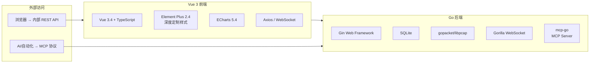

### 用户角色

| 角色 | 权限 | 说明 |
|------|------|------|
| **admin** | 全部 | 用户管理、系统设置、所有功能 |
| **user** | 常规 | 策略/任务/网卡/端口/历史/设置 |
| **guest** | 受限 | 可查看接口/端口/部分信息 |

---

## 2. 系统架构

### 整体架构图

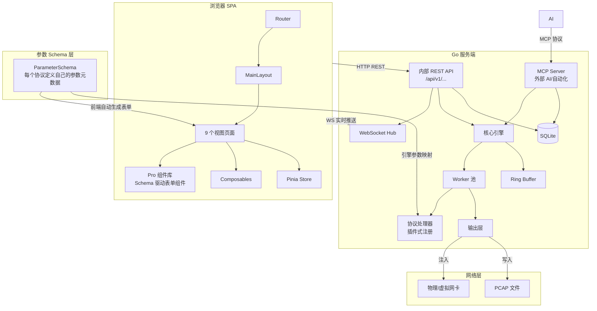

### 流量生成流水线

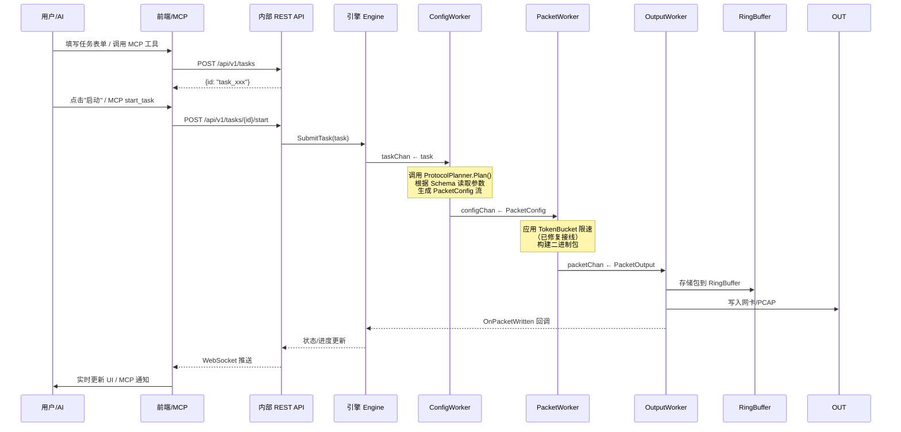

### 前端组件架构（目标）

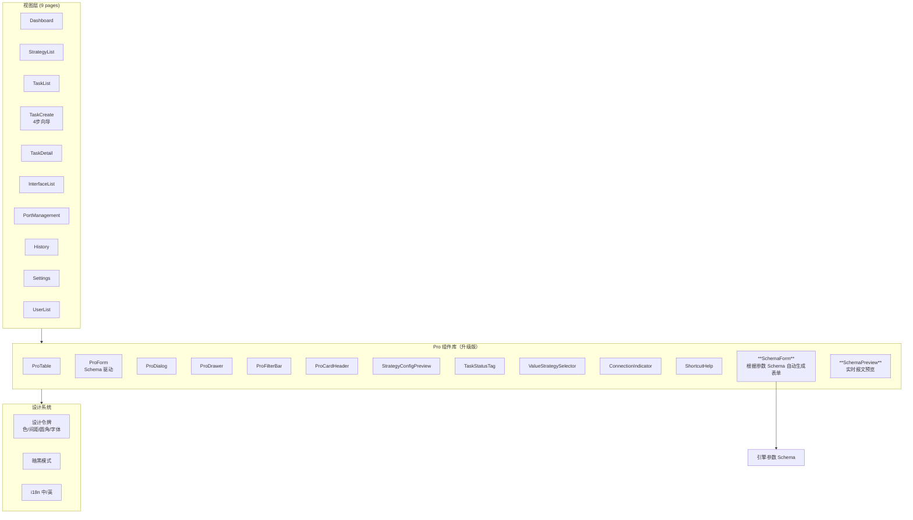

### 目录结构（目标）

```
trafficgen/
├── internal/
│   ├── api/
│   │   ├── rest/          # 内部 REST API（人用）
│   │   │   ├── task_handler.go
│   │   │   ├── strategy_handler.go
│   │   │   ├── auth_handler.go
│   │   │   └── ...
│   │   └── websocket/     # WebSocket Hub
│   ├── mcp/               # MCP Server（AI/自动化用）
│   │   ├── server.go
│   │   ├── tools.go       # MCP 工具定义
│   │   └── handlers.go
│   ├── core/              # 引擎核心
│   │   ├── engine.go
│   │   ├── worker.go
│   │   ├── builder.go
│   │   ├── buffer.go
│   │   └── types.go
│   ├── schema/            # ▲ 新增：参数 Schema 定义
│   │   ├── schema.go      #   ParameterSchema 类型
│   │   └── provider.go    #   SchemaProvider 接口
│   ├── protocol/          # 协议插件（插件式注册）
│   │   ├── protocol.go    #   Registry
│   │   ├── tcp/tcp.go
│   │   ├── udp/udp.go
│   │   ├── http/http.go
│   │   └── ...
│   ├── output/            # 输出层
│   ├── storage/           # 存储层
│   └── ...
```

---

## 3. 页面重设计原则

### 总体原则

| 原则 | 说明 |
|------|------|
| **扁平商务风格** | 干净利落，白底蓝主色，高信息密度，参考 Grafana / 企业后台风格 |
| **高信息密度** | 工具型产品，一屏显示尽可能多有用信息，不做过度留白 |
| **主次分明** | 常用功能显眼、不常用折叠/降级/收起，通过"基础/专家"模式切换 |
| **一致性** | 所有页面共用设计令牌（颜色/间距/圆角/字体），Pro 组件库统一管控 |
| **Schema 驱动** | 引擎参数 Schema 是前端表单的"真理之源"，加参数不改前端 |
| **复用优先** | 能复用组件/样式/逻辑的绝不重写，保证统一修改入口 |

### 设计令牌（Design Tokens）

当前已有 `design-system.css`，在此基础上深化：

| 令牌 | 当前值 | 建议 |
|------|--------|------|
| 主色 `--tg-primary` | `#2563EB` 蓝 | 保持蓝色系（网络工具行业标准色） |
| 页面背景 | `#F8FAFC` 浅灰 | 保持 |
| 卡片背景 | `#FFFFFF` 白 | 保持 |
| 卡片圆角 | `12px` | 保持或微调至 `8px`（更高密度） |
| 成功/警告/危险 | 绿/橙/红 | 保持 |
| 字体 | 系统默认 | 可考虑指定中文字体（如 Noto Sans SC） |

### 基础/专家模式

```
页面默认 → 基础模式
  ├─ 只显示最常用的 5-8 个核心参数（IP、端口、协议类型、包大小）
  ├─ 缺省值自动填充，新手可直接提交
  └─ 每个参数组有一个"展开"按钮

点击"展开全部"或切换到"专家模式"
  ├─ 显示协议的全部底层参数
  ├─ TCP 标志位（SYN/ACK/FIN/PSH/URG/RST）
  ├─ IP 选项（DSCP/ECN/DF/分片偏移）
  ├─ VLAN 详细字段（优先级/DEI）
  └─ 所有参数的完整说明文字
```

---

## 4. 认证系统

### 注册流程

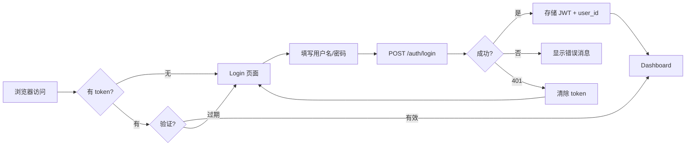

### 安全措施

| 措施 | 实现 |
|------|------|
| 密码加密 | bcrypt 哈希 |
| JWT 认证 | 24h 有效期 + 签发者声明 |
| Token 撤销 | 数据库记录 token_hash + status 字段 |
| 路由守卫 | 前端 beforeEach + 后端 JWT 中间件 |
| 角色中间件 | admin 权限校验 |
| 刷新令牌 | POST /auth/refresh 撤销旧令牌签发新令牌 |

### 功能点

| 功能 | 状态 | 说明 |
|------|------|------|
| 用户注册 | ✅ 完整 | 用户名 3-64 字符，密码 8-128，邮箱验证 |
| 用户登录 | ✅ 完整 | 返回 JWT + 过期时间 |
| Token 验证 | ✅ 完整 | JWT 签名 + 数据库撤销双重校验 |
| Token 刷新 | ✅ 完整 | 旧令牌撤销，新令牌签发 |
| 退出登录 | ✅ 完整 | 令牌标记为 revoked |
| 记住用户名 | ✅ 完整 | localStorage 持久化 |
| 忘记密码 | ⚠️ 部分 | 前端弹窗仅做提示，无邮件发送流程 |
| 用户资料编辑 | ✅ 完整 | 修改邮箱/密码，管理员不可通过 API 修改 |

---

## 5. 仪表盘

### 布局

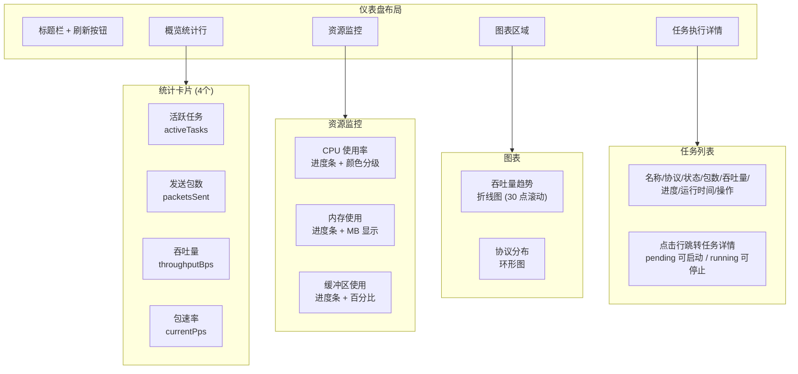

### 功能点

| 功能 | 状态 | 说明 |
|------|------|------|
| 统计卡片 | ✅ 完整 | 活跃任务、发送包数、吞吐量、包速率 |
| 资源监控 | ✅ 完整 | CPU（需修复返回 0 的 bug）/内存/缓冲区，进度条颜色分级 |
| 吞吐量趋势图 | ✅ 完整 | ECharts 折线图，30 点滚动窗口 |
| 协议分布图 | ✅ 完整 | 环形图，自动切换明暗主题 |
| 任务概览表 | ✅ 完整 | 最新 10 个任务，按状态排序 |
| 自动刷新 | ✅ 完整 | 10 秒轮询，tab 隐藏暂停 |
| 暗黑模式适配 | ✅ 完整 | 图表主题切换，CSS 变量 |
| CPU 监控 | ⚠️ 待修复 | 后端始终返回 0 |

---

## 6. 策略管理

### 数据模型

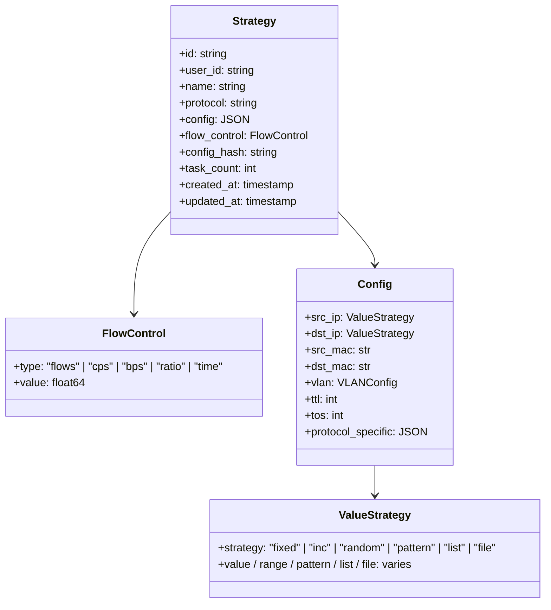

### 支持的协议

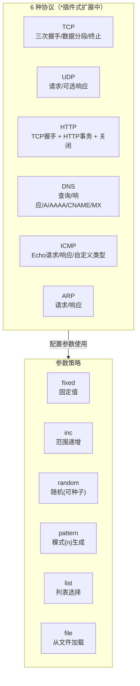

### 配置项详情（当前 + 引擎分析后补充）

| 协议 | 配置项 | 说明 | 优先级 |
|------|--------|------|--------|
| **TCP** | `tcp.handshake` | 是否模拟三次握手 (默认 true) | ✅ 已有 |
| | `tcp.termination` | 是否模拟四次挥手 (默认 true) | ✅ 已有 |
| | `tcp.mss` | 最大分段大小 (默认 1460) | ✅ 已有 |
| | `tcp.window_size` | 窗口大小 (默认 65535) | ✅ 已有 |
| | `tcp.flags` | 自定义 TCP 标志位 (SYN/ACK/FIN/PSH/URG/RST) | ✅ 已有 |
| | `tcp.seq` | 初始序列号 | ➕ 需补 |
| | `tcp.ack` | 初始确认号 | ➕ 需补 |
| | `tcp.options` | TCP 选项 (MSS/SACK/时间戳/WScale) | ➕ 需补 |
| | `tcp.urgent_pointer` | 紧急指针 | ➕ 需补 |
| **UDP** | `udp.response` | 是否生成响应包 (默认 false) | ✅ 已有 |
| | `udp.length` | 长度覆盖 | ➕ 需补 |
| **HTTP** | `http.method` | GET/POST/PUT/DELETE/PATCH/HEAD/OPTIONS | ✅ 已有 |
| | `http.uri` | 请求路径 (支持策略选择器) | ✅ 已有 |
| | `http.headers` | 自定义请求头 (键值对 + 预设) | ✅ 已有 |
| | `http.body` | 请求体 | ✅ 已有 |
| | `http.keep_alive` | 是否保持连接 | ✅ 已有 |
| | `http.transactions` | 事务数 (默认 1) | ✅ 已有 |
| | `http.think_time` | 思考时间 (ms) | ⚠️ 存在但未使用 |
| | `http.response_code` | 响应状态码 | ➕ 需补 |
| | `http.response_body` | 响应体内容 | ➕ 需补 |
| **DNS** | `dns.domain` | 查询域名 | ✅ 已有 |
| | `dns.query_type` | A(1)/AAAA(28)/CNAME(5)/MX(15)/TXT(16) | ✅ 已有 |
| | `dns.response` | 是否生成响应 | ✅ 已有 |
| | `dns.response_ip` | 响应 IP (默认 127.0.0.1) | ✅ 已有 |
| **ICMP** | `icmp.type` | 类型 (默认 8=Echo 请求) | ✅ 已有 |
| | `icmp.code` | 代码 (默认 0) | ✅ 已有 |
| | `icmp.sequence` | 序列号 (默认 1) | ✅ 已有 |
| | `icmp.data` | 自定义数据 (默认 'ping') | ✅ 已有 |
| | `icmp.id` | 标识符 | ➕ 需补 |
| **ARP** | `arp.operation` | 1=请求 / 2=响应 | ✅ 已有 |
| | `arp.target_mac` | 目标 MAC | ✅ 已有 |
| | `arp.target_ip` | 目标 IP | ✅ 已有 |

### 功能点

| 功能 | 状态 | 说明 |
|------|------|------|
| 策略列表 | ✅ 完整 | 含任务计数、协议标签、创建/更新时间 |
| 策略创建 | ✅ 完整 | 基于配置哈希的幂等创建 |
| 策略编辑 | ✅ 完整 | 克隆、编辑、配置更新 |
| 策略删除 | ✅ 完整 | 检查是否被任务引用后删除 |
| 策略复制 | ✅ 完整 | 克隆策略配置 |
| 参数策略选择器 | ⚠️ 部分 | 部分字段未在 ValueStrategySelector 中暴露（需改 Schema 后统一） |
| 策略模板 | ✅ 完整 | 8 个内置模板 |
| 策略配置预览 | ✅ 完整 | StrategyConfigPreview 组件 |
| Schema 驱动参数 | 🔄 待实施 | 引擎参数元数据 → 自动生成配置表单 |

---

## 7. 任务管理

### 任务创建流程（4步向导，保持并重新设计）

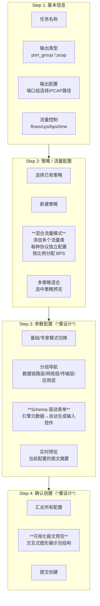

### 第 3 步设计（关键改造）

```
┌──────────────────────────────────────────────────────┐
│ 参数配置                                [基础] [专家] │
├──────────────────────────────────────────────────────┤
│                                                      │
│  ┌─ 网络层 ──────────┐  ┌─ 传输层 ──────────┐      │
│  │ 源 IP      输入框  │  │ 源端口      输入框  │      │
│  │ 目的 IP    输入框  │  │ 目的端口    输入框  │      │
│  │ TTL        64      │  │ TCP 标志     SYN   │      │
│  │ TOS        0       │  │ MSS         1460  │      │
│  │ DF位       ☑ 不分片│  │ Window      65535 │      │
│  │             ☐ 更多分片│                      │      │
│  └────────────────────┘  └────────────────────┘      │
│                                                      │
│  ┌─ 数据链路层 ──────┐  ┌─ 高级 ─────────────┐      │
│  │ 源 MAC     自动   │  │ IP ID        0     │      │
│  │ 目的 MAC   自动   │  │ 分片偏移     0     │      │
│  │ VLAN ID    100    │  │ IP 选项      无    │      │
│  │ VLAN 优先级  0    │  │ TCP 选项     无    │      │
│  └────────────────────┘  └────────────────────┘      │
│                                                      │
│  ┌─ 实时预览 ──────────────────────────────────┐    │
│  │ 即将生成的报文序列：                          │    │
│  │ SYN → SYN-ACK → ACK → DATA(1460B) → FIN    │    │
│  │ src_ip=192.168.1.10 → dst_ip=192.168.1.20   │    │
│  │ tcp: flags=SYN, mss=1460, window=65535      │    │
│  └──────────────────────────────────────────────┘    │
│                                                      │
│  [上一步]                     [下一步：确认]          │
└──────────────────────────────────────────────────────┘
```

### 第 4 步设计（关键改造）

```
┌─────────────────────────────────────────┐
│ 确认创建任务                     [上一步] │
├─────────────────────────────────────────┤
│ ┌─ 基本信息 ─────────────────────────┐  │
│ │ 任务名称: TCP 压力测试               │  │
│ │ 输出: 端口组 [生产网卡]              │  │
│ │ 流量控制: 1000 流                    │  │
│ └────────────────────────────────────┘  │
│ ┌─ 策略: TCP 基准测试 ───────────────┐  │
│ │ 协议: TCP                           │  │
│ │ 源 192.168.1.10:1234               │  │
│ │ 目的 192.168.1.20:80                │  │
│ │ MSS=1460, Window=65535              │  │
│ └────────────────────────────────────┘  │
│                                          │
│  交互式报文预览图                         │
│  ┌──────┐  TCP  ┌──────────┐            │
│  │ 源IP │──────→│  目的IP  │            │
│  └──────┘       └──────────┘            │
│                                          │
│  [取消]              [确认并创建任务]     │
└─────────────────────────────────────────┘
```

### 任务生命周期

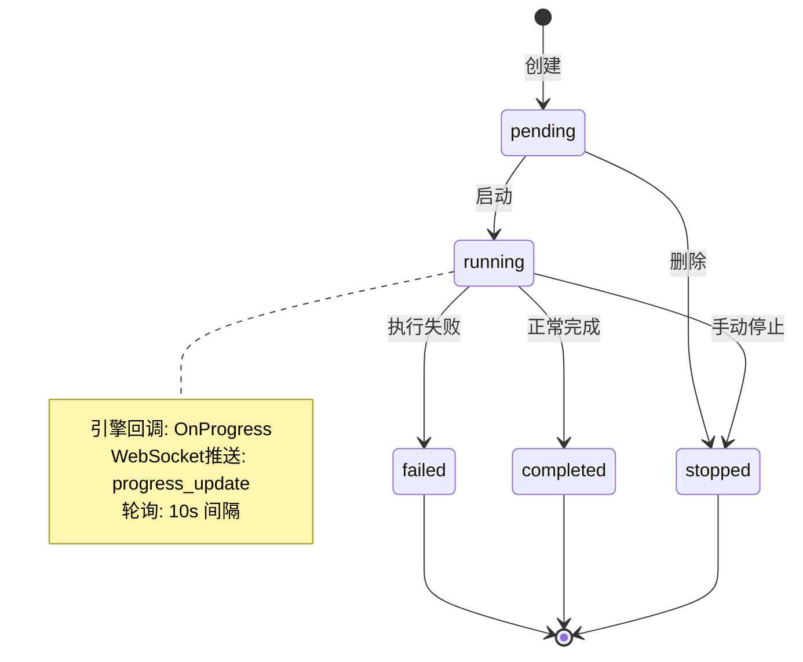

### 任务列表功能

| 功能 | 状态 | 说明 |
|------|------|------|
| 服务端分页 | ✅ 完整 | page/size 参数，每页 1-100，默认 20 |
| 状态筛选 | ✅ 完整 | pending/running/completed/failed/stopped |
| 协议筛选 | ✅ 完整 | TCP/UDP/HTTP/DNS/ICMP/ARP |
| 关键字搜索 | ✅ 完整 | 按名称模糊搜索 |
| 服务端排序 | ✅ 完整 | created_at/updated_at/name/status/progress |
| 批量删除 | ✅ 完整 | 选择 → 批量删除 |
| 批量停止 | ✅ 完整 | 选择 → 批量停止 |
| 任务卡死检测 | ✅ 完整 | 运行 >5 分钟且进度 0% 显示警告 |
| 自动刷新 | ✅ 完整 | 10 秒轮询，有运行任务时 |

### 任务详情页

| 功能 | 状态 | 说明 |
|------|------|------|
| 状态横幅 | ✅ 完整 | 颜色编码左边框 |
| 统计卡片 | ✅ 完整 | 包数/字节/包速率/比特率 |
| 吞吐量图表 | ✅ 完整 | PPS + Mbps 双系列折线图 |
| 策略配置展示 | ✅ 完整 | 所用策略列表 + 配置详情 |
| 错误日志 | ✅ 完整 | 完整错误信息展示 |
| 实时更新 | ✅ 完整 | WebSocket 订阅 + HTTP 轮询回退 |
| 启动/停止/删除 | ✅ 完整 | 上下文敏感操作按钮 |

---

## 8. 网卡管理

### 界面布局

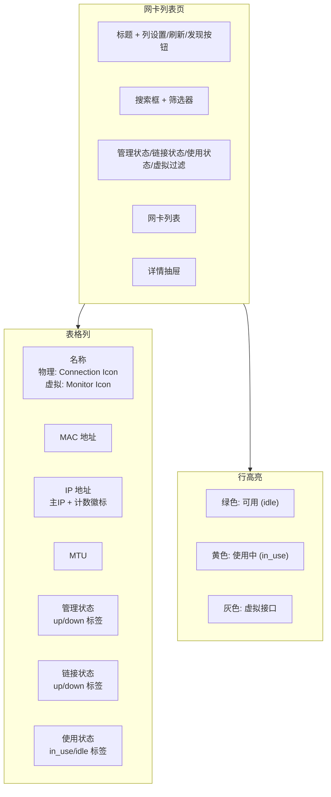

### 功能点

| 功能 | 状态 | 说明 |
|------|------|------|
| 接口列表 | ✅ 完整 | 名称/MAC/IP/MTU/管理/链接/使用状态 |
| 虚拟接口检测 | ✅ 完整 | 名称模式匹配 |
| 接口发现刷新 | ✅ 完整 | POST /interfaces/discover |
| 搜索过滤 | ✅ 完整 | 名称/IP/MAC 搜索 + 状态筛选 |
| 虚拟开关 | ✅ 完整 | 切换显示/隐藏虚拟接口 |
| 活动筛选标签 | ✅ 完整 | 可关闭的筛选标签 |
| 详情抽屉 | ✅ 完整 | 完整信息 + 端口分配列表 |
| 自动刷新 | ✅ 完整 | 30 秒轮询，tab 隐藏暂停 |

---

## 9. 端口管理

### 双 Tab 布局

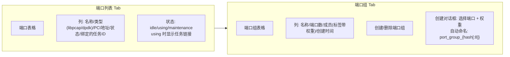

### 功能点

| 功能 | 状态 | 说明 |
|------|------|------|
| 端口列表 | ✅ 完整 | 类型标签、PCI 地址、状态、任务链接 |
| 端口组创建 | ✅ 完整 | 幂等创建 (哈希), 支持权重配置 |
| 端口组删除 | ✅ 完整 | 被任务引用时阻止删除 |
| 端口状态管理 | ✅ 完整 | 任务启动/停止时自动更新状态 |
| 空状态提示 | ✅ 完整 | 无端口时引导到网卡管理 |
| 客户端排序 | ✅ 完整 | 按端口号升序 |
| DPDK 支持 | ⚠️ 部分 | 类型字段和 UI 标签就绪，输出层未实现 |

---

## 10. 历史记录

### 功能点

| 功能 | 状态 | 说明 |
|------|------|------|
| 历史列表 | ✅ 完整 | 已完成/失败/停止/错误的任务 |
| 时间范围筛选 | ✅ 完整 | 今日/昨天/近7天/近30天/自定义 |
| 状态筛选 | ✅ 完整 | completed/failed/stopped/error |
| 服务端排序 | ✅ 完整 | 默认 completed_at DESC |
| 服务端分页 | ✅ 完整 | page/size 参数 |
| CSV 导出 | ✅ 完整 | 含 BOM 的 UTF-8 CSV，Excel 兼容 |
| 历史记录自动写入 | ⚠️ 待修复 | HistoryModel 表存在但未使用，查询直接读 TaskModel |

---

## 11. 系统设置

### 设置项

| 设置项 | 类型 | 范围 | 默认值 | 状态 |
|--------|------|------|--------|------|
| 语言 | 下拉 | zh-CN / en-US | 浏览器检测 | ✅ 完整 |
| 暗黑模式 | 开关 | on/off | 系统偏好 | ✅ 完整 |
| 最大任务数 | 数字 | 1-1000 | 100 | ✅ 完整 |
| 缓冲区大小 | 数字 | 1024-65536 | 4096 | ✅ 完整 |
| 日志级别 | 下拉 | debug/info/warn/error | info | ✅ 完整 |
| 设置持久化 | — | — | — | ⚠️ 待修复（内存存储，重启丢失） |

---

## 12. 用户管理

### 功能点

| 功能 | 状态 | 权限 | 说明 |
|------|------|------|------|
| 用户列表 | ✅ 完整 | admin 仅 | 用户名/邮箱/角色/启用/创建/更新/最后登录 |
| 创建用户 | ✅ 完整 | admin 仅 | 注册 + 角色/状态设置 |
| 编辑用户 | ✅ 完整 | admin 仅 | 角色/启用/邮箱，管理员不可修改 |
| 删除用户 | ✅ 完整 | admin 仅 | 不可删除管理员，支持批量删除 |
| 重置密码 | ✅ 完整 | admin 仅 | 生成 16 字符临时密码 |
| 启用/禁用 | ✅ 完整 | admin 仅 | 内联开关，确认对话框 |
| 角色筛选 | ✅ 完整 | admin 仅 | admin/user/guest 筛选 |
| 用户名搜索 | ✅ 完整 | admin 仅 | 模糊搜索 |

---

## 13. 实时通信

### WebSocket 消息协议

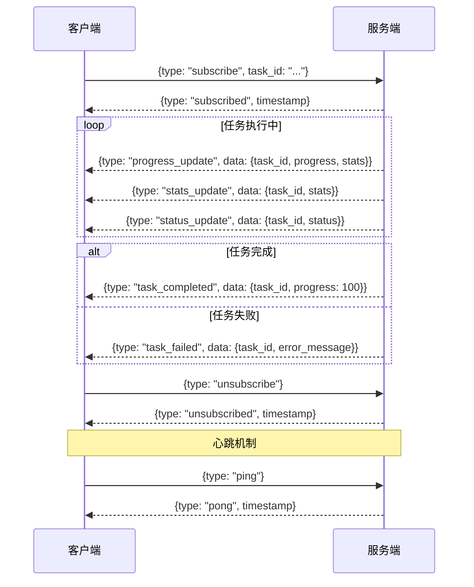

### 连接管理

| 功能 | 状态 | 说明 |
|------|------|------|
| WebSocket 升级 | ✅ 完整 | JWT 通过 query 参数验证 |
| 自动重连 | ✅ 完整 | 10 次尝试，3 秒间隔 |
| 心跳保活 | ✅ 完整 | 30 秒间隔 ping/pong |
| 任务订阅 | ✅ 完整 | 按 task_id 订阅 |
| 消息队列 | ✅ 完整 | 离线消息暂存 |
| HTTP 回退 | ✅ 完整 | WebSocket 失败时切换 HTTP 轮询 |
| 连接状态指示器 | ✅ 完整 | 绿/黄/红 三色状态 |

---

## 14. 流量生成引擎

### 核心流水线

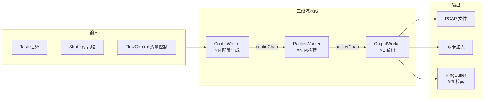

### 引擎参数 Schema 设计（目标）

这是整个重构的核心——通过 Schema 定义让引擎参数标准化，前端自动跟随。

```go
// 每个协议提供参数 Schema
type ParameterSchema struct {
    Name        string      // 参数名，如 "tcp.mss"
    DisplayName string      // 显示名，如 "最大分段大小"
    Type        string      // 类型: "string" | "number" | "bool" | "select" | "ip" | "mac" | "bytes"
    Default     interface{} // 缺省值
    Group       string      // 分组: "网络层" | "传输层" | "TCP高级" | ...
    IsCommon    bool        // true = 基础模式显示, false = 仅专家模式显示
    Required    bool        // 是否必填
    Min         *float64    // 最小值
    Max         *float64    // 最大值
    Options     []string    // 下拉选项（仅 type=select 时）
    Description string      // 说明文字
    Validation  string      // 校验规则: "ipv4" | "ipv6" | "port" | "mac" | ...
}
```

### 流量控制模式

| 模式 | 类型 | 说明 |
|------|------|------|
| **flows** | 总数控制 | 生成 N 个总流/包 |
| **cps** | 速率控制 | 每秒连接/流数 |
| **bps** | 速率控制 | TokenBucket 算法，支持 K/M/G 后缀 |
| **ratio** | 比例 | 0-100，多策略混合使用 |
| **time** | 时间控制 | 持续秒数 |

### 混合流量（核心功能）

> 一个任务内同时运行多种协议流量，按用户设定的比例分配带宽。

```
示例：一个任务 = "模拟真实网络环境"

  流量类 A: TCP 文件传输    60% 带宽
  流量类 B: DNS 域名解析     20% 带宽
  流量类 C: HTTP 网页浏览    15% 带宽
  流量类 D: ICMP 网络探测     5% 带宽

  四类流量同时跑，按 60:20:15:5 分配
```

**引擎层面设计**：

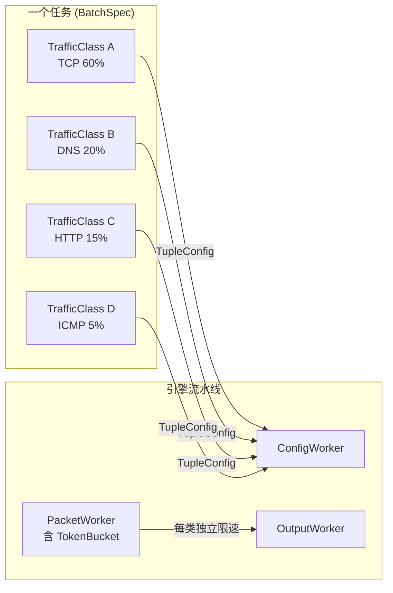

**现有类型复用**（`core/types.go` 已定义）：
- `BatchSpec` — 任务级包装，含 `Classes []TrafficClass`
- `TrafficClass` — 单个流量类（协议类型/BPS/流数/4元组策略/配置）
- `TupleConfig` — 4元组生成策略（src_ip/src_port/dst_ip/dst_port 的 inc/random/pattern）
- `StrategyConfig` — 单个值的生成策略
- `GlobalConfig` — 全局设置（总流数/持续时间）

**前端页面设计**：

```
任务创建 Step 2（策略选择）:

┌─────────────────────────────────────┐
│ 流量配置                              │
│                                      │
│ ┌─ 流量类 1 ──────────────────────┐  │
│ │ 协议: TCP ▼    BPS: 60%         │  │
│ │ 参数: [配置 TCP 参数...]         │  │
│ │ 4元组: src=inc[1-254] dst=fixed │  │
│ └─────────────────────────────────┘  │
│                                      │
│ ┌─ 流量类 2 ──────────────────────┐  │
│ │ 协议: DNS ▼    BPS: 20%         │  │
│ │ 参数: [配置 DNS 参数...]         │  │
│ │ 4元组: src=inc[1-254] dst=fixed │  │
│ └─────────────────────────────────┘  │
│                                      │
│ [+ 添加流量类]                        │
│                                      │
│ 4元组生成策略（全局或每类独立）         │
│ 源IP: [inc 范围 1-254]               │
│ 目的IP: [fixed 192.168.1.1]          │
│ 源端口: [random 1024-65535]          │
│ 目的端口: [fixed 80]                 │
└─────────────────────────────────────┘
```

**实施要点**：
- 每个流量类独立分配 BPS 限速（TokenBucket per class）
- 4元组策略确保每个流量类的包不重复（src_ip 递增避免冲突）
- 引擎按流量类分别创建子任务，共享同一输出
- 总计 BPS = 所有流量类 BPS 之和

### 引擎配置

| 参数 | 默认值 | 说明 |
|------|--------|------|
| config_workers | 4 | 配置生成 worker 数 |
| packet_workers | 8 | 包构建 worker 数 |
| output_workers | 1 | 输出 worker 数 |
| buffer_size | 4096 | RingBuffer 大小 |
| queue_size | 1024 | 内部通道队列大小 |

---

## 15. 外部 API（MCP）

### 设计原则

- **只有一套外部 API**：MCP（Model Context Protocol），供 AI 助手和自动化脚本调用
- **与内部 REST 完全独立**：`internal/mcp/` 目录，与 `internal/api/rest/` 分开
- **共享同一份数据契约**：通过 `internal/schema/` 或 `pkg/contract/` 共享 DTO 定义
- **工具粒度**：每个功能一个大工具，一次传所有参数，适合大模型使用

### 目录结构

```
internal/
├── api/
│   └── rest/         # 内部 REST API（浏览器用）
├── mcp/              # MCP Server（AI/自动化用）
│   ├── server.go     # MCP 服务器启动
│   ├── tools.go      # 工具定义（tools）
│   └── handlers.go   # 工具处理逻辑
├── schema/           # 共享数据契约（可选）
└── ...
```

### MCP 工具清单（目标）

| 工具 | 说明 | 参数 |
|------|------|------|
| `create_task` | 创建并启动流量任务 | 策略ID、输出类型、流量控制、所有协议参数 |
| `stop_task` | 停止任务 | 任务ID |
| `get_task_status` | 查询任务状态 | 任务ID |
| `list_tasks` | 列出所有任务 | 状态筛选、分页 |
| `create_strategy` | 创建策略 | 协议、全部配置参数 |
| `list_strategies` | 列出所有策略 | 协议筛选 |
| `list_interfaces` | 列出网卡 | 无 |
| `list_ports` | 列出端口 | 无 |
| `get_system_status` | 系统状态 | 无 |
| `export_history` | 导出历史 | 时间范围、格式 |
| `manage_users` | 用户管理（admin） | 操作类型、用户信息 |

---

## 16. API 端点一览

### 公开端点（无需认证）

| 方法 | 路径 | 说明 |
|------|------|------|
| GET | `/health` | 健康检查 |
| GET | `/ready` | 就绪检查 |
| GET | `/ws` | WebSocket 升级 |
| GET | `/metrics` | Prometheus 指标 |

### 认证端点

| 方法 | 路径 | 说明 |
|------|------|------|
| POST | `/api/v1/auth/register` | 注册 |
| POST | `/api/v1/auth/login` | 登录 |
| POST | `/api/v1/auth/logout` | 退出 |
| POST | `/api/v1/auth/refresh` | 刷新令牌 |
| GET | `/api/v1/auth/validate` | 验证令牌 |

### 策略端点

| 方法 | 路径 | 说明 |
|------|------|------|
| GET | `/api/v1/strategies` | 策略列表 |
| POST | `/api/v1/strategies` | 创建策略 |
| GET | `/api/v1/strategies/:id` | 获取策略 |
| PUT | `/api/v1/strategies/:id` | 更新策略 |
| DELETE | `/api/v1/strategies/:id` | 删除策略 |
| GET | `/api/v1/strategies/:id/tasks` | 策略关联任务 |

### 任务端点

| 方法 | 路径 | 说明 |
|------|------|------|
| GET | `/api/v1/tasks` | 任务列表 (分页/排序/筛选) |
| POST | `/api/v1/tasks` | 创建任务 |
| GET | `/api/v1/tasks/:id` | 任务详情 |
| POST | `/api/v1/tasks/:id/start` | 启动任务 |
| POST | `/api/v1/tasks/:id/stop` | 停止任务 |
| DELETE | `/api/v1/tasks/:id` | 删除任务 |
| GET | `/api/v1/history` | 历史记录 |

### 系统端点

| 方法 | 路径 | 说明 |
|------|------|------|
| GET | `/api/v1/system/status` | 系统状态 |
| GET | `/api/v1/system/protocols` | 支持协议列表 |
| GET | `/api/v1/system/stats` | 引擎统计 |
| GET | `/api/v1/interfaces` | 网卡列表 |
| POST | `/api/v1/interfaces/discover` | 网卡发现 |
| GET | `/api/v1/ports` | 端口列表 |
| GET | `/api/v1/port-groups` | 端口组列表 |
| GET | `/api/v1/port-groups/:id` | 端口组详情 |
| POST | `/api/v1/port-groups` | 创建端口组 |
| DELETE | `/api/v1/port-groups/:id` | 删除端口组 |
| GET | `/api/v1/settings` | 获取设置 |
| PUT | `/api/v1/settings` | 更新设置 |

### 管理端点（admin only）

| 方法 | 路径 | 说明 |
|------|------|------|
| GET | `/api/v1/users` | 用户列表 |
| GET | `/api/v1/users/:id` | 用户详情 |
| PUT | `/api/v1/users/:id` | 更新用户 |
| DELETE | `/api/v1/users/:id` | 删除用户 |
| POST | `/api/v1/users/:id/reset-password` | 重置密码 |

---

## 17. 当前状态评估

### 功能完整度


### 已知缺陷

| 缺陷 | 严重性 | 说明 |
|------|--------|------|
| 🔴 CPU 监控未实现 | 中 | GetStatus 始终返回 0 |
| 🔴 设置不持久化 | 中 | 重启后所有设置丢失 |
| 🔴 历史记录表未使用 | 中 | HistoryModel 存在但查询读 TaskModel |
| 🔴 速率限制未接线 | 高 | TokenBucket 创建为 rate=0（不限速），BPS 设置不生效 |
| 🔴 混合流量未实现 | 高 | BatchSpec/TrafficClass 类型已定义，引擎尚未接入 |
| 🟡 Prometheus 指标未采集 | 中 | 指标声明了但从未在引擎中记录 |
| 🟡 多 PacketWorker 乱序 | 中 | 只适用于单 worker |
| 🟢 PCAP 旋转不清理 | 低 | 旧文件永远不会删除 |
| 🟢 RBAC 权限系统未用 | 低 | DefaultRBAC 定义了但中间件直接查 role |
| 🟢 Redis 缓存未接入 | 低 | 缓存基础设施就绪但无代码使用 |
| 🟢 DPDK 输出未实现 | 低 | 类型字段和 UI 就绪，输出层缺失 |
| 🟢 端口分配 DB 表未用 | 低 | 使用内存 map 而非 DB 表 |

---

## 18. 后续优化方向

> 详细的分阶段实施计划、代码位置、修复方案见 [`docs/engine-analysis.md` §8 修复优先级建议](./engine-analysis.md#8-修复优先级建议)。
> 以下为高层路线图摘要。

### Phase 1: 修 bug + 补基础（1-2 周）

```
P0 - 必须立刻修复:
  ├─ 速率限制接线 (engine.go:193)
  ├─ CPU 监控 (system.go)
  └─ Settings 持久化 (settings_handler.go)

P0.5 - 核心功能（混合流量，必做）:
  ├─ 混合流量引擎 (BatchSpec/TrafficClass 接入引擎流水线)
  ├─ 4元组生成策略 (inc/random/pattern 用于 src/dst IP/port)
  ├─ 每类独立 BPS 限速 (TokenBucket per TrafficClass)
  └─ 前端混合流量配置界面 (Step 2 扩展为流量类配置)

P1 - 专业必备:
  ├─ DSCP/ECN 独立控制
  ├─ TCP 数据偏移支持选项
  ├─ 参数验证增强
  └─ HTTP 响应自定义
```

### Phase 2: IPv6 + Schema 化（2-3 周）

```
P2 - IPv6 全链路: 见 docs/ipv6-migration.md
P3 - Schema 驱动: 见 docs/engine-analysis.md §5.2
```

### Phase 3: 协议扩展 + 引擎增强（3-4 周）

```
P4 - 插件化协议注册
P5 - 引擎能力扩展 (resequencing / MTU 检查 / PCAP 重放)
```

### Phase 4: MCP + 高级功能（持续迭代）

```
P6 - MCP 实现（具体需求后续沟通）
P7 - 流量场景模板
P8 - 输出增强 (pcapng / 旋转清理)
```

### 两份文档的关系

| 文档 | 定位 | 回答的问题 |
|------|------|-----------|
| `docs/requirements.md`（本文档） | **需求规格** | 我们决定做什么、做成什么样 |
| `docs/engine-analysis.md` | **现状分析** | 引擎现状如何、为什么需要改、具体改哪里 |

- 本文档定义**目标状态**和**决策**
- 引擎分析报告记录**当前状态**和**技术细节**
- 实施时以本文档的需求为准，具体代码改动点参考引擎分析报告

---

*文档状态：已确认。以上需求基于代码审查、引擎深度分析和讨论决策写入。*