# FlowB — 功能需求确认文档

> 项目名称：FlowB（流量生成器 Flow Builder）
> 版本：v1.5 | 日期：2026-08-19 | 状态：已确认（新增协议级双视角对抗审查、原子用例颗粒度和逐协议修复闭环；PCAP 回放/资源管理/解析引擎需求见 §15-§17）

---

## 目录

1. [项目概览](#1-项目概览)
2. [系统架构](#2-系统架构)
3. [页面重设计原则](#3-页面重设计原则)
4. [认证系统](#4-认证系统)
5. [仪表盘](#5-仪表盘)
6. [策略管理](#6-策略管理)
7. [任务管理](#7-任务管理)
8. [网卡管理](#8-网卡管理)
9. [端口管理](#9-端口管理)
10. [历史记录](#10-历史记录)
11. [系统设置](#11-系统设置)
12. [用户管理](#12-用户管理)
13. [实时通信](#13-实时通信)
14. [流量生成引擎](#14-流量生成引擎)
15. [PCAP 资产管理](#15-pcap-资产管理)
16. [PCAP 回放](#16-pcap-回放)
17. [PCAP 解析引擎](#17-pcap-解析引擎)
18. [外部 API（MCP）](#18-外部-apimcp)
19. [API 端点一览](#19-api-端点一览)
20. [当前状态评估](#20-当前状态评估)
21. [后续优化方向](#21-后续优化方向)

---

## 1. 项目概览

### 一句话

> 面向网络工程师的**高性能网络流量生成器 FlowB**，通过 Web 管理界面配置多协议网络流量，经 Go 引擎生成实时数据包，支持网卡注入或 PCAP 文件输出，并提供 MCP 协议供 AI/自动化工具调用。

### 已确认的决策

以下决策已在讨论中确认，写入本需求文档：

| # | 决策 | 确认 |
|---|------|------|
| 1 | **项目名称：FlowB**（Flow Builder） | ✅ |
| 2 | **"流"的定义**：一个流 = 一次完整通信过程（如 TCP 有 SYN→SYN-ACK→ACK→数据→挥手），用户能控制每个 TCP 标志位、每个 IP 选项、每个 VLAN 字段 | ✅ |
| 3 | **基础/专家模式**：只在页面层面。引擎永远支持全部参数，页面默认显示常用参数，展开显示全部 | ✅ |
| 4 | **Schema 驱动表单**：引擎参数带元数据描述（名称/类型/缺省值/分组/是否常用/校验规则），前端根据 Schema 自动生成表单 | ✅ |
| 5 | **IPv4 + IPv6 双栈支持** | ✅ |
| 6 | **参数精细度**：B 级——网络工程师需要的专业参数都要有，不追求每个比特位但专业够用 | ✅ |
| 7 | **现有引擎 bug 重构时一并修复**（速率限制未接线、CPU 监控返回 0、设置不持久化、多 worker 乱序、HistoryModel 表未使用等） | ✅ |
| 8 | **插件式协议注册**：一个协议成功实现后再加下一个，通过 Registry 统一管理 | ✅ |
| 9 | **Python 遗留引擎**：标记为历史参考，保留但不动 | ✅ 已标记 |
| 10 | **保留 Element Plus（按钮/表格/弹窗等 UI 零件）** + 深度定制样式（设计令牌改色/圆角/间距） | ✅ |
| 11 | **设计风格**：扁平商务 + 高信息密度，参考企业后台工具（如 Grafana） | ✅ |
| 12 | **外部 API 只有 MCP 一套**，内部 REST 和 MCP 代码目录完全分开 | ✅ |
| 13 | **MCP 工具粒度**：每个功能一个大工具，一次传所有参数，适合大模型调用 | ✅（MCP 具体需求后续沟通） |
| 14 | **目录结构**：`internal/api/rest/`（内部 REST）和 `internal/mcp/`（MCP Server）完全独立 | ✅ |
| 15 | **页面全面重做**：当前只能算"能用"，全部翻新 | ✅ |
| 16 | **混合流量（BatchSpec）**：必做。一个任务内多种协议按比例分配带宽 | ✅ |
| 17 | **PCAP 回放**：读 pcap -> 按需改写 L2-L4 -> 回放（网卡/pcap），支持多流放大与双口分流。详见 §16 | ✅ |
| 18 | **PCAP 资产管理**：pcap 导入/查询/删除 + 校验控制，导入时全量解析预提取。详见 §15 | ✅ |
| 19 | **PCAP 解析引擎**：独立模块，全层（L2-L7 含应用层）解析，导入时预提取。详见 §17 | ✅ |
| 20 | **回放即策略**：pcap 回放作为 `TrafficClass.Type="replay"` 与 `Strategy(protocol="replay")`，与合成流量统一管理 | ✅ |
| 21 | **回放保真**：默认忠实回放，不修正异常包；校验和默认重算、支持保持。详见 §16.10 | ✅ |

### 技术栈

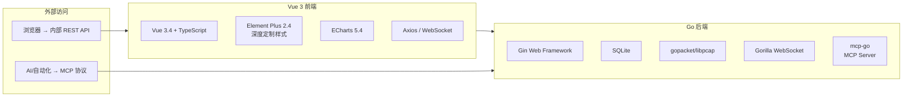

### 用户角色

| 角色 | 权限 | 说明 |
|------|------|------|
| **admin** | 全部 | 用户管理、系统设置、所有功能 |
| **user** | 常规 | 策略/任务/网卡/端口/历史/设置 |
| **guest** | 受限 | 可查看接口/端口/部分信息 |

---

## 2. 系统架构

### 整体架构图

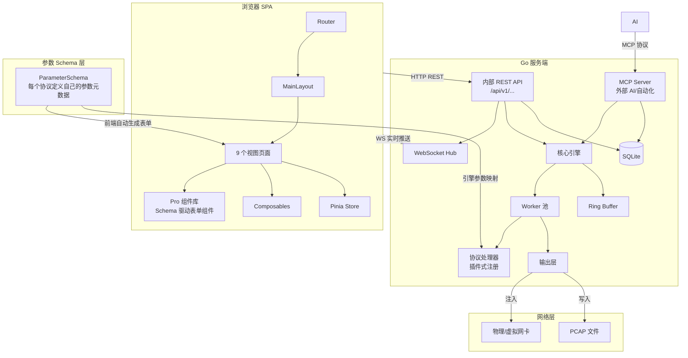

### 流量生成流水线

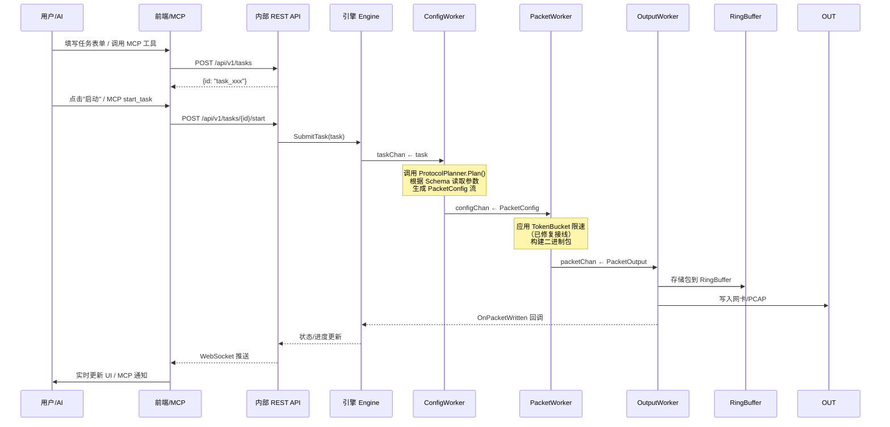

### 前端组件架构（目标）

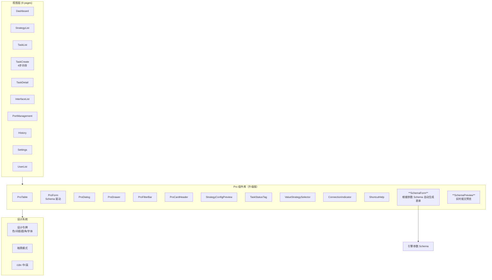

### 目录结构（目标）

```
trafficgen/
├── internal/
│   ├── api/
│   │   ├── rest/          # 内部 REST API（人用）
│   │   │   ├── task_handler.go
│   │   │   ├── strategy_handler.go
│   │   │   ├── auth_handler.go
│   │   │   └── ...
│   │   └── websocket/     # WebSocket Hub
│   ├── mcp/               # MCP Server（AI/自动化用）
│   │   ├── server.go
│   │   ├── tools.go       # MCP 工具定义
│   │   └── handlers.go
│   ├── core/              # 引擎核心
│   │   ├── engine.go
│   │   ├── worker.go
│   │   ├── builder.go
│   │   ├── buffer.go
│   │   └── types.go
│   ├── schema/            # ▲ 新增：参数 Schema 定义
│   │   ├── schema.go      #   ParameterSchema 类型
│   │   └── provider.go    #   SchemaProvider 接口
│   ├── protocol/          # 协议插件（插件式注册）
│   │   ├── protocol.go    #   Registry
│   │   ├── tcp/tcp.go
│   │   ├── udp/udp.go
│   │   ├── http/http.go
│   │   └── ...
│   ├── output/            # 输出层
│   ├── storage/           # 存储层
│   └── ...
```

---

## 3. 页面重设计原则

### 总体原则

| 原则 | 说明 |
|------|------|
| **扁平商务风格** | 干净利落，白底蓝主色，高信息密度，参考 Grafana / 企业后台风格 |
| **高信息密度** | 工具型产品，一屏显示尽可能多有用信息，不做过度留白 |
| **主次分明** | 常用功能显眼、不常用折叠/降级/收起，通过"基础/专家"模式切换 |
| **一致性** | 所有页面共用设计令牌（颜色/间距/圆角/字体），Pro 组件库统一管控 |
| **Schema 驱动** | 引擎参数 Schema 是前端表单的"真理之源"，加参数不改前端 |
| **复用优先** | 能复用组件/样式/逻辑的绝不重写，保证统一修改入口 |

### 设计令牌（Design Tokens）

当前已有 `design-system.css`，在此基础上深化：

| 令牌 | 当前值 | 建议 |
|------|--------|------|
| 主色 `--tg-primary` | `#2563EB` 蓝 | 保持蓝色系（网络工具行业标准色） |
| 页面背景 | `#F8FAFC` 浅灰 | 保持 |
| 卡片背景 | `#FFFFFF` 白 | 保持 |
| 卡片圆角 | `12px` | 保持或微调至 `8px`（更高密度） |
| 成功/警告/危险 | 绿/橙/红 | 保持 |
| 字体 | 系统默认 | 可考虑指定中文字体（如 Noto Sans SC） |

### 基础/专家模式

```
页面默认 → 基础模式
  ├─ 只显示最常用的 5-8 个核心参数（IP、端口、协议类型、包大小）
  ├─ 缺省值自动填充，新手可直接提交
  └─ 每个参数组有一个"展开"按钮

点击"展开全部"或切换到"专家模式"
  ├─ 显示协议的全部底层参数
  ├─ TCP 标志位（SYN/ACK/FIN/PSH/URG/RST）
  ├─ IP 选项（DSCP/ECN/DF/分片偏移）
  ├─ VLAN 详细字段（优先级/DEI）
  └─ 所有参数的完整说明文字
```

---

## 4. 认证系统

### 注册流程

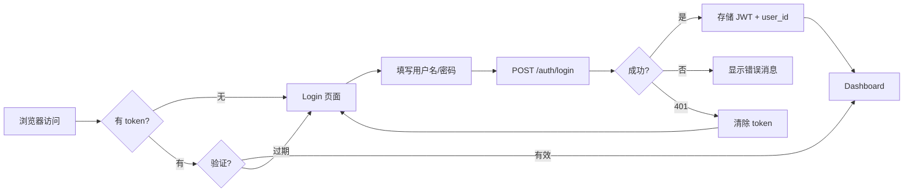

### 安全措施

| 措施 | 实现 |
|------|------|
| 密码加密 | bcrypt 哈希 |
| JWT 认证 | 24h 有效期 + 签发者声明 |
| Token 撤销 | 数据库记录 token_hash + status 字段 |
| 路由守卫 | 前端 beforeEach + 后端 JWT 中间件 |
| 角色中间件 | admin 权限校验 |
| 刷新令牌 | POST /auth/refresh 撤销旧令牌签发新令牌 |

### 功能点

| 功能 | 状态 | 说明 |
|------|------|------|
| 用户注册 | ✅ 完整 | 用户名 3-64 字符，密码 8-128，邮箱验证 |
| 用户登录 | ✅ 完整 | 返回 JWT + 过期时间 |
| Token 验证 | ✅ 完整 | JWT 签名 + 数据库撤销双重校验 |
| Token 刷新 | ✅ 完整 | 旧令牌撤销，新令牌签发 |
| 退出登录 | ✅ 完整 | 令牌标记为 revoked |
| 记住用户名 | ✅ 完整 | localStorage 持久化 |
| 忘记密码 | ⚠️ 部分 | 前端弹窗仅做提示，无邮件发送流程 |
| 用户资料编辑 | ✅ 完整 | 修改邮箱/密码，管理员不可通过 API 修改 |

---

## 5. 仪表盘

### 布局

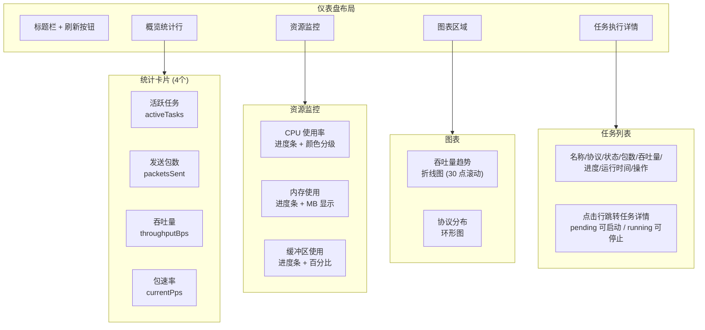

### 功能点

| 功能 | 状态 | 说明 |
|------|------|------|
| 统计卡片 | ✅ 完整 | 活跃任务、发送包数、吞吐量、包速率 |
| 资源监控 | ✅ 完整 | CPU（需修复返回 0 的 bug）/内存/缓冲区，进度条颜色分级 |
| 吞吐量趋势图 | ✅ 完整 | ECharts 折线图，30 点滚动窗口 |
| 协议分布图 | ✅ 完整 | 环形图，自动切换明暗主题 |
| 任务概览表 | ✅ 完整 | 最新 10 个任务，按状态排序 |
| 自动刷新 | ✅ 完整 | 10 秒轮询，tab 隐藏暂停 |
| 暗黑模式适配 | ✅ 完整 | 图表主题切换，CSS 变量 |
| CPU 监控 | ⚠️ 待修复 | 后端始终返回 0 |

---

## 6. 策略管理

### 数据模型

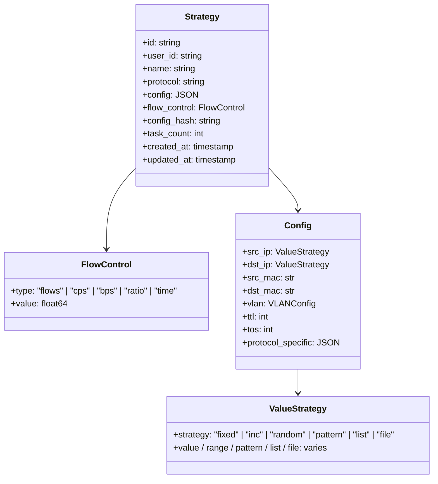

### 支持的协议

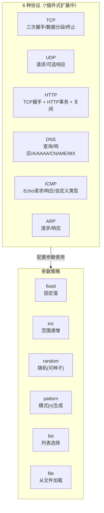

### 配置项详情（当前 + 引擎分析后补充）

| 协议 | 配置项 | 说明 | 优先级 |
|------|--------|------|--------|
| **TCP** | `tcp.handshake` | 是否模拟三次握手 (默认 true) | ✅ 已有 |
| | `tcp.termination` | 是否模拟四次挥手 (默认 true) | ✅ 已有 |
| | `tcp.mss` | 最大分段大小 (默认 1460) | ✅ 已有 |
| | `tcp.window_size` | 窗口大小 (默认 65535) | ✅ 已有 |
| | `tcp.flags` | 自定义 TCP 标志位 (SYN/ACK/FIN/PSH/URG/RST) | ✅ 已有 |
| | `tcp.seq` | 初始序列号 | ➕ 需补 |
| | `tcp.ack` | 初始确认号 | ➕ 需补 |
| | `tcp.options` | TCP 选项 (MSS/SACK/时间戳/WScale) | ➕ 需补 |
| | `tcp.urgent_pointer` | 紧急指针 | ➕ 需补 |
| **UDP** | `udp.response` | 是否生成响应包 (默认 false) | ✅ 已有 |
| | `udp.length` | 长度覆盖 | ➕ 需补 |
| **HTTP** | `http.method` | GET/POST/PUT/DELETE/PATCH/HEAD/OPTIONS | ✅ 已有 |
| | `http.uri` | 请求路径 (支持策略选择器) | ✅ 已有 |
| | `http.headers` | 自定义请求头 (键值对 + 预设) | ✅ 已有 |
| | `http.body` | 请求体 | ✅ 已有 |
| | `http.keep_alive` | 是否保持连接 | ✅ 已有 |
| | `http.transactions` | 事务数 (默认 1) | ✅ 已有 |
| | `http.think_time` | 思考时间 (ms) | ⚠️ 存在但未使用 |
| | `http.response_code` | 响应状态码 | ➕ 需补 |
| | `http.response_body` | 响应体内容 | ➕ 需补 |
| **DNS** | `dns.domain` | 查询域名 | ✅ 已有 |
| | `dns.query_type` | A(1)/AAAA(28)/CNAME(5)/MX(15)/TXT(16) | ✅ 已有 |
| | `dns.response` | 是否生成响应 | ✅ 已有 |
| | `dns.response_ip` | 响应 IP (默认 127.0.0.1) | ✅ 已有 |
| **ICMP** | `icmp.type` | 类型 (默认 8=Echo 请求) | ✅ 已有 |
| | `icmp.code` | 代码 (默认 0) | ✅ 已有 |
| | `icmp.sequence` | 序列号 (默认 1) | ✅ 已有 |
| | `icmp.data` | 自定义数据 (默认 'ping') | ✅ 已有 |
| | `icmp.id` | 标识符 | ➕ 需补 |
| **ARP** | `arp.operation` | 1=请求 / 2=响应 | ✅ 已有 |
| | `arp.target_mac` | 目标 MAC | ✅ 已有 |
| | `arp.target_ip` | 目标 IP | ✅ 已有 |

### 功能点

| 功能 | 状态 | 说明 |
|------|------|------|
| 策略列表 | ✅ 完整 | 含任务计数、协议标签、创建/更新时间 |
| 策略创建 | ✅ 完整 | 基于配置哈希的幂等创建 |
| 策略编辑 | ✅ 完整 | 克隆、编辑、配置更新 |
| 策略删除 | ✅ 完整 | 检查是否被任务引用后删除 |
| 策略复制 | ✅ 完整 | 克隆策略配置 |
| 参数策略选择器 | ⚠️ 部分 | 部分字段未在 ValueStrategySelector 中暴露（需改 Schema 后统一） |
| 策略模板 | ✅ 完整 | 8 个内置模板 |
| 策略配置预览 | ✅ 完整 | StrategyConfigPreview 组件 |
| Schema 驱动参数 | 🔄 待实施 | 引擎参数元数据 → 自动生成配置表单 |

---

## 7. 任务管理

### 任务创建流程（4步向导，保持并重新设计）

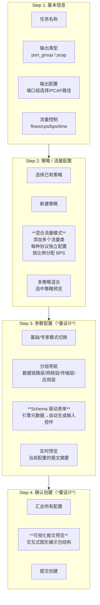

### 第 3 步设计（关键改造）

```
┌──────────────────────────────────────────────────────┐
│ 参数配置                                [基础] [专家] │
├──────────────────────────────────────────────────────┤
│                                                      │
│  ┌─ 网络层 ──────────┐  ┌─ 传输层 ──────────┐      │
│  │ 源 IP      输入框  │  │ 源端口      输入框  │      │
│  │ 目的 IP    输入框  │  │ 目的端口    输入框  │      │
│  │ TTL        64      │  │ TCP 标志     SYN   │      │
│  │ TOS        0       │  │ MSS         1460  │      │
│  │ DF位       ☑ 不分片│  │ Window      65535 │      │
│  │             ☐ 更多分片│                      │      │
│  └────────────────────┘  └────────────────────┘      │
│                                                      │
│  ┌─ 数据链路层 ──────┐  ┌─ 高级 ─────────────┐      │
│  │ 源 MAC     自动   │  │ IP ID        0     │      │
│  │ 目的 MAC   自动   │  │ 分片偏移     0     │      │
│  │ VLAN ID    100    │  │ IP 选项      无    │      │
│  │ VLAN 优先级  0    │  │ TCP 选项     无    │      │
│  └────────────────────┘  └────────────────────┘      │
│                                                      │
│  ┌─ 实时预览 ──────────────────────────────────┐    │
│  │ 即将生成的报文序列：                          │    │
│  │ SYN → SYN-ACK → ACK → DATA(1460B) → FIN    │    │
│  │ src_ip=192.168.1.10 → dst_ip=192.168.1.20   │    │
│  │ tcp: flags=SYN, mss=1460, window=65535      │    │
│  └──────────────────────────────────────────────┘    │
│                                                      │
│  [上一步]                     [下一步：确认]          │
└──────────────────────────────────────────────────────┘
```

### 第 4 步设计（关键改造）

```
┌─────────────────────────────────────────┐
│ 确认创建任务                     [上一步] │
├─────────────────────────────────────────┤
│ ┌─ 基本信息 ─────────────────────────┐  │
│ │ 任务名称: TCP 压力测试               │  │
│ │ 输出: 端口组 [生产网卡]              │  │
│ │ 流量控制: 1000 流                    │  │
│ └────────────────────────────────────┘  │
│ ┌─ 策略: TCP 基准测试 ───────────────┐  │
│ │ 协议: TCP                           │  │
│ │ 源 192.168.1.10:1234               │  │
│ │ 目的 192.168.1.20:80                │  │
│ │ MSS=1460, Window=65535              │  │
│ └────────────────────────────────────┘  │
│                                          │
│  交互式报文预览图                         │
│  ┌──────┐  TCP  ┌──────────┐            │
│  │ 源IP │──────→│  目的IP  │            │
│  └──────┘       └──────────┘            │
│                                          │
│  [取消]              [确认并创建任务]     │
└─────────────────────────────────────────┘
```

### 任务生命周期

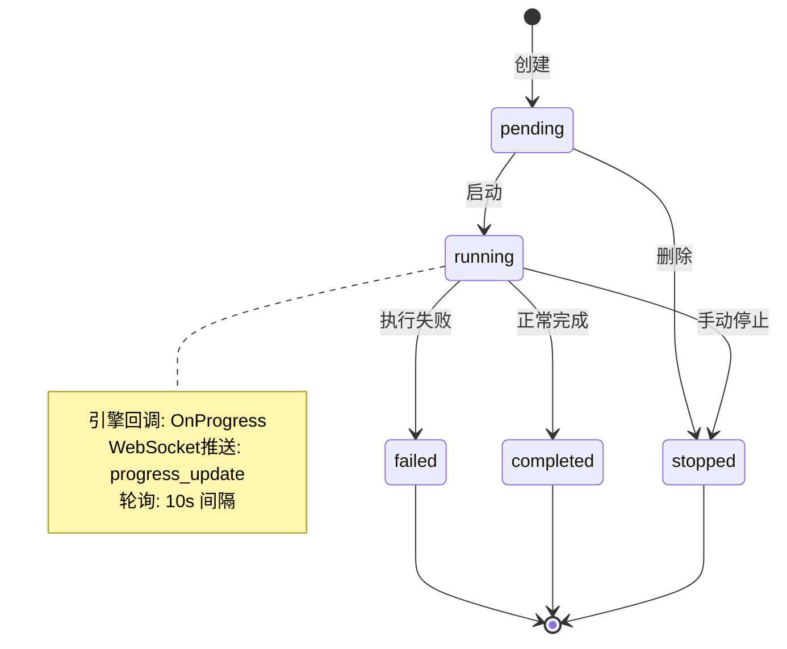

### 任务列表功能

| 功能 | 状态 | 说明 |
|------|------|------|
| 服务端分页 | ✅ 完整 | page/size 参数，每页 1-100，默认 20 |
| 状态筛选 | ✅ 完整 | pending/running/completed/failed/stopped |
| 协议筛选 | ✅ 完整 | TCP/UDP/HTTP/DNS/ICMP/ARP |
| 关键字搜索 | ✅ 完整 | 按名称模糊搜索 |
| 服务端排序 | ✅ 完整 | created_at/updated_at/name/status/progress |
| 批量删除 | ✅ 完整 | 选择 → 批量删除 |
| 批量停止 | ✅ 完整 | 选择 → 批量停止 |
| 任务卡死检测 | ✅ 完整 | 运行 >5 分钟且进度 0% 显示警告 |
| 自动刷新 | ✅ 完整 | 10 秒轮询，有运行任务时 |

### 任务详情页

| 功能 | 状态 | 说明 |
|------|------|------|
| 状态横幅 | ✅ 完整 | 颜色编码左边框 |
| 统计卡片 | ✅ 完整 | 包数/字节/包速率/比特率 |
| 吞吐量图表 | ✅ 完整 | PPS + Mbps 双系列折线图 |
| 策略配置展示 | ✅ 完整 | 所用策略列表 + 配置详情 |
| 错误日志 | ✅ 完整 | 完整错误信息展示 |
| 实时更新 | ✅ 完整 | WebSocket 订阅 + HTTP 轮询回退 |
| 启动/停止/删除 | ✅ 完整 | 上下文敏感操作按钮 |

---

## 8. 网卡管理

### 界面布局

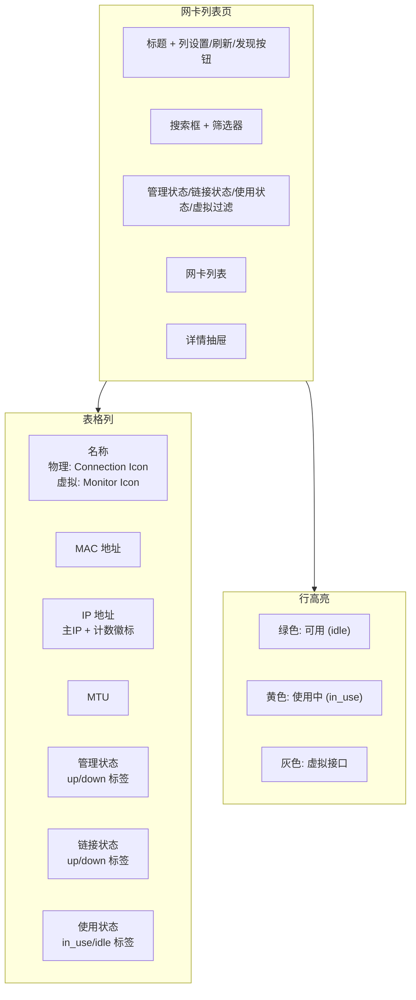

### 功能点

| 功能 | 状态 | 说明 |
|------|------|------|
| 接口列表 | ✅ 完整 | 名称/MAC/IP/MTU/管理/链接/使用状态 |
| 虚拟接口检测 | ✅ 完整 | 名称模式匹配 |
| 接口发现刷新 | ✅ 完整 | POST /interfaces/discover |
| 搜索过滤 | ✅ 完整 | 名称/IP/MAC 搜索 + 状态筛选 |
| 虚拟开关 | ✅ 完整 | 切换显示/隐藏虚拟接口 |
| 活动筛选标签 | ✅ 完整 | 可关闭的筛选标签 |
| 详情抽屉 | ✅ 完整 | 完整信息 + 端口分配列表 |
| 自动刷新 | ✅ 完整 | 30 秒轮询，tab 隐藏暂停 |

---

## 9. 端口管理

### 双 Tab 布局

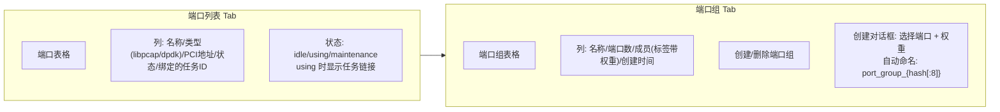

### 功能点

| 功能 | 状态 | 说明 |
|------|------|------|
| 端口列表 | ✅ 完整 | 类型标签、PCI 地址、状态、任务链接 |
| 端口组创建 | ✅ 完整 | 幂等创建 (哈希), 支持权重配置 |
| 端口组删除 | ✅ 完整 | 被任务引用时阻止删除 |
| 端口状态管理 | ✅ 完整 | 任务启动/停止时自动更新状态 |
| 空状态提示 | ✅ 完整 | 无端口时引导到网卡管理 |
| 客户端排序 | ✅ 完整 | 按端口号升序 |
| DPDK 支持 | ⚠️ 部分 | 类型字段和 UI 标签就绪，输出层未实现 |

---

## 10. 历史记录

### 功能点

| 功能 | 状态 | 说明 |
|------|------|------|
| 历史列表 | ✅ 完整 | 已完成/失败/停止/错误的任务 |
| 时间范围筛选 | ✅ 完整 | 今日/昨天/近7天/近30天/自定义 |
| 状态筛选 | ✅ 完整 | completed/failed/stopped/error |
| 服务端排序 | ✅ 完整 | 默认 completed_at DESC |
| 服务端分页 | ✅ 完整 | page/size 参数 |
| CSV 导出 | ✅ 完整 | 含 BOM 的 UTF-8 CSV，Excel 兼容 |
| 历史记录自动写入 | ⚠️ 待修复 | HistoryModel 表存在但未使用，查询直接读 TaskModel |

---

## 11. 系统设置

### 设置项

| 设置项 | 类型 | 范围 | 默认值 | 状态 |
|--------|------|------|--------|------|
| 语言 | 下拉 | zh-CN / en-US | 浏览器检测 | ✅ 完整 |
| 暗黑模式 | 开关 | on/off | 系统偏好 | ✅ 完整 |
| 最大任务数 | 数字 | 1-1000 | 100 | ✅ 完整 |
| 缓冲区大小 | 数字 | 1024-65536 | 4096 | ✅ 完整 |
| 日志级别 | 下拉 | debug/info/warn/error | info | ✅ 完整 |
| 设置持久化 | — | — | — | ⚠️ 待修复（内存存储，重启丢失） |

---

## 12. 用户管理

### 功能点

| 功能 | 状态 | 权限 | 说明 |
|------|------|------|------|
| 用户列表 | ✅ 完整 | admin 仅 | 用户名/邮箱/角色/启用/创建/更新/最后登录 |
| 创建用户 | ✅ 完整 | admin 仅 | 注册 + 角色/状态设置 |
| 编辑用户 | ✅ 完整 | admin 仅 | 角色/启用/邮箱，管理员不可修改 |
| 删除用户 | ✅ 完整 | admin 仅 | 不可删除管理员，支持批量删除 |
| 重置密码 | ✅ 完整 | admin 仅 | 生成 16 字符临时密码 |
| 启用/禁用 | ✅ 完整 | admin 仅 | 内联开关，确认对话框 |
| 角色筛选 | ✅ 完整 | admin 仅 | admin/user/guest 筛选 |
| 用户名搜索 | ✅ 完整 | admin 仅 | 模糊搜索 |

---

## 13. 实时通信

### WebSocket 消息协议

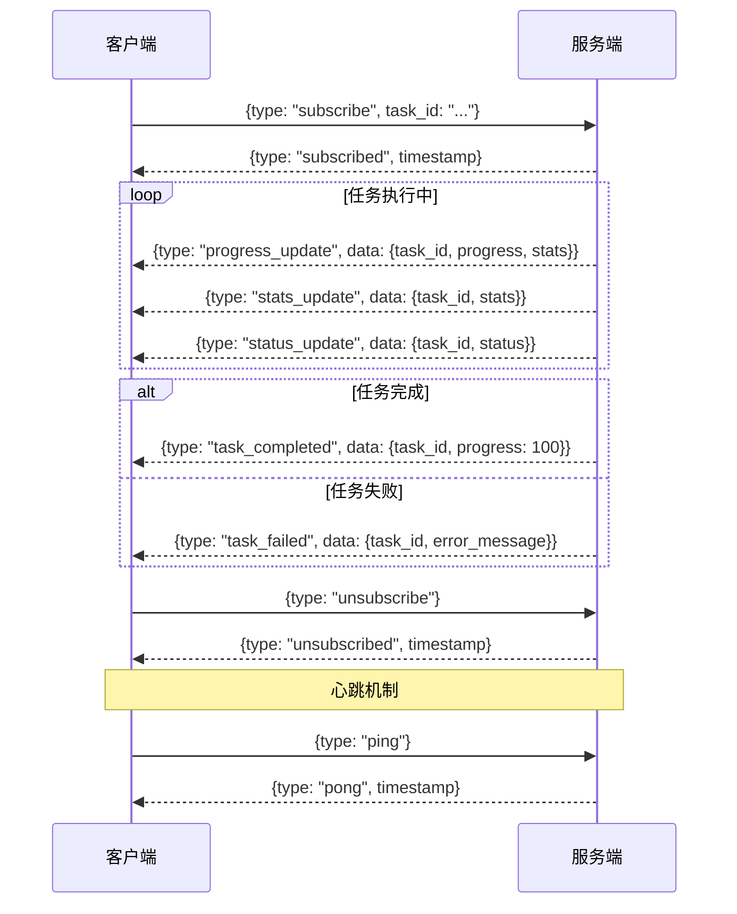

### 连接管理

| 功能 | 状态 | 说明 |
|------|------|------|
| WebSocket 升级 | ✅ 完整 | JWT 通过 query 参数验证 |
| 自动重连 | ✅ 完整 | 10 次尝试，3 秒间隔 |
| 心跳保活 | ✅ 完整 | 30 秒间隔 ping/pong |
| 任务订阅 | ✅ 完整 | 按 task_id 订阅 |
| 消息队列 | ✅ 完整 | 离线消息暂存 |
| HTTP 回退 | ✅ 完整 | WebSocket 失败时切换 HTTP 轮询 |
| 连接状态指示器 | ✅ 完整 | 绿/黄/红 三色状态 |

---

## 14. 流量生成引擎

### 核心流水线

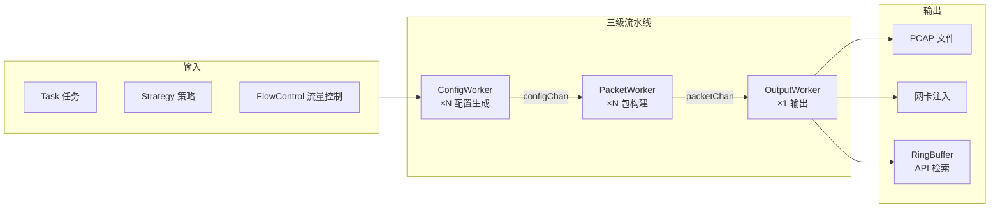

### 引擎参数 Schema 设计（目标）

这是整个重构的核心——通过 Schema 定义让引擎参数标准化，前端自动跟随。

```go
// 每个协议提供参数 Schema
type ParameterSchema struct {
    Name        string      // 参数名，如 "tcp.mss"
    DisplayName string      // 显示名，如 "最大分段大小"
    Type        string      // 类型: "string" | "number" | "bool" | "select" | "ip" | "mac" | "bytes"
    Default     interface{} // 缺省值
    Group       string      // 分组: "网络层" | "传输层" | "TCP高级" | ...
    IsCommon    bool        // true = 基础模式显示, false = 仅专家模式显示
    Required    bool        // 是否必填
    Min         *float64    // 最小值
    Max         *float64    // 最大值
    Options     []string    // 下拉选项（仅 type=select 时）
    Description string      // 说明文字
    Validation  string      // 校验规则: "ipv4" | "ipv6" | "port" | "mac" | ...
}
```

### 流量控制模式

| 模式 | 类型 | 说明 |
|------|------|------|
| **flows** | 总数控制 | 生成 N 个总流/包 |
| **cps** | 速率控制 | 每秒连接/流数 |
| **bps** | 速率控制 | TokenBucket 算法，支持 K/M/G 后缀 |
| **ratio** | 比例 | 0-100，多策略混合使用 |
| **time** | 时间控制 | 持续秒数 |

### 混合流量（核心功能）

> 一个任务内同时运行多种协议流量，按用户设定的比例分配带宽。

```
示例：一个任务 = "模拟真实网络环境"

  流量类 A: TCP 文件传输    60% 带宽
  流量类 B: DNS 域名解析     20% 带宽
  流量类 C: HTTP 网页浏览    15% 带宽
  流量类 D: ICMP 网络探测     5% 带宽

  四类流量同时跑，按 60:20:15:5 分配
```

**引擎层面设计**：

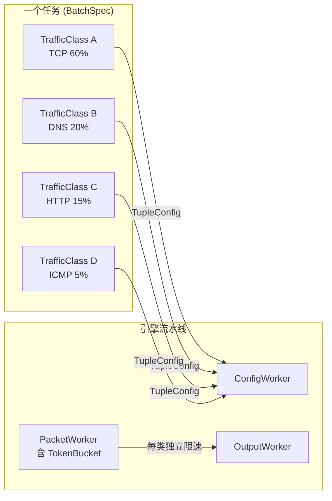

**现有类型复用**（`core/types.go` 已定义）：
- `BatchSpec` — 任务级包装，含 `Classes []TrafficClass`
- `TrafficClass` — 单个流量类（协议类型/BPS/流数/4元组策略/配置）
- `TupleConfig` — 4元组生成策略（src_ip/src_port/dst_ip/dst_port 的 inc/random/pattern）
- `StrategyConfig` — 单个值的生成策略
- `GlobalConfig` — 全局设置（总流数/持续时间）

**前端页面设计**：

```
任务创建 Step 2（策略选择）:

┌─────────────────────────────────────┐
│ 流量配置                              │
│                                      │
│ ┌─ 流量类 1 ──────────────────────┐  │
│ │ 协议: TCP ▼    BPS: 60%         │  │
│ │ 参数: [配置 TCP 参数...]         │  │
│ │ 4元组: src=inc[1-254] dst=fixed │  │
│ └─────────────────────────────────┘  │
│                                      │
│ ┌─ 流量类 2 ──────────────────────┐  │
│ │ 协议: DNS ▼    BPS: 20%         │  │
│ │ 参数: [配置 DNS 参数...]         │  │
│ │ 4元组: src=inc[1-254] dst=fixed │  │
│ └─────────────────────────────────┘  │
│                                      │
│ [+ 添加流量类]                        │
│                                      │
│ 4元组生成策略（全局或每类独立）         │
│ 源IP: [inc 范围 1-254]               │
│ 目的IP: [fixed 192.168.1.1]          │
│ 源端口: [random 1024-65535]          │
│ 目的端口: [fixed 80]                 │
└─────────────────────────────────────┘
```

**实施要点**：
- 每个流量类独立分配 BPS 限速（TokenBucket per class）
- 4元组策略确保每个流量类的包不重复（src_ip 递增避免冲突）
- 引擎按流量类分别创建子任务，共享同一输出
- 总计 BPS = 所有流量类 BPS 之和

### 引擎配置

| 参数 | 默认值 | 说明 |
|------|--------|------|
| config_workers | 4 | 配置生成 worker 数 |
| packet_workers | 8 | 包构建 worker 数 |
| output_workers | 1 | 输出 worker 数 |
| buffer_size | 4096 | RingBuffer 大小 |
| queue_size | 1024 | 内部通道队列大小 |

---

## 15. PCAP 资产管理

### 15.1 概述

PCAP 文件是回放的输入原材料。导入时做**全量解析预提取**（流索引、方向分类、每包每层字段），落盘 + 入库，供：

- **查看**：用户直接浏览 pcap 内容（流明细、包字段，类 Wireshark）
- **回放**：发包前直接取用预提取信息，不重复解析
- **配置校验**：写改写规则时实时预览 matcher 命中哪几条流

资源管理需功能完善：**能查、能导入、能删除**，配套校验与控制。

### 15.2 资产数据模型

```go
// internal/storage/models.go 新增
type PcapAssetModel struct {
    ID               string    `gorm:"primaryKey;size:64"`
    UserID           string    `gorm:"size:64;not null;index"`          // 用户隔离
    Name             string    `gorm:"size:255;not null"`
    OriginalFilename string    `gorm:"size:255"`
    StoragePath      string    `gorm:"size:512;not null"`                // 磁盘 data/pcaps/{id}.pcap
    PayloadsPath     string    `gorm:"size:512"`                         // data/pcaps/{id}.payloads（重组 L7 流）
    TrigramIndexPath string    `gorm:"size:512"`                         // trigram 索引文件
    FileHash         string    `gorm:"size:64;index"`                    // sha256，去重 + 完整性
    FileSize         int64
    Status           string    `gorm:"size:32;not null;index"`           // importing|ready|error|reindexing
    ParseError       string    `gorm:"size:1024"`
    ParserVersion    string    `gorm:"size:32"`                          // 解析引擎版本
    Tags             string    `gorm:"size:256"`                         // 标签，逗号分隔（v1 字段，v2 做 UI 检索）
    Notes            string    `gorm:"type:text"`                        // 备注
    // 全局统计（查询/筛选/排序用）
    PacketCount      int64
    ByteCount        int64
    FlowCount        int64
    DurationUs       int64                                               // 微秒
    LinkType         int                                                 // DLT_*
    Snaplen          int
    ProtocolDist     string    `gorm:"type:text"`                        // JSON: {"tcp":120,"udp":30}
    CreatedAt        time.Time `gorm:"autoCreateTime"`
    UpdatedAt        time.Time `gorm:"autoUpdateTime"`
}
```

**流详情见 `FlowModel`（§17.3），包详情见 `PacketModel`（§17.4）**，不在此表存 JSON 大块。资产表只存资产级元数据 + 全局统计，流/包是独立表（一对多），支持索引/分页/条件过滤。

`Status` 是控制核心：`importing`（解析中，不可用不可删）-> `ready`（可用）/ `error`（解析失败，保留错误信息）/ `reindexing`（重解析中）。

### 15.3 导入功能

```
用户上传 pcap 文件 / 指定服务端路径
        │
        ▼
【导入校验】（见 15.6）
  ├─ 格式：pcap magic / pcapng magic
  ├─ 大小上限：可配（默认 2GB，防滥用）
  ├─ 链路层：v1 仅以太网（DLT_EN10MB），非以太网（WiFi/SLL/Raw）直接拒绝
  ├─ 可读性：gopacket 试读，损坏即拒
  ├─ 磁盘空间：预估需 4× pcap 大小（.payloads+trigram+索引），不足则拒绝 + 报"预计需 X 可用 Y"
  └─ 去重：sha256 命中已有资产 -> 直接返回已有 ID（幂等）
        │
        ▼
落盘 -> 建 PcapAssetModel(Status=importing)
        │
        ▼
调 §17 解析引擎全量解析（异步）
        │
        ▼
回填 FlowModel + PacketModel + .payloads + trigram 索引，Status=ready
        │
        ▼
返回资产 ID
```

**异步导入**：大 pcap 解析耗时，导入异步执行，前端轮询 Status 进度。`importing` 期间不可用于回放，但**支持取消**（见 §15.5）。

### 15.4 查询功能

多层级按需查询（完整端点见 §19）：

- **资产列表**：分页 + 按 name/协议分布/大小/时间筛选
- **资产详情**：全局统计 + 流概览
- **流列表/详情**：FlowModel 全量字段（5 元组、方向、统计、TCP 专属、L7 元数据、重组状态）
- **包列表**：PacketModel 最小索引分页
- **单包全字段**：动态重解析 L2-L7（LayerRecord，类 Wireshark 逐层展开）
- **负载查看**：单包负载（按 RawOffset 读 pcap）/ 重组流字节（.payloads）/ 最高层 body
- **多条件搜索**：流过滤 + 包过滤 + 负载内容，AND 组合（见 §17.10）

包级查看是"直接看包信息"的落点：前端按 `LayerRecord` 逐层展开显示，类 Wireshark packet details。

### 15.5 删除功能

```
DELETE /api/v1/pcaps/:id
        │
        ▼
【引用检查】
  ├─ 查 StrategyModel：有无 protocol=replay 且 config.pcap_asset_id==该 ID 的策略
  ├─ 查 TaskModel：有无运行中任务引用
  └─ 有引用 -> 拒绝，返回引用列表（同策略删除检查任务的模式）
        │
        ▼
【状态检查】
  ├─ Status=reindexing -> 拒绝（防并发）
  └─ Status=importing -> 转为"取消导入"语义：终止解析、清理半成品文件+记录
        │
        ▼
删磁盘文件 + 删 DB 记录（+ 流索引，若独立表）
```

可选 `?force=true`：强制删（级联把引用它的策略标记失效），默认不强制，保护用户。

### 15.6 校验与控制

| 控制类别 | 具体规则 |
|---------|---------|
| **导入校验** | 格式 / 大小上限 / 链路层（非以太网拒绝）/ 损坏检测 / sha256 去重 |
| **磁盘空间** | 导入前预估需 4× pcap 大小（.payloads+trigram+索引），不足拒绝 + 报"预计需 X 可用 Y"；中途写入失败回滚清理 |
| **引用控制** | 删除前查策略 + 任务引用，有则阻止 |
| **状态控制** | `reindexing` 期间不可删不可用；`importing` 期间不可用但**可取消** |
| **取消** | `importing` 期间可取消（DELETE 触发），终止解析 + 清理半成品文件和记录 |
| **完整性** | 导入算 sha256 入库；可选读取时重算校验（防磁盘文件被外部篡改） |
| **配额控制** | 用户级存储上限 + 资产数量上限（可配，防滥用） |
| **权限** | UserID 隔离，用户只能查/删自己的；admin 可查所有 |
| **重解析** | 解析逻辑升级后，`POST /reparse` 重建索引（Status=reindexing -> ready） |
| **并发** | 同 hash 并发导入只跑一次，其他等结果复用 |

### 15.7 与其他模块的关系

- **§16 PCAP 回放**：replay 策略通过 `pcap_asset_id` 引用资产，回放读 `FlowModel.OffsetLayout`（byte-patch 偏移）+ `PacketModel.RawOffset`（定位字节）+ 原始 pcap 文件，零二次解析
- **§17 PCAP 解析引擎**：资产导入时调 `pcapparser.Parse()`，解析引擎填充 `FlowModel` + `PacketModel` + `.payloads` 重组流 + trigram 索引。解析内部黑盒，资产层只管存取
- **§6 策略管理**：pcap 资产是 replay 策略的原材料，UI 上 pcap 资产列表可挂在策略管理下
- **§19 API 端点**：资产 CRUD + 流/包查询 + 负载搜索端点见 §19

---

## 16. PCAP 回放

### 16.1 概述与定位

**一句话**：读取 pcap 文件，按需改写 L2/L3/L4 参数，按设定速率从网卡或 pcap 文件回放，支持多流放大与双口分流。

**定位**：原列于 §21 P5（后续优化），现正式细化立项。对标 tcpreplay 套件（tcprewrite + tcpprep + tcpreplay）与商业产品（Spirent TestCenter / Keysight ixNetwork 的 StreamBlock + Traffic Modifier）。

**核心原则**：

- **商业级回放**：支持按包/按流改写、多流放大、双口分流、全速率模式
- **byte-patch 保真**：用 gopacket 定位层与字段偏移，patch 原始字节，**不重构包**--未改写字段（含畸形结构、未知协议、TCP 选项）原样保留
- **默认忠实，opt-in 修复**：回放不"修正"包；所有可能改变包内容的动作（校验和重算、MTU 截断、fixlen）默认关闭或可控
- **回放即策略**：pcap 回放作为一种 TrafficClass 类型与 Strategy 协议，与合成流量统一管理

### 16.2 已确认决策

| # | 维度 | 决定 |
|---|------|------|
| 1 | 改写范围 | L2 + L3 + L4 |
| 2 | 多流放大 | 支持（1 pcap -> N 流），公式 N×M |
| 3 | 速率模式 | 全模式：original / multiplier / bps / pps / max |
| 4 | flow 定义 | 5 元组双向归一化 |
| 5 | 多流 TCP seq | per-flow 随机偏移（offset 语义） |
| 6 | 方向处理 | 双口分流（client/server 分两口） |
| 7 | 方向分类 | 首包定初始方向 + SYN/SYN-ACK 校准 + 校准一次锁定 + UDP 端口辅助 |
| 8 | pcap 文件输出 | 单文件 + 双文件均支持 |
| 9 | 积压策略 | 有界反压 + 漂移吸收（不丢包） |
| 10 | 限速桶 | 类内共享桶 + 类间独立桶 |
| 11 | 混合任务 | 支持；回放 = `TrafficClass.Type="replay"` |
| 12 | 规则执行 | 并行（matcher 匹配原始 pcap，不链式）；同字段重叠不同值=冲突报错，同值=幂等 |
| 13 | 校验和 | 默认 recompute，支持 preserve；改写动字段时强制重算 |
| 14 | 异常注入 | v2+；v1 只做异常保留，`inject` 字段位置预留 |

### 16.3 核心能力（8 子能力）

| # | 子能力 | 说明 |
|---|--------|------|
| 1 | 纯回放 | 读 pcap 按原样发出 |
| 2 | per-packet 改写 | 对每个包字段做覆盖 |
| 3 | per-flow 改写 | 同一流所有包应用一致替换，保流完整 |
| 4 | 多流放大 | 1 pcap -> N 流，IP/MAC/seq 按策略变 |
| 5 | 方向感知 | 区分 client/server，单口填 MAC / 双口分流 |
| 6 | 校验和重算 | 改 L3 必重算 IP+L4 校验和 |
| 7 | 速率/时间模型 | 保原始间隔 / 倍速 / 按 BPS·PPS / 极速 |
| 8 | 循环与持续时间 | loop N 次 / 跑到时间到 / 跑指定包数 |

### 16.4 数据结构

```go
// ReplaySpec：replay 策略的 config（Strategy.protocol="replay"）
type ReplaySpec struct {
    PcapAssetID string         `json:"pcap_asset_id"`           // 引用 §15 资产
    Loop        int            `json:"loop"`                    // 0=无限
    Speed       ReplaySpeed    `json:"speed"`
    Direction   string         `json:"direction"`               // single | dual
    ChecksumMode string        `json:"checksum_mode"`           // recompute(默认) | preserve
    Rewrites    []RewriteRule  `json:"rewrites"`
    FlowScaling *FlowScaling   `json:"flow_scaling,omitempty"`  // 可选：多流放大
    Inject      *InjectConfig  `json:"inject,omitempty"`        // v2 预留：异常注入
}

type ReplaySpeed struct {
    Mode       string  `json:"mode"`        // original | multiplier | bps | pps | max
    Multiplier float64 `json:"multiplier"`  // multiplier 模式：1.5=1.5 倍速
    BPS        string  `json:"bps"`         // bps 模式："200k"
    PPS        float64 `json:"pps"`         // pps 模式
}

type RewriteRule struct {
    Match    FlowMatcher   `json:"match"`    // 作用于哪些包/流；空=全部
    Kind     string        `json:"kind"`     // field | endpoint | ipmap | portmap | macmap
    Target   string        `json:"target"`   // field/endpoint 模式：改哪个字段
    Mapping  map[string]string `json:"mapping,omitempty"` // map 模式：值->值替换表
    Scope    string        `json:"scope"`    // per-packet | per-flow（值一致性）
    Apply    string        `json:"apply"`    // set | offset
    Strategy StrategyConfig `json:"strategy"`// 复用现有 fixed/inc/random/list/pattern
}

// FlowMatcher：方向归一化匹配，写正写反都能命中
type FlowMatcher struct {
    Protocol string `json:"protocol,omitempty"` // tcp|udp|icmp|arp|"" = any
    SrcIP    string `json:"src_ip,omitempty"`   // exact 或 CIDR，空=any
    SrcPort  uint16 `json:"src_port,omitempty"` // 0=any
    DstIP    string `json:"dst_ip,omitempty"`
    DstPort  uint16 `json:"dst_port,omitempty"`
}

type FlowScaling struct {
    Count      int             `json:"count"`               // 每条原流克隆 N 份（总 N×M）
    SrcIP      StrategyConfig `json:"src_ip,omitempty"`     // per-flow 取一致值
    DstIP      StrategyConfig `json:"dst_ip,omitempty"`
    SrcPort    StrategyConfig `json:"src_port,omitempty"`
    DstPort    StrategyConfig `json:"dst_port,omitempty"`
    SrcMAC     StrategyConfig `json:"src_mac,omitempty"`
    DstMAC     StrategyConfig `json:"dst_mac,omitempty"`
    SeqOffset  StrategyConfig `json:"seq_offset,omitempty"` // 每条流 seq 随机偏移
    Interleave string         `json:"interleave,omitempty"` // stack(默认) | serial
}
```

**Target 字段词汇**（决定端点 vs 字段语义）：

| 类别 | 端点（双向一致，复用方向分类） | 字段（逐包，方向无关） |
|------|------|------|
| L3 | `client_ip`、`server_ip` | `src_ip`、`dst_ip`、`ttl`、`dscp`、`ecn`、`ip_flags`、`frag_offset` |
| L4 | `client_port`、`server_port` | `src_port`、`dst_port`、`seq`、`ack`、`window`、`tcp_flags` |
| L2 | -- | `src_mac`、`dst_mac`、`vlan_id`、`vlan_pcp` |

### 16.5 改写引擎：三种操作

| 操作 | Kind/Target | 语义 | 典型场景 | 需识别流 | 需判方向 |
|------|-------------|------|---------|---------|---------|
| **映射** | `kind: ipmap/portmap/macmap` | 值->值全局替换，双向一致 | 换网重放、地址平移 | 否 | 否 |
| **端点** | `target: client_ip/server_ip` | 按流迁移端点，双向一致 | 改特定流的端点 | 是 | 是 |
| **字段** | `target: src_ip/dst_port/...` | 单方向单字段覆盖 | 强制逐包改某字段 | 否 | 否 |

映射支持 CIDR（`10.0.0.0/8 -> 192.168.0.0/16`，网段平移保偏移）。`seq`/`ack`/`ip_id` 用 `apply: offset`（流内 delta 不变），其余用 `apply: set`。

### 16.6 规则执行语义

**并行模型**（非链式）：

- 所有 `matcher` 永远匹配**原始 pcap 值**（不受其他规则改写结果影响）
- 所有改写独立计算后合并，base = 原始包 + 全部改写合并结果
- 不同字段规则：天然叠加
- 同字段重叠：**不同目标值 = 冲突报错**；**相同值 = 幂等允许**
- 单条 map 的 mapping 表内：键值对**同时**应用（单次扫描，不内部链式）
- 多条规则之间：并行，不链式
- FlowScaling base = 合并后的包，克隆在 base 上变；映射 + FlowScaling 可共存（映射打底，克隆递增）
- 端点/字段规则（set 语义）与 FlowScaling（vary 语义）动同一字段 = 冲突报错（"固定某值"与"按流变化"意图相斥）；映射（substitution）与 FlowScaling 不冲突
- 链式（规则 N 看规则 N-1 输出）：v2 提供 `see: "rewritten"` 显式声明，v1 不做

### 16.7 流分组与方向分类

**流分组**（per-flow 改写与多流放大的基础）：5 元组双向归一化--把 (src,sport,dst,dport,proto) 按大小排序后哈希，一个连接的两个方向归到同一条流。ARP/ICMP 退化为 (ip,type) 等。

**方向分类**（双口分流的前提，每条流独立状态机）：

```
1. 首包定初始方向：流首包 src 视为 client 候选（发起方即 client）
2. 握手校准：
   - 见 SYN（独立 SYN，无 ACK）：SYN 的 src=client -> 校准，锁定
   - 见 SYN+ACK：其 src=server -> 校准，锁定（能纠首包猜错，如 pcap 漏 SYN 只抓到 SYN-ACK）
3. 校准一次后该流方向锁定，后续包不再判
4. UDP（无握手）：沿用首包初始方向 + 知名端口辅助
   （首包端口对含已知服务端口 53/67/68/123/161 等，该侧判为 server，优先于首包猜测）
```

方向分类失败（纯 P2P 随机端口、无握手无端口辅助）：回退首包猜测 + 告警"方向不确定"，或要求用户提供显式 IP 映射。

### 16.8 多流放大

- **N×M 公式**：源 pcap 有 M 条流，`FlowScaling.Count=N`，输出 N×M 条流（每条原流克隆 N 份）
- **per-flow 替换表**：每条克隆流 k 取一组一致的 IP/端口/MAC（来自 StrategyConfig），保证流完整
- **per-flow seq 随机偏移**：`new_seq = orig_seq + offset_k`，流内 delta 不变，N 流 seq 互不雷同；ack/ip_id 同理
- **k-way 时间戳归并**：N 条克隆流保原始时间线时，按发送时刻堆式 streaming 归并成一条有序流（不聚合到内存，符合流式约束）

### 16.9 速率与时间模型

5 模式分两族：

| 族 | 模式 | 机制 |
|----|------|------|
| 时间戳 pacing | original、multiplier | 按 pcap 原始 ts 间隔发包（multiplier 除以倍速）。不走 TokenBucket |
| 速率 pacing | bps、pps、max | 忽略原始 ts，走现有 TokenBucket（max=无限速率） |

- **漂移吸收**（时间戳 pacing）：维护 `timeOffset`，包计划时刻已过时把原点挪到现在、立即发当前包、后续按新原点 spacing。不丢包、不无限突发、保相对时序
- **有界反压**（速率 pacing）：全链路有界通道 + 流式读取，reader 写满即阻塞，被 TokenBucket 消费速度反压。内存安全，不丢包
- **循环时间戳偏移**：original/multiplier 模式循环时，每轮 ts 偏移 `loop_index × pcap_duration`，避免时间倒退；每轮重随机 seq 偏移（每轮像新流量）

### 16.10 回放保真与异常处理

**保真原则（硬保证）**：

1. 默认忠实回放，不动任何未显式指定的内容
2. replay 路径**不走 resequencer**，保留 pcap 全局文件序
3. **不去重**，重复/重传原样保留
4. byte-patch 只改显式字段，**不重构包结构**
5. 校验和可配（`recompute` 默认 / `preserve`），改写动字段时强制重算
6. fixlen / MTU 截断 / 任何"修复"动作一律 opt-in，默认关闭
7. 若未来启多 PacketWorker，replay 必须有"保文件序"模式（按文件位置序，不按 seq 重排）

**异常包逐类型处理**：

| 异常类型 | 处理 | 说明 |
|---------|------|------|
| 乱序 | ✅ 保留 | 文件序输出，不走 resequencer |
| 重传 | ✅ 保留 | 不去重；seq 偏移统一应用 |
| 重复包 | ✅ 保留 | 不去重 |
| 坏校验和 | ⚠️ 默认重算会"修" | 需 `checksum_mode: preserve` 才保留 |
| 畸形包（坏长度/无效标志） | ✅ 保留 | byte-patch 不重构 |
| 分片重叠/错序 | ✅ 保留 | 不重组；IPID 偏移按组应用 |
| TTL/窗口异常 | ✅ 保留 | 不动除非规则指定 |
| 超大/超小包 | ✅ 保留 | MTU 截断 opt-in |
| 时序异常 | ✅ 保留 | original 模式保原始 ts 间隔 |

**校验和冲突与解法**：

- TX-offload 坏校验和（发送机本机抓包，L4 校验和是网卡占位值）-> 需重算
- 故意坏校验和（测 DUT 处理）-> 需保留
- 解法：`checksum_mode`（`recompute` 默认修好 offload / `preserve` 保留异常）
- 改写动字段 -> 强制重算（否则字段与校验和自相矛盾，非用户所要的"坏校验和"异常）
- "改字段 + 保留坏校验和"：v1 不支持，v2 可"重算后重新注入同款错误"

**异常注入**（v2+）：给正常流量注入乱序/重传/丢包/抖动/重复/比特错，对标 Spirent/Keysight impairment 与 Linux netem。`InjectConfig` 字段位置预留，v1 不实现。

### 16.11 双口分流与输出

- **单口模式**：所有包一个口出，MAC 按方向填（client/server 侧各填对）
- **双口模式**：client->server 走口 1，server->client 走口 2，需 `Task.Interface` + `Task.Interface2`（Task 模型新增 `Interface2` 字段，单口模式留空，向后兼容）
- **routing writer**：新增输出 Writer 实现，持两个 interface writer，按 `PacketConfig.Direction`（synth 已打 up/down，replay 按方向分类）路由。synth 流量因此也能享受双口分流
- **MAC 来源**：值来自 FlowScaling/改写规则，出口来自方向分类，两者正交
- **pcap 输出**：单文件（包内带方向 tag）/ 双文件（一口一个）均支持；双口是网卡输出概念
- **输出 pcap 时间戳**：用计划发送时刻（反映实际回放节奏）

### 16.12 流水线接入

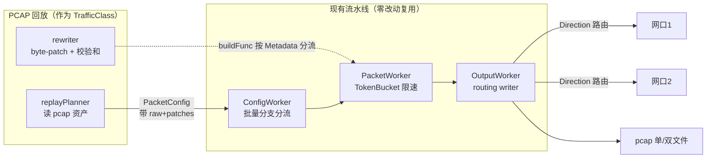

**三处接入点**（均为扩展，不改现有合约）：

1. **ConfigWorker 批量分支**：`Type=="replay"` 调 `replayPlanner.Plan()`，否则调协议 planner
2. **buildFunc 全局单函数**：按 `config.Metadata["_replay"]` 标记分流--合成包走 builder 重建，回放包走 patch+校验和
3. **输出层**：新增 routing writer

**复用基础设施**：PacketConfig 通道、PacketWorker、TokenBucket（按 ClassID）、Writer 接口、ParameterSchema、Direction 字段。

### 16.13 场景矩阵（关键场景）

| 维度 | 场景 | 可行性 | 处理 |
|------|------|--------|------|
| 输入 | pcap / pcapng / 巨型 / 损坏 / snaplen 截断 / ts 乱序 | ✅/⚠️ | 流式读；损坏报错；截断 fixlen opt-in；ts 乱序排序或告警 |
| 协议 | TCP 完整/中途/单向、UDP 请求响应/单向、ICMP、ARP、HTTP、分片、IPv6 | ✅/⚠️ | IPv6 因 byte-patch 可回放+改部分字段，地址改写留 v2 |
| 链路层 | 以太网、VLAN、QinQ、MPLS、GRE/VXLAN、WiFi、Raw、Jumbo、Runt | ✅/⚠️/❌ | v1 仅以太网；QinQ/MPLS/隧道透传不改内层；WiFi/SLL 拒绝 |
| 改写 | 纯回放、改 MAC/IP(CIDR)/端口/TTL/DSCP/VLAN 增删/seq/flags、组合、冲突 | ✅/❌ | 同字段冲突拦截；VLAN 增删检查 MTU |
| 多流 | 2/100/10000 流、IP 递增/随机、N×M、双口、循环、限速 | ✅/⚠️ | 大 N 流式+有界；bps 总速率共享桶 |
| 速率 | max/multiplier/bps/pps/original、低于原始、循环、精度 | ✅/⚠️ | 低于原始走反压不丢包；循环 ts 偏移 |
| 方向 | 单口、双口、全单向、无握手、判错 | ✅/⚠️ | 判错告警+方向统计 |
| 输出 | pcap 单/双文件、网卡单/双口、both、旋转 | ✅ | 复用现有 pcap 旋转 |
| 异常 | 乱序/重传/坏校验和/畸形/分片重叠/超大超小 | ✅/⚠️ | 默认全保留；坏校验和需 preserve |
| 集成 | REST、MCP、Schema 表单、batch 混合 | ✅ | 回放即策略，进 Schema |

**交互热点**：纯回放×TX-offload 校验和（需重算）、改 IP×L4 校验和（连算）、改 seq×多流（per-flow 偏移）、设定速率<原始×bps（反压不丢包）、多流×original×循环（k-way+ts 偏移+重随机）、双口×方向判错（告警）、双口×pcap 输出（单/双文件）、IPv6 pcap×无 IPv6 合成（byte-patch 可回放）。

### 16.14 配置示例

**场景 A：纯回放**
```json
{"pcap_asset_id":"pcap_abc123","speed":{"mode":"original"},"direction":"single","loop":1}
```

**场景 B：换网重放（IP 替换）**
```json
{
  "pcap_asset_id":"pcap_abc123","speed":{"mode":"multiplier","multiplier":1.0},"direction":"single",
  "rewrites":[{"kind":"ipmap","mapping":{"1.0.0.1":"11.0.0.1"}}]
}
```

**场景 C：多流放大（1->100 流，IP 递增）**
```json
{
  "pcap_asset_id":"pcap_abc123","speed":{"mode":"bps","bps":"500k"},"direction":"single",
  "flow_scaling":{"count":100,
    "src_ip":{"strategy":"inc","range":["11.0.0.1","11.0.0.100"],"step":1},
    "dst_ip":{"strategy":"fixed","value":"22.0.0.1"},
    "seq_offset":{"strategy":"random","range":[0,4294967295],"seed":42},
    "interleave":"stack"}
}
```

**场景 D：定向改单流（端点迁移）**
```json
{
  "pcap_asset_id":"pcap_abc123","speed":{"mode":"original"},"direction":"single",
  "rewrites":[
    {"match":{"protocol":"tcp","src_ip":"1.0.0.1","src_port":1000,"dst_ip":"2.0.0.1","dst_port":21},
     "kind":"endpoint","target":"client_ip","apply":"set","strategy":{"strategy":"fixed","value":"11.0.0.1"}},
    {"match":{"protocol":"udp","src_ip":"1.0.0.1","src_port":2000,"dst_ip":"2.0.0.1","dst_port":2001},
     "kind":"endpoint","target":"server_ip","apply":"set","strategy":{"strategy":"fixed","value":"22.0.0.1"}}
  ]
}
```

**场景 E：双口分流回放**
```json
{"pcap_asset_id":"pcap_abc123","speed":{"mode":"multiplier","multiplier":2.0},"direction":"dual","loop":0}
```

**场景 F：混合任务（合成 TCP + 回放 pcap + DNS，一个 batch）**
```json
{
  "classes":[
    {"id":"bg_tcp","type":"tcp","bps":"60%","flow_count":50,"config":{"tcp":{"handshake":true,"mss":1460}}},
    {"id":"replay1","type":"replay","bps":"30%","replay":{
       "pcap_asset_id":"pcap_abc123","speed":{"mode":"original"},"direction":"dual",
       "rewrites":[{"kind":"ipmap","mapping":{"1.0.0.1":"11.0.0.1"}}]}},
    {"id":"dns_bg","type":"dns","bps":"10%","flow_count":100,"config":{"dns":{"domain":"example.com","query_type":1}}}
  ],
  "global":{"duration_seconds":60}
}
```

### 16.15 不在 v1 范围

- 异常注入（impairment）：v2+
- 链式规则（规则 N 看规则 N-1 输出）：v2+，`see:"rewritten"` 显式声明
- IPv6 地址改写：v2（IPv6 pcap 回放本身因 byte-patch 可行）
- 双层 VLAN（QinQ）改写、隧道内层改写：v2
- 非以太网链路层（WiFi/SLL/Raw）：v2
- payload 字节改写：v2
- "改字段 + 保留坏校验和"：v2（重算后重新注入同款错误）
- pcap 解析引擎内部实现：见 §17，设计单独沟通确认

---

## 17. PCAP 解析引擎

### 17.1 模块定位

独立目录 `internal/pcapparser/`（与 `internal/output/pcap.go` 写入端分开）。职责：读 pcap/pcapng -> 产出全层级结构化描述，供 §15 资产管理（查看）与 §16 回放（发包）两个消费方共用。

**两个消费者需求解耦**：

- 查看：要字段**值**（L2-L7 全字段，类 Wireshark）
- 回放：要字段**偏移**（byte-patch 用）

回放不碰字段值，查看不碰偏移，分开处理。

**双向测试用例**：

- 报文 -> 预期值（提取）：从 pcap 解析字段当测试断言的预期值
- 预期值 -> 报文（构造）：已有 §16 生成器 builder

**黑盒接口**：资产层调 `pcapparser.Parse(path) (*PcapAnalysis, error)`，解析内部对资产层是黑盒。

### 17.2 数据模型与存储原则

**层级结构**：

```
PcapAsset（主键）
  └─ Flows[]（FlowModel，列表信息，包汇总派生）
       └─ Packets[]（PacketModel，详细记录，包是原子）
```

- **包为原子、流为派生汇总**：先解析所有包，再从包汇总成流。流信息是包的派生视图。
- **导入可单遍实现**：数据模型是包主流派生，但实现可单遍（解析一包就累加到对应流桶），存时包和流一起存。

**存储原则**：

- pcap 文件（磁盘）= **真理之源**，DB 存指针 + 聚合，不存可重算的派生值
- 磁盘文件：`{id}.pcap`（原始字节）+ `{id}.payloads`（物化重组 L7 流）+ trigram 索引文件
- **不存**：每包 L2-L7 字段值（按需重解析）、负载字节（引用偏移）

**存储形式**（已确认）：独立表 `FlowModel` + `PacketModel`，字段建列，支持索引/分页/条件过滤。不用 JSON 大块。

### 17.3 FlowModel（流级全量聚合）

流远少于包（1M 包可能 10k-100k 流），每流存全量聚合。FlowModel 完整字段：

```go
// internal/storage/models.go 新增
type FlowModel struct {
    ID          string    `gorm:"primaryKey;size:64"`
    PcapAssetID string    `gorm:"size:64;not null;index"`   // 归属 pcap
    UserID      string    `gorm:"size:64;not null;index"`   // 用户隔离

    // 标识
    FlowKey     string    `gorm:"size:128;index"`           // 归一化 flow key
    L4Protocol  string    `gorm:"size:16;index"`            // tcp|udp|icmp|arp
    IPVersion   int                                         // 4|6
    SrcIP       string    `gorm:"size:45;index"`
    SrcPort     uint16
    DstIP       string    `gorm:"size:45;index"`
    DstPort     uint16

    // 方向分类
    Client       string    `gorm:"size:64"`                 // client 端点 ip:port
    Server       string    `gorm:"size:64"`                 // server 端点 ip:port
    DirMethod    string    `gorm:"size:16"`                 // syn|port|first_packet
    DirConfident bool                                        // 分类可信度
    DirStatus    string    `gorm:"size:16"`                 // classified|uncertain

    // 统计
    PacketCount  int64
    ByteCount    int64
    C2SPackets   int64                                      // c2s 包数
    C2SBytes     int64
    S2CPackets   int64
    S2CBytes     int64
    FirstTsUs    int64                                      // 首包时间（微秒）
    LastTsUs     int64
    DurationUs   int64

    // TCP 专属
    HandshakeStatus string `gorm:"size:16"`                 // none|partial|complete
    C2SInitSeq      uint32                                  // 初始 seq
    S2CInitSeq      uint32
    SeqRange        string `gorm:"size:64"`                 // JSON [min,max]
    FlagsSummary    string `gorm:"type:text"`               // JSON {syn:n,fin:n,rst:n,...}
    MSS             uint16
    WindowScale     int
    WindowRange     string `gorm:"size:64"`
    TCPOptions      string `gorm:"type:text"`               // JSON 出现的选项
    RetransCount    int64                                   // 重传数
    OutOfOrderCount int64                                   // 乱序数

    // L7 元数据
    L7Protocol  string    `gorm:"size:16;index"`            // http|dns|tls|raw|...
    L7Metadata  string    `gorm:"type:text"`                // JSON，按协议展开（完整详情）
    // TCP：一条完整报文（method/uri/status/host 等）
    // UDP：列表，每条 L7 消息都记（DNS 所有查询/应答）
    // 常用 L7 过滤字段反范式建列（供实时过滤，同 PcapAsset 反范式模式）
    L7Method    string    `gorm:"size:16;index"`            // HTTP method
    L7Host      string    `gorm:"size:255;index"`           // HTTP host / TLS SNI
    L7QueryName string    `gorm:"size:255;index"`           // DNS 查询名

    // 重组引用（流级最高层负载地址）
    StreamFile        string `gorm:"size:512"`              // {pcap_id}.payloads
    C2SOffset         int64                                  // c2s 重组流偏移
    C2SLength         int64
    S2COffset         int64
    S2CLength         int64
    C2SBodyOffset     int64                                  // L7 body 在 c2s 流内偏移
    C2SBodyLength     int64
    S2CBodyOffset     int64
    S2CBodyLength     int64
    ReassemblyComplete bool                                  // 重组完整性
    GapInfo           string `gorm:"size:256"`               // 缺口信息

    // 改写偏移布局（回放 byte-patch 用，封装恒定，每流一份）
    OffsetLayout string    `gorm:"type:text"`               // JSON 字段->偏移

    // 完整性
    ParserVersion string    `gorm:"size:32"`                 // 解析时用的版本

    CreatedAt time.Time `gorm:"autoCreateTime"`
}
```

### 17.4 PacketModel（包级最小索引）

每包只存最小索引，字段值不存（按需重解析）。约 120 字节/包（含负载哈希/异常/分片标记）：

```go
type PacketModel struct {
    ID          string    `gorm:"primaryKey;size:64"`
    PcapAssetID string    `gorm:"size:64;not null;index"`
    FlowID      string    `gorm:"size:64;not null;index"`   // 归属流
    UserID      string    `gorm:"size:64;not null;index"`

    RawOffset   int64                                       // pcap 文件中字节偏移（定位/重解析入口）
    Length      int                                          // 包长
    TimestampUs int64     `gorm:"index"`                    // 时间（排序/pacing/显示）
    IndexInFlow int                                          // 流内序号
    Direction   string    `gorm:"size:4;index"`             // c2s|s2c
    L4Protocol  string    `gorm:"size:16;index"`            // tcp|udp|icmp|arp
    PayloadHash string    `gorm:"size:64;index"`            // 负载 sha256（等值断言用，免传整个负载）
    AnomalyFlag string    `gorm:"size:16;index"`            // truncated|oversize|undersize|""（异常标记）
    FragGroupID string    `gorm:"size:64;index"`            // IP 分片组 ID（IPID+src+dst），无分片则空
    FragOffset  int                                          // 分片偏移（8字节单位），非分片包 -1

    CreatedAt time.Time `gorm:"autoCreateTime"`
}
```

L2-L7 完整字段值**不存**，查询时按 `RawOffset` 重解析单包（见 §17.7）。`PayloadHash` 供测试等值断言（"该包负载应是 X"用哈希比对，免传大负载）；`AnomalyFlag` 标记截断/超大/超小包；`FragGroupID`/`FragOffset` 标记 IP 分片组关系（见 §17.6）。

### 17.5 两级负载地址

| 级别 | 负载地址 | 指向 | 用途 |
|------|---------|------|------|
| 包级 | `(RawOffset, header_len, payload_len)` | pcap 文件 | 单包负载查看/提取/回放 |
| 流级（最高层） | `(StreamFile, offset, body_offset, body_length)` | `.payloads` 重组 L7 流 | 完整 HTTP body 等、流级提取/搜索 |

两级都存地址，不存字节。包级直接定位 pcap 文件；流级定位物化的重组流文件。

包级 `header_len`/`payload_len` 不逐包存储，由流的 `OffsetLayout`（封装恒定）或动态重解析得出。

### 17.6 TCP 重组（v1）

用 gopacket `tcpassembly`（`Assembler` + `StreamPool` + `Stream` 接口）。

- **双向分别重组**：一个 TCP 流 c2s、s2c 各自独立重组
- **排序**：按 seq，处理回绕（PAWS）
- **重传**：重复 seq 数据去重（重传包在包级保留，重组流内去重），重传数计入 FlowModel
- **缺口**：seq 空洞标记 gap，缺口部分无法重组，`ReassemblyComplete=false` + `GapInfo`
- **边界**：FIN/RST 触发流结束 flush；超长流分段 flush 防内存涨
- **L7 解析**：重组流上跑 L7 parser，得 L7 头 + body 边界（`BodyOffset/Length`）
- **物化**：重组流写入 `{pcap_id}.payloads` 文件，FlowModel 存偏移引用

**方向分类依赖**：重组分 c2s/s2c 依赖方向分类（§16.7）。分类失败（纯 P2P 无握手）回退首包猜测，`DirStatus=uncertain`，重组按猜测方向分，标注不确定。

**UDP / 非 TCP 流**：不重组（每包独立 L7 消息）。流级 L7 元数据存**列表**（每条消息都记，如 DNS 所有查询/应答）。流级负载地址用包级（逐包查），不建重组流。

**IP 分片处理**：分片包按 `IPID+src+dst` 分组，PacketModel 标 `FragGroupID` + `FragOffset`。重组流处理顺序：**IP 分片先重组，再 TCP 重组**（分片重组在 TCP 重组之前）。非首片分片无 L4 头，byte-patch 时按分片处理（只改 L2/L3，跳过 L4）。截断包（`AnomalyFlag=truncated`）尽力解析已有部分，标记不完整。

### 17.7 动态解析（按需重解析单包字段）

每包字段值**不预存**，查询时按 `(pcap_id, RawOffset, length)` 读 pcap 文件那段字节，gopacket 解析单包，返回完整 `LayerRecord`。

- 单包解析：微秒级
- 翻页（一页 50 包）：重解析 50 包，亚毫秒，用户无感
- 与负载查看同一机制（按 RawOffset 读字节），字段多过一遍 gopacket

**LayerRecord（动态生成，不存储）**：

```go
type LayerRecord struct {
    Layer   string          // "eth"|"ipv4"|"tcp"|"http"|...
    Fields  map[string]any  // 该层字段值（查看用）
    Offsets map[string]int  // 字段字节偏移（每层偏移，查看用）
    Range   [2]int          // 该层在帧内 [start,end)
}
```

**FlowModel.OffsetLayout vs LayerRecord.Offsets 关系**：

- `FlowModel.OffsetLayout`：存储，每流一份（封装恒定），回放 byte-patch 用，只含可改字段偏移
- `LayerRecord.Offsets`：动态生成，每包每层，查看用，含全字段偏移

两者并存不冲突，服务不同消费者。

### 17.8 协议范围与深度

- **gopacket 内置全开**：HTTP/DNS/TLS/DHCP/SNMP/Modbus/ARP/ICMP/IPv4/IPv6/TCP/UDP/SCTP/GRE/VXLAN/MPLS/... 几十种
- **未知协议 opaque 保留**：gopacket 不认识的层，存字节范围 + 层名（若有）+ "未识别"标签，不阻断解析
- **插件扩展**：`ProtocolParser` 接口 + Registry 注册新协议解析器（如 QUIC/HTTP2/HTTP3），不动核心
- **加密流量**：TLS/SSH 解 handshake 元数据（SNI/版本/密码套件/cert 链长度），payload 标"加密 opaque"，不解密
- **解析深度**：能解析的都解析，字段全展开

### 17.9 负载搜索（trigram，v1）

**机制**：trigram（三字节）倒排索引。

- 索引：每个 trigram -> 出现该 trigram 的 (flow_id, dir, offset) 列表
- 搜索模式 P：拆 trigrams -> 交集 -> 候选位置 -> 读对应流字节验证 -> 命中
- 支持**任意子串**（文本 + 二进制），实时

**索引范围**：

- TCP：索引重组 L7 流（c2s/s2c，完整 HTTP body 等）
- UDP：索引每包负载（每包独立 L7 消息）
- 统一支持任意子串搜索

**加密负载**：TLS payload 加密，搜索匹配密文（意义有限，除非搜已知字节模式）；handshake 明文部分可正常搜。

**命中映射回包**：重组流知道每段来自哪个包，流命中可定位到贡献的包。

**存储代价**：trigram 索引约为负载的 3 倍。

### 17.10 多条件组合查询

```
POST /api/v1/pcaps/:id/search
{
  "flow_filter": {                    // 流级过滤（FlowModel SQL）
    "protocol": "tcp", "src_ip": "10.0.0.1", "dst_port": 443,
    "l7": {"type": "http", "method": "POST"}
  },
  "packet_filter": {                  // 包级过滤（PacketModel 索引列或重解析）
    "direction": "c2s", "time_range": ["...", "..."], "flags": {"rst": false}
  },
  "payload": {                        // 负载内容（trigram 索引）
    "contains": "password", "encoding": "ascii", "regex": "可选正则"
  },
  "scope": "reassembled",             // reassembled(TCP) | packet(UDP/单包)
  "return": ["flow", "packet", "payload_range"],
  "limit": 100, "offset": 0
}
```

**执行计划**：

1. `flow_filter` -> SQL 查 FlowModel -> 候选流集合 F
2. `payload` -> trigram 索引查"含 X" -> 候选 (flow, offset) 集合 P
3. F ∩ P（流级交集）
4. `packet_filter` -> 候选流内按包过滤（索引列或重解析）
5. 返回命中的流 + 包 + 负载匹配位置，分页

**条件类型**：

| 维度 | 条件 | 走什么 |
|------|------|--------|
| 流头部 | 协议、IP、端口、方向 | FlowModel SQL |
| 流 L7 | HTTP method、DNS 查询名、TLS SNI | FlowModel L7 元数据 |
| 包头部 | direction、time、flags | PacketModel 索引列或重解析 |
| 负载内容 | 含子串、正则、字节序列 | trigram 索引 + 验证 |
| 范围 | 时间区间、大小区间 | 索引列范围查询 |

**组合方式**：v1 **只支持 AND**（条件同时满足）。OR / 嵌套分组留 v2。

### 17.11 实时查询 API

| 端点 | 返回 |
|------|------|
| `GET /pcaps/:id/packets/:pid` | 单包全字段（动态重解析） |
| `GET /pcaps/:id/packets/:pid/payload` | 单包负载（按 RawOffset 读 pcap） |
| `GET /pcaps/:id/flows/:fid/stream?dir=c2s&offset=&limit=` | 重组流字节（.payloads 偏移读），支持 Range |
| `GET /pcaps/:id/flows/:fid/body?dir=c2s` | 最高层 body |
| `POST /pcaps/:id/search` | 多条件组合搜索 |
| `POST /pcaps/:id/extract` | 批量提取指定包/字段（测试预期值，一次取多包多字段，免逐包调用） |
| `POST /pcaps/:id/match-preview` | matcher 命中预览（传 FlowMatcher，返回命中的流列表，配置改写规则时验证） |

按需返回，支持 Range 分块拉取大流。

### 17.12 重解析

解析逻辑升级后，已有资产重建索引：

- **重建**：FlowModel（重新聚合）+ `.payloads`（重新重组）+ trigram 索引
- **保留**：PacketModel 索引（RawOffset 等，不失效）+ 原始 pcap 文件
- **触发**：`POST /pcaps/:id/reparse`，`Status=reindexing` -> `ready`
- **版本一致性**：FlowModel 带 `ParserVersion`，查询时若版本不匹配当前引擎版本，提示 reparse

### 17.13 存储代价

| 项 | 大小 |
|----|------|
| `{id}.pcap` | 原始大小 |
| FlowModel + PacketModel | 每流 ~2KB × 流数 + 每包 ~120B × 包数（含负载哈希/异常/分片标记） |
| `{id}.payloads` 重组流 | ≈ 原 pcap 负载量 |
| trigram 索引 | ≈ 3 × 负载量 |

总额外约 **4 × 负载量**。1GB pcap（70% 负载）-> 额外 ~2.8GB。**不设上限，全量建**（已确认）。

### 17.14 不在 v1 范围

- OR / 嵌套分组查询：v2
- TCP 重组的 L7 跨流关联（如 HTTP/2 多路复用）：v2
- 加密 payload 解密：不做（只抓 handshake 元数据）

### 17.15 与其他模块的关系

- **§15 资产管理**：导入时调 `pcapparser.Parse()`，解析引擎填充 FlowModel + PacketModel + `.payloads` + trigram 索引。解析内部黑盒，资产层只管存取。
- **§16 回放**：replay planner 读 `FlowModel.OffsetLayout`（byte-patch 偏移）+ `PacketModel.RawOffset`（定位字节）+ 原始 pcap 文件，零二次解析。

---

## 18. 外部 API（MCP）

### 设计原则

- **只有一套外部 API**：MCP（Model Context Protocol），供 AI 助手和自动化脚本调用
- **与内部 REST 完全独立**：`internal/mcp/` 目录，与 `internal/api/rest/` 分开
- **共享同一份数据契约**：通过 `internal/schema/` 或 `pkg/contract/` 共享 DTO 定义
- **工具粒度**：每个功能一个大工具，一次传所有参数，适合大模型使用

### 目录结构

```
internal/
├── api/
│   └── rest/         # 内部 REST API（浏览器用）
├── mcp/              # MCP Server（AI/自动化用）
│   ├── server.go     # MCP 服务器启动
│   ├── tools.go      # 工具定义（tools）
│   └── handlers.go   # 工具处理逻辑
├── schema/           # 共享数据契约（可选）
└── ...
```

### MCP 工具清单（目标）

| 工具 | 说明 | 参数 |
|------|------|------|
| `create_task` | 创建并启动流量任务 | 策略ID、输出类型、流量控制、所有协议参数 |
| `stop_task` | 停止任务 | 任务ID |
| `get_task_status` | 查询任务状态 | 任务ID |
| `list_tasks` | 列出所有任务 | 状态筛选、分页 |
| `create_strategy` | 创建策略 | 协议、全部配置参数 |
| `list_strategies` | 列出所有策略 | 协议筛选 |
| `list_interfaces` | 列出网卡 | 无 |
| `list_ports` | 列出端口 | 无 |
| `get_system_status` | 系统状态 | 无 |
| `export_history` | 导出历史 | 时间范围、格式 |
| `manage_users` | 用户管理（admin） | 操作类型、用户信息 |
| `import_pcap` | 导入 pcap 资产 | 文件/路径、名称 |
| `list_pcaps` | 列出 pcap 资产 | 协议/大小/时间筛选 |
| `replay_pcap` | 创建并启动回放任务 | pcap_asset_id、改写规则、速率、方向、多流放大、输出配置 |

---


## 18.1 协议文档与测试验收要求

本节是所有新增协议及协议扩展的强制需求，适用于 `docs/protocol-designs/` 下的代码设计文档、用例文档和 `trafficgen/test/protocol_pcap/cases/` 下的可执行用例。

### 18.1.1 每协议必须执行两条独立的对抗审查

每个协议的代码设计文档和用例文档完成后，必须分别执行以下两条独立审查；不能只检查 Markdown 格式，也不能以文件生成完成替代协议验收。

**代码逻辑对抗审查**必须把 design、testcase、cases JSON 与实际实现逐项对账，至少覆盖：

- planner（规划器）的输入解析、默认值、状态和包序列；
- builder（构造器）的字段布局、长度、偏移、字节序和校验和；
- validator（校验器）的合法值、边界值、溢出和错误文本；
- registry（注册表）的层分类、依赖层、传输替代和可选底座；
- IPv4/IPv6、UDP/TCP、以太网或隧道承载的接线；
- 请求/响应、单向、握手、保活、重试、重连和异常终止；
- 多流、多会话、父子流关联、流 ID、端口、SID/序号等会话状态；
- planner 错误向任务创建、启动、运行终态和 MCP 返回值的传播；
- pcap 与 `port_group`/NIC 两种输出路径；
- tshark 字段、包数、方向、握手、终止和原始字节断言是否真正观察到目标逻辑。

代码逻辑审查结论必须区分：

1. 已实现且可验证；
2. 实现与文档/用例不一致；
3. 当前尚未实现，必须明确标记为待实现边界。

不得把设计文档中的未来实现描述当作已实现行为，也不得用放宽断言、删除断言或综合冒烟用例掩盖代码缺口。

**用例覆盖对抗审查**必须从协议规范和 design 的每一行反向推导测试，至少核对：

- 每个规范章节、消息类型、业务状态和状态迁移；
- 每种字段编码、长度编码、字节序、对齐、标签和校验规则；
- 零值、空值、最小值、最大值和边界相邻值；
- 截断、长度不匹配、溢出、未知值和非法组合；
- 默认端口、非默认端口、IPv4、IPv6 和混合拒绝；
- 请求/响应、双向、单向、握手、保活、重试、重连、FIN/RST 或异常中断；
- 协议支持的多流、多会话和父子流关联；
- 每个 validator/规划器错误分支及 `expect_error` 任务失败语义；
- 断言是否针对实际输出值，而不是只断言“不 panic”或“任务未报错”；
- pcap 与 NIC 输出是否都能使用同一份用例契约。

### 18.1.2 用例必须拆分到不可再分的原子颗粒度

一个 case 只能证明一个独立行为、一个独立规范分支或一个独立错误路径：

- 每个独立规范逻辑至少一个独立 case；
- 每个独立编码/字段长度分支至少一个独立 case；
- 每个边界、截断、溢出和非法组合至少一个独立 case；
- 每个不同载体、方向或状态迁移必须有独立 case，除非规范和实现明确证明路径完全相同；
- 多会话 case 不能只证明“包数增加”，必须证明每个会话的独立状态、关联和调度无关的可观察结果；
- 每个 case 必须有字段、帧、包序列、错误文本或其他可观察断言；
- `expect_error=true` 用例不得混入与失败任务无关的成功包结构断言；
- 设计行、未来规划和待实现边界不得写入当前 JSON ID 集合，除非已有可执行实现和断言。

“不可再分”的判定标准是：删除该 case 后，至少一个独立规范逻辑、代码分支、边界或错误路径将失去直接证据。综合冒烟 case 只能作为集成检查，不能替代原子用例覆盖。

### 18.1.3 对抗审查后的修复闭环

每个协议的验收顺序固定为：

```text
设计文档 + 用例文档 + cases JSON
  → 代码逻辑对抗审查
  → 用例覆盖对抗审查
  → 汇总 finding
  → 每个 confirmed finding 先补最小失败用例/断言
  → 修复实现或三件套
  → review 修改内容
  → 运行相关测试（含 -race）
  → 重新执行代码逻辑审查
  → 重新执行用例覆盖审查
  → confirmed findings = 0
```

修复前不得只凭静态判断宣布完成。无法由当前实现或规范裁决的内容必须记录为待实现边界，并从当前已覆盖统计中排除。不得通过删除断言、放宽阈值、改变错误期望或把失败改成跳过来消除 finding。

### 18.1.4 代理与阶段闸门

- 子代理最多同时运行 2 个；一个完成或停止后才能补充下一个；
- 一个子代理只负责一个最小任务：一个协议、一个审查视角或一个 finding；不得打包多个协议或多个事项；
- 同一协议的代码逻辑审查和用例覆盖审查必须相互独立；
- M1 MCP 测试驱动必须证明单 case、suite、正例、负例、失败校验、pcap 和 NIC 输出链路可执行；
- B1 及后续 B2-B6 批次必须逐协议通过双视角审查和原子用例检查后，才算批次完成；
- 所有协议逐协议审查通过后，才执行 MCP pcap + `port_group`/NIC 双输出全量回归。

### 18.1.5 协议完成验收标准

协议只有同时满足以下条件才可标记完成：

1. design、testcase、cases 三方 ID、场景、包数、偏移和断言一致；
2. 代码逻辑对抗审查无 confirmed finding；
3. 用例覆盖对抗审查无 confirmed finding；
4. 原子用例覆盖所有已承诺的规范和实现分支；
5. 每个确认 finding 都有失败用例/断言和修复后的回归证据；
6. 负路径确实传播为失败，而不是 0 包成功；
7. pcap/NIC 验证结果与文档声明一致；
8. 未实现内容明确标为待实现，不计入完成度。

## 19. API 端点一览

### 公开端点（无需认证）

| 方法 | 路径 | 说明 |
|------|------|------|
| GET | `/health` | 健康检查 |
| GET | `/ready` | 就绪检查 |
| GET | `/ws` | WebSocket 升级 |
| GET | `/metrics` | Prometheus 指标 |

### 认证端点

| 方法 | 路径 | 说明 |
|------|------|------|
| POST | `/api/v1/auth/register` | 注册 |
| POST | `/api/v1/auth/login` | 登录 |
| POST | `/api/v1/auth/logout` | 退出 |
| POST | `/api/v1/auth/refresh` | 刷新令牌 |
| GET | `/api/v1/auth/validate` | 验证令牌 |

### 策略端点

| 方法 | 路径 | 说明 |
|------|------|------|
| GET | `/api/v1/strategies` | 策略列表 |
| POST | `/api/v1/strategies` | 创建策略 |
| GET | `/api/v1/strategies/:id` | 获取策略 |
| PUT | `/api/v1/strategies/:id` | 更新策略 |
| DELETE | `/api/v1/strategies/:id` | 删除策略 |
| GET | `/api/v1/strategies/:id/tasks` | 策略关联任务 |

### 任务端点

| 方法 | 路径 | 说明 |
|------|------|------|
| GET | `/api/v1/tasks` | 任务列表 (分页/排序/筛选) |
| POST | `/api/v1/tasks` | 创建任务 |
| GET | `/api/v1/tasks/:id` | 任务详情 |
| POST | `/api/v1/tasks/:id/start` | 启动任务 |
| POST | `/api/v1/tasks/:id/stop` | 停止任务 |
| DELETE | `/api/v1/tasks/:id` | 删除任务 |
| GET | `/api/v1/history` | 历史记录 |

### 系统端点

| 方法 | 路径 | 说明 |
|------|------|------|
| GET | `/api/v1/system/status` | 系统状态 |
| GET | `/api/v1/system/protocols` | 支持协议列表 |
| GET | `/api/v1/system/stats` | 引擎统计 |
| GET | `/api/v1/interfaces` | 网卡列表 |
| POST | `/api/v1/interfaces/discover` | 网卡发现 |
| GET | `/api/v1/ports` | 端口列表 |
| GET | `/api/v1/port-groups` | 端口组列表 |
| GET | `/api/v1/port-groups/:id` | 端口组详情 |
| POST | `/api/v1/port-groups` | 创建端口组 |
| DELETE | `/api/v1/port-groups/:id` | 删除端口组 |
| GET | `/api/v1/settings` | 获取设置 |
| PUT | `/api/v1/settings` | 更新设置 |

### PCAP 资产端点

| 方法 | 路径 | 说明 |
|------|------|------|
| GET | `/api/v1/pcaps` | 资产列表（分页/筛选） |
| POST | `/api/v1/pcaps` | 导入 pcap（上传/指定路径，异步解析） |
| GET | `/api/v1/pcaps/:id` | 资产详情（全局统计 + 流概览） |
| GET | `/api/v1/pcaps/:id/flows` | 流列表（FlowModel，分页/筛选） |
| GET | `/api/v1/pcaps/:id/flows/:fid` | 单流详情（全量字段） |
| GET | `/api/v1/pcaps/:id/flows/:fid/stream?dir=c2s&offset=&limit=` | 重组流字节（.payloads 偏移读，支持 Range） |
| GET | `/api/v1/pcaps/:id/flows/:fid/body?dir=c2s` | 最高层 body（HTTP body 等） |
| GET | `/api/v1/pcaps/:id/packets?offset=&limit=` | 包列表（PacketModel 最小索引，分页） |
| GET | `/api/v1/pcaps/:id/packets/:pid` | 单包全字段（动态重解析 L2-L7） |
| GET | `/api/v1/pcaps/:id/packets/:pid/payload` | 单包负载（按 RawOffset 读 pcap） |
| POST | `/api/v1/pcaps/:id/search` | 多条件组合搜索（流过滤 + 包过滤 + 负载内容，AND） |
| POST | `/api/v1/pcaps/:id/extract` | 批量提取包字段（测试预期值，一次取多包多字段） |
| POST | `/api/v1/pcaps/:id/match-preview` | matcher 命中预览（配置改写规则时验证命中流） |
| GET | `/api/v1/pcaps/:id/download` | 下载原始 pcap |
| POST | `/api/v1/pcaps/:id/reparse` | 重新解析（重建 FlowModel/payloads/trigram） |
| DELETE | `/api/v1/pcaps/:id` | 删除资产（引用检查，可选 force）；importing 状态时为取消导入+清理 |

### 管理端点（admin only）

| 方法 | 路径 | 说明 |
|------|------|------|
| GET | `/api/v1/users` | 用户列表 |
| GET | `/api/v1/users/:id` | 用户详情 |
| PUT | `/api/v1/users/:id` | 更新用户 |
| DELETE | `/api/v1/users/:id` | 删除用户 |
| POST | `/api/v1/users/:id/reset-password` | 重置密码 |

---

## 20. 当前状态评估

### 功能完整度

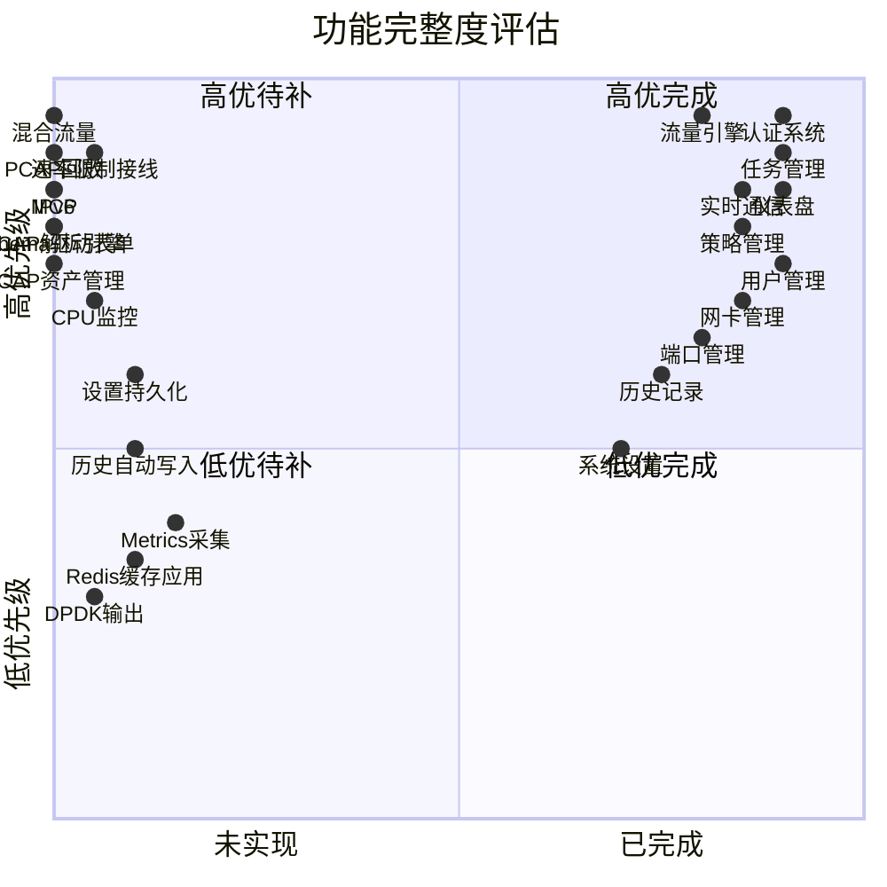

### 已知缺陷

| 缺陷 | 严重性 | 说明 |
|------|--------|------|
| 🔴 CPU 监控未实现 | 中 | GetStatus 始终返回 0 |
| 🔴 设置不持久化 | 中 | 重启后所有设置丢失 |
| 🔴 历史记录表未使用 | 中 | HistoryModel 存在但查询读 TaskModel |
| 🔴 速率限制未接线 | 高 | TokenBucket 创建为 rate=0（不限速），BPS 设置不生效 |
| 🔴 混合流量未实现 | 高 | BatchSpec/TrafficClass 类型已定义，引擎尚未接入 |
| 🟡 Prometheus 指标未采集 | 中 | 指标声明了但从未在引擎中记录 |
| 🟡 多 PacketWorker 乱序 | 中 | 只适用于单 worker |
| 🟢 PCAP 旋转不清理 | 低 | 旧文件永远不会删除 |
| 🟢 RBAC 权限系统未用 | 低 | DefaultRBAC 定义了但中间件直接查 role |
| 🟢 Redis 缓存未接入 | 低 | 缓存基础设施就绪但无代码使用 |
| 🟢 DPDK 输出未实现 | 低 | 类型字段和 UI 就绪，输出层缺失 |
| 🟢 端口分配 DB 表未用 | 低 | 使用内存 map 而非 DB 表 |

---

## 21. 后续优化方向

> 详细的分阶段实施计划、代码位置、修复方案见 [`docs/engine-analysis.md` §8 修复优先级建议](./engine-analysis.md#8-修复优先级建议)。
> 以下为高层路线图摘要。

### Phase 1: 修 bug + 补基础（1-2 周）

```
P0 - 必须立刻修复:
  ├─ 速率限制接线 (engine.go:193)
  ├─ CPU 监控 (system.go)
  └─ Settings 持久化 (settings_handler.go)

P0.5 - 核心功能（混合流量，必做）:
  ├─ 混合流量引擎 (BatchSpec/TrafficClass 接入引擎流水线)
  ├─ 4元组生成策略 (inc/random/pattern 用于 src/dst IP/port)
  ├─ 每类独立 BPS 限速 (TokenBucket per TrafficClass)
  └─ 前端混合流量配置界面 (Step 2 扩展为流量类配置)

P1 - 专业必备:
  ├─ DSCP/ECN 独立控制
  ├─ TCP 数据偏移支持选项
  ├─ 参数验证增强
  └─ HTTP 响应自定义
```

### Phase 2: IPv6 + Schema 化（2-3 周）

```
P2 - IPv6 全链路: 见 docs/ipv6-migration.md
P3 - Schema 驱动: 见 docs/engine-analysis.md §5.2
```

### Phase 3: 协议扩展 + 引擎增强（3-4 周）

```
P4 - 插件化协议注册
P5 - 引擎能力扩展 (resequencing / MTU 检查)
P5.5 - PCAP 回放与资源管理（需求已确认见 §15-§17，含解析引擎/资产管理/回放/改写/双口/多流）
```

### Phase 4: MCP + 高级功能（持续迭代）

```
P6 - MCP 实现（具体需求后续沟通）
P7 - 流量场景模板
P8 - 输出增强 (pcapng / 旋转清理)
```

### 两份文档的关系

| 文档 | 定位 | 回答的问题 |
|------|------|-----------|
| `docs/requirements.md`（本文档） | **需求规格** | 我们决定做什么、做成什么样 |
| `docs/engine-analysis.md` | **现状分析** | 引擎现状如何、为什么需要改、具体改哪里 |

- 本文档定义**目标状态**和**决策**
- 引擎分析报告记录**当前状态**和**技术细节**
- 实施时以本文档的需求为准，具体代码改动点参考引擎分析报告

---

*文档状态：已确认。以上需求基于代码审查、引擎深度分析和讨论决策写入。*